# WayLink comprehensive backend parallel implementation plan

- **Planning branch:** `backend-parallel-development-plan`
- **Base:** `codex_2` at `f0b065b921fcbcc2c8ba0ded5d913ed79295e020`
- **Prepared:** 2 October 2026
- **Primary target source:** `SYSTEM_REQUIREMENTS_AND_ARCHITECTURE.md` (the repository does not contain a file named `SYSTEM_REQUIREMENTS_AND_ARCHITECTURE(2).md`)
**Scope of this branch:** analysis and planning only; no application, schema, route, seed, Docker, or frontend logic changes

---

## 1. Executive summary

WayLink should continue as one TypeScript/Fastify/Mongoose modular monolith. Four independent backends or four long-lived branches cut directly from `codex_2` would create both ordinary merge conflicts and more dangerous semantic conflicts in identities, states, schemas, and payloads.

The proposed shared-foundation idea is directionally correct, but it needs two changes:

1. **Do not branch the four workflows from an unfinished `backend-foundation`.** First merge a reviewed foundation into a stable `integration/backend-base`, tag the contract baseline, and create all four feature branches from that exact commit.
2. **Freeze contracts and ownership, not all implementation.** Freeze identifiers, aggregate ownership, state enums/transitions, cross-role DTOs, indexes/uniqueness, auth claims/policies, error envelopes, idempotency/OCC rules, route registration mechanism, and deterministic scenario IDs. Keep internal service algorithms, query tuning, projections, and UI-specific read models flexible behind those contracts.

Recommended sequence:

```text
codex_2 @ f0b065b
  -> foundation/backend-v1
  -> reviewed merge: integration/backend-base
  -> tag: backend-contract-v1
       |-- feature/store-backend
       |-- feature/planning-backend
       |-- feature/loading-backend
       `-- feature/delivery-backend
  -> short, frequent integration PRs into integration/backend-v1
  -> cross-role E2E + offline verification
  -> release candidate
```

The current repository is not empty. It already has a working backend skeleton, 61 declared module routes, 15 Mongoose models, reference-data imports, auth handoff/JWT support, Docker Compose, and frontend API bridges. However, most backend code is organized as large route files that directly query globally centralized models. Tests are mainly foundation/preflight unit tests; Mongo transaction, concurrency, authorization-matrix, contract, and cross-role E2E evidence is missing. Prototype data remains in secondary frontend paths. The foundation phase must therefore **extract and stabilize boundaries without rewriting the system wholesale**.

The plan uses these evidence levels:

| Level | Meaning |
|---|---|
| **CODE** | Source exists and passes static checks. |
| **CONNECTED** | A real caller uses the API contract; no mock is used on that path. |
| **RUNTIME** | The behavior is proven against the real Mongo replica-set/local stack. |
| **E2E** | The cross-role workflow is proven from user action to downstream role and persisted recovery. |

Critical workflows are not done below **E2E**.

---

## 2. Current repository findings

### 2.1 Audit baseline

| Area | CURRENT / OBSERVED on `codex_2` | TARGET / REQUIRED | GAP | PROPOSED DEVELOPMENT DECISION |
|---|---|---|---|---|
| Backend stack | Node/TypeScript/Fastify/Mongoose under `backend/`; Zod request validation; REST `/api/v1`. | Same modular monolith stack. | Structure is route-centric rather than controller/service/repository/domain centric. | Preserve stack; reorganize incrementally by module behind stable route contracts. |
| Route surface | 61 `app.get/post/put/patch` declarations across auth, reference, orders, planning, loading, driver, operations, files. | Architecture endpoint families plus complete ownership/contract tests. | Route existence is not runtime/E2E proof; schemas are local Zod objects and OpenAPI lacks useful route schemas. | Inventory existing routes, assign owners, freeze DTOs, then move domain logic out of handlers. |
| Models | 15 models in one `backend/src/database/models/index.ts`. | Owned aggregate models and explicit cross-module ports. | Every developer would edit the same 350-line model registry; enum/state drift is easy. | Split schema definitions by owning module; retain one foundation-owned model-registration barrel only if it is generated/static. |
| Auth | Argon2, one-use hashed 60-second handoff, origin binding, JWT issuer/audience, role guard, `/me`, email update, logout audit. | Role + resource ownership/depot/assignment policies; active-user enforcement per request; formal auth contract. | Token auth does not recheck active user; ownership checks are scattered; no refresh session collection by design. | Foundation owns authentication and policy primitives; domain modules own resource-specific authorization. Keep stateless access-token sessions for the hackathon. |
| Database | MongoDB; timestamps; optimistic version keys on several aggregates; transactions for publish and load confirm. | Reproducible indexes/validators, transaction and race proof, canonical identities. | No migration ledger; `syncIndexes()` is embedded in seed; identity types differ between target document and code. | Freeze identity convention, add versioned database change scripts, and test on a replica set. |
| Seed | Idempotent upserts for 120 outlets, 60 vehicles, 910 calendar days, four explicitly labelled demo products, and seven users. Preflight validates shape/continuity. | Deterministic reference + operational scenario, reset/fresh commands, official CSC when available. | Demo seed only adds calendar dates; it does not create a complete multi-role operational scenario. Official CSC is absent. Passwords exist in source seed. | Scripts are source of truth; add versioned deterministic scenarios and environment-provided demo password. Never treat a dump as canonical. |
| Docker | Root Compose includes Mongo 8 replica set, init, one-shot seed, API, and five Nginx frontend containers. | Fresh one-command reproducible stack and test stack. | Runtime verification is not established in repository evidence; no isolated integration-test database service/profile. | Foundation/platform owner verifies Compose and adds test profile/reset commands without changing topology. |
| Errors/observability | Standard envelope, request IDs, Pino redaction, health endpoints, audit helper. | Correlated domain transitions and cross-role traceability. | Audit events have loose `data`, no required summary/audience, and are not transactionally coupled to every state change. | Define event catalogue and transactional event-write convention; retain requestId and canonical entity IDs. |
| Idempotency/OCC | Generic idempotency records; `If-Match` helper; versions on core records. | Retry-safe create/confirm/complete/offline operations. | Coverage is inconsistent; order create uses idempotency, many terminal mutations do not. | Freeze operation-by-operation concurrency table before feature branching. |
| Tests | 13 test cases across HTTP foundation, time/crypto/config, and seed preflight. | Unit, real-Mongo integration, contract, race, browser E2E, offline recovery. | No domain/API workflow evidence or replica-set transaction proof. | Build shared test harness/fixtures in foundation; modules add tests only under owned fixture namespaces. |
| Frontend integration | Real API clients/auth callbacks exist in all role apps. Dispatcher/Loader/Driver/Store have some live bridges. | All judge-path screens server-backed; offline Driver/Loader paths canonical. | Sample/mock imports remain, and `IMPLEMENTATION_STATUS.md` acknowledges secondary gaps. | Backend contracts must not be inferred from frontend mocks. Feature branches connect only to frozen DTOs. |
| Package management | Root scripts plus one lockfile per package; backend owns its package dependencies. | Low-conflict dependency changes. | Parallel backend branches could collide in `backend/package*.json`. | Foundation installs shared dependencies; later dependency changes require a small platform PR before module work rebases. |

### 2.2 Verified versus unverified

- **Observed in source:** app bootstrap, security plugins, 61 routes, 15 models, seed/preflight logic, Compose topology, API clients, and 13 test declarations.
- **Repository documentation says verified:** backend/frontend builds and existing tests. This is supporting evidence, not a fresh runtime audit in this planning branch.
- **UNVERIFIED / NEEDS CONFIRMATION:** real Mongo replica-set transaction behavior, current Compose startup on every developer machine, Cloudinary integration, complete authorization matrix, cross-origin browser E2E, claim/publish races, non-location offline mutation replay, and production deployment.
- **Primary-source naming issue:** requested `SYSTEM_REQUIREMENTS_AND_ARCHITECTURE(2).md` is absent. This plan uses the existing 97,804-byte `SYSTEM_REQUIREMENTS_AND_ARCHITECTURE.md`; team must confirm it is the intended revision.
- **Product source:** `CSC/products.demo.csv` is explicitly a four-row demo fixture, not verified official CSC data.

### 2.3 What is good, missing, and over-shared

**Good:** one deploy/database; a real transaction-capable Mongo topology; a role-oriented module outline; shared security/error/idempotency primitives; deterministic official reference imports; explicit prototype flags; existing vertical-slice route coverage.

**Missing:** owned domain services/repositories; a canonical transition catalogue; migration/version ledger; DTO/OpenAPI contract source; deterministic operational scenario; Mongo integration harness; resource policy tests; transactionally consistent audit conventions; complete offline command handlers; unambiguous stop identity.

**Should be shared/frozen:** identity conventions, enums/transitions, core schemas/indexes, API envelopes and cross-role DTOs, auth claims/policy interfaces, idempotency/OCC conventions, database migration runner, event catalogue, registration manifest, test scenario IDs.

**Should remain flexible:** module-internal folder depth, repository query implementation, projection composition, constraint algorithm internals if outputs remain compatible, UI view models, caching, polling cadence within approved ranges, and non-breaking optional response fields.

**Must not be shared unnecessarily:** business rules in `common/`, one giant DTO file, one global repository, one global fixture file, UI types imported from Mongoose, or domain-specific Zod schemas placed in app bootstrap.

---

## 3. Architecture alignment and decisions

### 3.1 Recommended module architecture

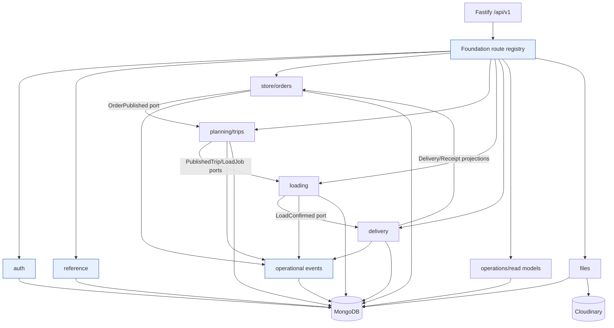

Rules:

- Routes perform HTTP translation only.
- Application services orchestrate one use case and own transaction boundaries.
- Domain policies/state machines contain pure rules.
- Repositories are private to their owner module.
- A module may depend on another module's **published port/read interface**, never its repository or Mongoose model.
- Cross-module writes use the owning module's command service within the same process/session; do not emulate an event bus.
- Operational events are an audit/read-feed side effect, not the authoritative source of state.

### 3.2 Recommended backend repository structure

```text
backend/
  src/
    app/
      create-app.ts                 # foundation-owned composition
      module-registry.ts            # stable imports of each module plugin
      health.routes.ts
    config/
      env.ts
      logger.ts
    db/
      connection.ts
      transaction.ts
      migrations/
        0001-baseline.ts
      migrate.ts
    common/
      auth/                          # JWT mechanics and generic role guard only
      errors/
      http/                          # envelope, pagination, request IDs
      idempotency/
      validation/                    # ObjectId/date primitives only
      observability/
    contracts/
      common.ts                      # Role, IDs, error/pagination DTOs
      events.ts                      # reviewed event catalogue
      generated/                     # OpenAPI-derived client types; no hand edits
    modules/
      auth/
        auth.module.ts
        http/
        application/
        domain/
        persistence/
      reference/
      store/                         # Order + store receipt/application surface
      planning/                      # Trip aggregate and allocation
      loading/                       # LoadRecord aggregate
      delivery/                      # Driver execution, DeliveryRecord, GPS, sync
      files/
      operations/                    # projections/audit/remarks; no aggregate writes
      each module:
        <module>.module.ts           # one Fastify plugin exported to registry
        http/{routes,schemas,presenters}.ts
        application/{commands,queries,ports}.ts
        domain/{types,state-machine,policies}.ts
        persistence/{model,repository,indexes}.ts
    types/fastify.d.ts
    server.ts
  database/
    seed/
      reference/
      users/
      scenarios/
      run-seed.ts
      reset.ts
    fixtures/                        # deterministic machine-owned input files
  tests/
    support/                         # foundation-owned Mongo/app harness
    fixtures/{foundation,store,planning,loading,delivery}/
    contract/
    e2e/
  docs/
    api.openapi.json                 # generated in CI
    contracts/
    adr/
```

### 3.3 Directory ownership and dependency rules

| Directory | Purpose | Owner | May be changed by feature developers? | Allowed dependencies | Forbidden dependencies |
|---|---|---|---|---|---|
| `src/app/**` | Composition and health | Foundation integrator | No, except reviewed registration PR | All module entry points | Domain code inside app |
| `src/config/**` | Validated runtime config | Foundation/platform | Change request only | Common primitives | Module-specific policy |
| `src/db/**` | Connection, transaction, migrations | Foundation/database steward | New migration by steward | Mongoose/config | HTTP/frontend code |
| `src/common/**` | Truly generic mechanics | Foundation | Change request only | No domain modules | Order/trip/load/delivery concepts |
| `src/contracts/**` | Frozen cross-role public contracts | Contract steward | Proposal + cross-owner approval | Primitive types only | Mongoose documents |
| `modules/auth/**` | Identity and handoff | Foundation/auth owner | Auth owner only | common/db | Operational repositories |
| `modules/reference/**` | Outlet/vehicle/product/calendar masters | Foundation/reference owner | Reference owner only | common/db | Workflow mutations |
| `modules/store/**` | Order aggregate, Store receipt commands/projections | Store developer | Yes | contracts, auth policy ports, reference read ports | Planning/loading/delivery repositories |
| `modules/planning/**` | Trip aggregate, allocation, deferral, validation | Dispatcher developer | Yes | contracts, order command/read ports, reference ports | Store/loader raw models |
| `modules/loading/**` | LoadRecord and Loader workflow | Loader developer | Yes | contracts, trip command/read port | Trip/delivery raw models |
| `modules/delivery/**` | Driver workflow, DeliveryRecord, GPS, offline sync/PIN verification | Driver developer | Yes | contracts, trip/load read/command ports | Store/planning repositories |
| `modules/operations/**` | Read projections, remarks, audit exports | Integration owner | Coordinated only | published read ports/events | Direct aggregate status updates |
| `modules/files/**` | Asset ownership/signing | Foundation/files owner | Coordinated only | domain authorization ports | Unscoped file reads |
| `database/seed/scenarios/<module>` | Deterministic additions | Respective module | Yes, separate file | Frozen scenario manifest | Editing shared seed core |
| `tests/fixtures/<module>` | Owned test builders | Respective module | Yes | shared fixture primitives | Editing other modules' fixture defaults |

`common` is not a dumping ground. Code moves there only when it is domain-neutral, has at least two real consumers, and has no dependency on an aggregate state.

---

## 4. Domain ownership matrix

| Entity / aggregate | Canonical owner | Creates | Updates / transitions | Reads | Classification | Freeze before branching? |
|---|---|---|---|---|---|---|
| User | Auth | seed/admin process | Auth profile/activation policy | Every module through `CurrentActor`/user read port | Identity master | Yes |
| AuthHandoff | Auth | Login command | Exchange consumes atomically | Auth only | Ephemeral auth data | Yes |
| Access session | Auth | JWT issuer | Client clears; expiry ends it | Auth middleware | Stateless token, not a Mongo collection | Yes |
| Outlet | Reference | reference import | reference import/admin-only future flow | Store, planning, delivery | Shared reference | Yes |
| Product | Reference/catalog | approved CSC import | import/retire | Store and order service | Shared reference | Yes |
| Vehicle | Reference | reference import | import/retire; audited override only if approved | Planning, loading, delivery | Shared reference | Yes |
| CalendarDay | Reference | reference import | import only | Store/planning | Shared reference | Yes |
| Order | Store | Store Manager command | Store owns submit/cancel rules; Planning owns allocation/deferral only through Order command port; Delivery marks fulfillment through Order port | Store, planning, loader/driver projections | Operational aggregate | Yes: identity, schema, states, indexes, ports |
| Trip | Planning | Dispatcher | Planning draft/publish/cancel; Loading/Delivery transition through Trip command port | Dispatcher, assigned Loader/Driver, Store projection | Operational aggregate | Yes |
| TripStop | Planning, embedded in Trip | Dispatcher planning service | Delivery transitions stop through Trip command port | Loading, delivery, Store/monitor projections | Embedded operational entity | Yes |
| LoadRecord | Loading | Created transactionally when Planning publishes Trip | Claiming Loader transitions; Dispatcher may use explicit reassignment command | Loader, Dispatcher, assigned Driver snapshot | Operational aggregate | Yes |
| DeliveryRecord | Delivery | Driver arrival/bootstrap service as decided in contract | Assigned Driver executes; Store submits receipt through Delivery command port | Driver, Store, Dispatcher | Operational aggregate | Yes |
| TripLocation | Delivery | Assigned Driver sync/location endpoint | Append only | Dispatcher and related Store projection | Operational telemetry | Yes: dedupe/retention/indexes |
| FileAsset | Files | authorized Driver/Store completion | Provider verification/status | Related roles through domain ownership policy | Operational metadata | Yes |
| OperationalEvent | Operations/audit | all application services | Append only; remark review is a separate reviewed event or constrained update | role/audience projections | Audit/read-feed | Yes: event catalogue and envelope |
| IdempotencyRecord | Foundation | mutation middleware/service | immutable until TTL | owning operation | Technical | Yes |
| SyncReceipt | Delivery/offline | sync service | immutable result per mutation | assigned Driver/support | Technical operational | Yes |
| PinChallenge | Delivery | Store command after arrival | Driver verification consumes/locks/rotates | Store sees plaintext only at creation; Driver sees result only | Ephemeral operational security | Yes |

### 4.1 Developer ownership diagram

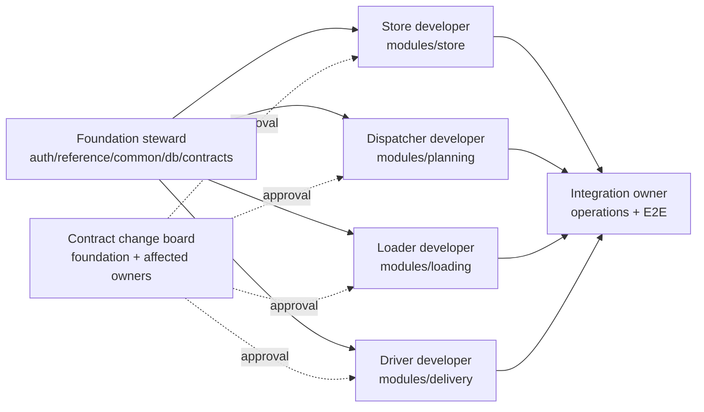

No developer owns another module's persistence model. Cross-owner state changes are exposed as application ports and covered by contract tests.

---

## 5. Canonical entity and operational ID strategy

### 5.1 Frozen identity rules

The current code uses `outletId` and `vehicleId` as official string business keys, while operational aggregates use Mongo ObjectIds. Renaming every reference before the hackathon would create large, low-value churn. Freeze this explicit convention:

| Name | Identifies | Representation | Scope / rule |
|---|---|---|---|
| `userId` | One persisted employee account | Mongo ObjectId string | Never employee ID/email. JWT `sub`. |
| `employeeId` | Human/business employee key | Unique string such as `DSP-1001` | Login/display/import only. |
| `outletId` | One official physical outlet | Unique official string such as `OUT001` | Current schema convention retained; never an order/store-manager ID. |
| `vehicleId` | One physical fleet vehicle | Unique official string such as `VEH001` | Never a route/run/assignment ID. |
| `productId` | Persisted product master record | Mongo ObjectId string | SKU is the stable business key/snapshot. |
| `orderId` | One submitted order aggregate | Mongo ObjectId string | `orderNumber` is its human key. |
| `tripId` | One planned **vehicle run** on a service date | Mongo ObjectId string | This, not `vehicleId`, identifies an operational run. |
| `tripStopId` | One physical visit embedded in a Trip | Stable embedded ObjectId string | Generated once at draft creation; globally unambiguous when combined with `tripId`; endpoint remains nested. Replace `STOP-1` identity before branching. |
| `loadRecordId` | One loading/reconciliation job | Mongo ObjectId string | One-to-one with trip; APIs may locate by tripId but responses expose both. |
| `deliveryRecordId` | One execution of one physical TripStop | Mongo ObjectId string | One-to-one `(tripId, tripStopId)`; may cover multiple orders. |
| `fileAssetId` | One verified uploaded asset metadata record | Mongo ObjectId string | Provider `publicId` is not accepted as domain identity. |
| `eventId` | One operational/audit/remark event | Mongo ObjectId string | Append-only event identity. |
| `pinChallengeId` | One issued proof challenge | Mongo ObjectId string | PIN plaintext is never identity or storage. |
| `clientMutationId` | One offline command attempt | UUID | Unique per actor/device command; dedupe key. |
| `pointId` | One captured GPS point | UUID | Global dedupe key; replace sequence-only identity. |

### 5.2 Physical versus operational identity

```text
Physical vehicle: vehicleId
Planned/physical vehicle run: tripId
Planned visit: tripStopId (inside tripId)
Warehouse job for that run: loadRecordId
Delivery execution at that visit: deliveryRecordId
Commercial request: orderId
```

A TripStop can contain `orderIds[]`; the current one-order-per-stop model is a gap. Loader and Driver must never use `vehicleId` as their job identity. URLs keyed by `tripId` are convenience lookups, not proof that Trip and LoadRecord are the same entity.

---

## 6. Database/domain relationship design

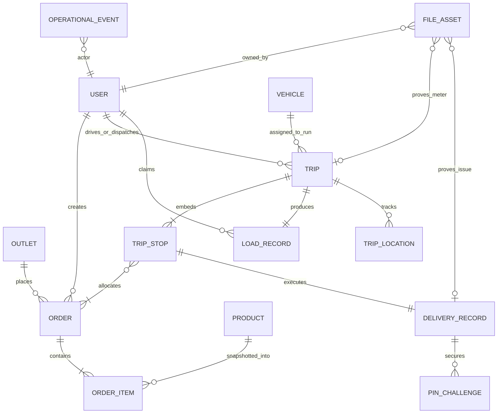

### 6.1 Field classification legend

- **[A]** explicitly required by the architecture/source.
- **[B]** necessary implementation detail inferred to make the requirement safe/implementable.
- **[C]** optional proposal; do not add without owner approval.

### 6.2 Collection specifications

#### `users` — owner: Auth

Major fields: `_id:ObjectId [B]`; `employeeId:string [A]`; `name:string [A]`; `role:enum [A]`; `passwordHash:string [A]`; `email:string [A]`; `emailVerifiedAt?:Date [A]`; `outletId?:string [A/current convention]`; `depot?:enum [A]`; `active:boolean [A]`; `failedLoginCount:int [A]`; `lockedUntil?:Date [A]`; `lastLoginAt?:Date [A]`; timestamps `[A]`; version `[B]`.

Constraints/indexes: unique employeeId; unique normalized email (current code only has `{email,role}` and must change); sparse unique phone only if phone is retained `[C]`; `{role,active}`. Query patterns: login, current actor, drivers by depot, manager outlet binding. No password hash in default projections.

#### `auth_handoffs` — owner: Auth

Fields: `_id [B]`; `userId:ObjectId [A]`; `codeHash:string [A]`; `intendedOrigin:string [A]`; `expiresAt:Date [A]`; `consumedAt?:Date [A]`; timestamps `[B]`. Unique code hash; TTL expiresAt; `{userId,createdAt:-1}`. Exchange is atomic compare-and-set. No plaintext code.

**Sessions:** no persisted session collection in v1. Access JWT is stateless and short-lived `[A/decision]`; logout is client clearing plus audit. Refresh-token sessions/revocation are `[C]` and out of hackathon scope.

#### `outlets` — owner: Reference

Fields: `_id [B]`; `outletId:string official key [A]`; `displayName [A/approved synthetic where source lacks it]`; `brand [A]`; `district [A]`; `depot [A]`; `dockType [A]`; `parkingConstraint [A]`; `mallWindow? [A]`; `windowOpenTime/windowCloseTime [A/current naming]`; `coordinates? [A but source currently absent]`; `active [A]`; `source [B]`; timestamps `[A]`.

Indexes: unique outletId; `{depot,brand}`; district; 2dsphere only when valid coordinates exist. Query patterns: manager context, planning filters, window/access validation. Freeze schema/indexes before branching.

#### `vehicles` — owner: Reference

Fields: `_id [B]`; `vehicleId:string official key [A]`; `type [A]`; `temperatureClass [A/current naming]`; capacity weight/volume `[A]`; fuel type, kmPerL, weeklyFuelQuotaL `[A]`; depot `[A]`; active `[A]`; timestamps `[A]`. Indexes: unique vehicleId; `{depot,active,type,temperatureClass}`. Route-use is computed from Trips; do not mutate master quota from UI. Audited override is `[C]`.

#### `products` — owner: Reference/catalog

Fields: `_id [B]`; `sku [A]`; `brand,name,unit [A]`; `orderTypes[] [B/current catalogue need]`; weight/volume/temperature/fragile planning attributes `[A]`; `source,assumptions[] [B]`; active `[A]`; timestamps `[A]`. Indexes: unique SKU; `{brand,active,name}`. Product snapshots are embedded into orders. Official CSC remains **UNVERIFIED / NEEDS CONFIRMATION**.

#### `calendar_days` — owner: Reference

Fields match the imported calendar: date, day/week/year, weekend/payday/festival/ramp/holiday/monsoon/operating `[A]`; timestamps `[B]`. Unique date. Used for operating-day and cutoff validation. Reference data, frozen.

#### `orders` — owner: Store

Fields: `_id [B]`; `orderNumber [A]`; `outletId:string [A/current convention]`; `createdBy:ObjectId [A; migrate current storeManagerId name before freeze or document alias]`; brand/orderType `[A]`; `requestedDeliveryDate:string [A; current requestedDate must be reconciled]`; `submittedAt/cutoffDeadlineAt/submittedBeforeCutoff/cutoffBucket [A]`; priority `[A]`; status `[A]`; embedded item snapshots including productId/SKU/name/unit/quantity/planning attributes `[A]`; `totals{weightKg,volumeM3} [A; current flattened totals are a gap]`; deferral object `[A]`; allocation `{tripId,tripStopId,allocatedAt} [A]`; statusHistory with from/to/actor/reason `[A; current entries contain only status]`; version/timestamps `[A/B]`.

Indexes: unique orderNumber; `{outletId,createdAt:-1}`; `{status,requestedDeliveryDate,brand}`; `{allocation.tripId}`; `{cutoffBucket,status}`. Query patterns: outlet history, planning queue, trip manifest, delivery trace. Operational; frozen before branching.

#### `trips` with embedded `tripStops` — owner: Planning

Trip fields: `_id/tripNumber [A/B]`; serviceDate/depot/vehicleId/driverId/dispatcherId `[A]`; `routeIndex 1|2 [A]`; driver claim metadata `[A]`; status `[A]`; planned/actual time fields `[A]`; totals/constraintCheck `[A]`; stops `[A]`; lastLocation projection `[A]`; created/published actors `[A]`; version/history/timestamps `[A/B]`.

TripStop fields: stable ObjectId `tripStopId [B]`; sequence `[A]`; outlet ID + immutable snapshot `[A]`; `orderIds[] [A]`; planned arrival/window deadline/timing result/status/version `[A]`.

Indexes: unique tripNumber; unique `{vehicleId,serviceDate,routeIndex}`; `{driverId,serviceDate}`; `{status,serviceDate}`; `{stops.orderIds}`. Current gaps: no routeIndex unique constraint, one order per stop, string `STOP-n`, no outlet snapshot/window deadline, and different state enum. These must be resolved in foundation because Loader and Driver consume them.

#### `load_records` — owner: Loading

Fields: `_id/loadRecordId [B]`; unique tripId `[A]`; depot `[A]`; status `[A]`; claim/unclaim/start/confirm actors and times `[A]`; item snapshots with stop/order/SKU/expected/loaded/status `[A]`; exception details `[A]`; departure variance `[A]`; version/timestamps `[A/B]`. Indexes: unique tripId; `{depot,status,createdAt}`; `{claimedBy,status}`. Current gap: unclaim audit fields are absent and exceptions use `Mixed`.

#### `delivery_records` — owner: Delivery

Fields: `_id [B]`; tripId/tripStopId/outletId/driverId `[A]`; status `[A]`; device and server arrival/completion timestamps `[A/B]`; windowDeadlineAt/timingResult/outcome `[A]`; item outcomes (multiple order IDs allowed) `[A]`; proof challenge reference/verified time/location `[A]`; bounded mutation IDs/syncStatus `[A]`; embedded receipt with items/remark/evidence IDs `[A]`; version/timestamps `[A/B]`.

Indexes: unique `{tripId,tripStopId}`; `{outletId,status,updatedAt:-1}`; `{driverId,status}`; receipt result history index. Current record has one `orderId` and cannot represent consolidated stop orders; fix before branching.

#### `pin_challenges` — owner: Delivery

Separate storage is a **[B] necessary implementation detail** to support rotation, expiry, attempt limits, and no plaintext retention cleanly. Fields: `_id`; deliveryRecordId; hash; issuedBy; issuedAt; expiresAt; attempts; maxAttempts; verifiedAt; revokedAt; version. Indexes: `{deliveryRecordId,issuedAt:-1}` and TTL on expiresAt only if expired audit retention is not required. Unique partial index allowing one active challenge per delivery is `[B]`. Current embedded PIN fields are a migration gap. Team may approve an embedded active challenge instead, but must preserve identical security/concurrency behavior.

#### `trip_locations` — owner: Delivery

Fields: `_id [B]`; pointId UUID `[A]`; tripId/driverId/vehicleId `[A]`; GeoJSON location `[A]`; accuracy/speed/heading `[A]`; recordedAt/receivedAt/source `[A]`. Unique pointId; `{tripId,recordedAt}`; `{driverId,recordedAt:-1}`; 2dsphere. Current sequence-based dedupe and latitude/longitude fields are a contract gap. Retention TTL is `[C]` pending privacy approval.

#### `file_assets` — owner: Files

Fields: `_id [B]`; provider/publicId/kind/mime/bytes/dimensions `[A]`; ownerUserId `[A]`; tripId/deliveryRecordId `[A]`; captured/uploaded time/status `[A]`; provider version/signature verification metadata `[B]`. Unique provider/publicId; domain/kind indexes. Access is always authorized through related domain ports, not merely role.

#### `operational_events` — owner: Operations/audit

Fields: `_id [B]`; eventType/entityType/entityId/actorId/actorRole/audienceRoles/summary/data/requestId/createdAt `[A]`; optional causation mutation ID `[B]`. Append-only indexes from architecture. Current remarks mutate event data; prefer append `remark.reviewed` event plus read projection, or explicitly freeze the mutable exception.

#### `idempotency_records` and `sync_receipts` — owners: Foundation and Delivery

Idempotency fields currently satisfy the base requirement; retain unique `{key,userId,operation}` and TTL. Add lifecycle/state only if a reserve-then-complete implementation is adopted `[B]`. SyncReceipt keeps mutation ID, actor, trip, operation, terminal result, response, timestamps `[A]`; add payload hash `[B]` so a reused mutation ID with different content is rejected.

Unless marked `?`, fields above are required once the record reaches the state that needs them; state-dependent fields are enforced by application commands plus Mongo validators where expressible. `TripStop`, OrderItem, load items, receipt, and status-history entries are embedded documents, not independent collections.

| Collection | Primary write owner | Other consumers | Expected hot queries | OCC / retention |
|---|---|---|---|---|
| users | Auth | Reference, all policy layers | employeeId login; userId actor; active drivers by depot | version; no TTL |
| auth_handoffs | Auth | none | active codeHash + origin + expiry | atomic consume; TTL expiry |
| outlets | Reference | Store, Planning, Delivery | official ID; depot/brand/district; window/access | import version; soft active |
| vehicles | Reference | Planning, Loading, Delivery | official ID; active fleet by depot/capability | import version; soft active |
| products | Reference | Store | own brand/type/search; product ID validation | import version; soft active |
| calendar_days | Reference | Store, Planning | exact date; next operating dates | immutable import; no TTL |
| orders | Store | Planning, Loading/Delivery projections, Operations | outlet history; planning status/date/brand; trip allocation | version; never hard-delete |
| trips | Planning | Loading, Delivery, Operations | service date/state; driver/day; vehicle/day; contained order | version; never hard-delete |
| load_records | Loading | Planning/Delivery/Operations | trip one-to-one; depot/state; claimant active jobs | version; never hard-delete |
| delivery_records | Delivery | Store, Operations | trip/stop; outlet/state/history; driver/state | version; never hard-delete |
| pin_challenges | Delivery | Store issue/Driver verify commands | current active challenge by Delivery | version; TTL/retention approval |
| trip_locations | Delivery | Operations/Store projection | trip chronological/latest; driver recent | append/dedupe; retention approval |
| file_assets | Files | Related domain policies | provider/publicId; trip/kind; delivery/kind | immutable status lifecycle |
| operational_events | Operations/audit | all role feeds | entity timeline; audience feed; event type | append only; no hackathon TTL |
| idempotency_records | Foundation | all mutation owners | actor/operation/key | immutable result; 24h+ TTL policy |
| sync_receipts | Delivery | Driver sync/support | actor/mutation ID; trip pending/conflicts | immutable result; retained through demo |

### 6.3 Database validators, indexes, and migrations

Mongoose schemas alone are insufficient. Foundation deliverables:

1. `database/migrations` with monotonically numbered, idempotent scripts and a `schema_migrations` collection `[B]`.
2. Each owner exports its expected indexes; one migration runner applies them. Do not run destructive `syncIndexes()` implicitly in production seed.
3. CI compares declared indexes with a fresh database and fails on drift.
4. Mongo JSON Schema validators for core required fields/enums are `[B]`; implement for Orders, Trips, LoadRecords, DeliveryRecords, PinChallenges, and SyncReceipts after DTO freeze.
5. Every schema change states forward migration, compatibility window, seed impact, and rollback/data-repair plan.

---

## 7. Seed, dump, reset, and shared scenario strategy

### 7.1 Decisions

| Question | Decision |
|---|---|
| Dump as primary source? | **No.** Dumps hide schema/index provenance, are binary/noisy, and age badly. |
| Seed scripts as primary source? | **Yes.** Versioned source files + scripts + scenario manifest are reviewable and deterministic. |
| Script migrations/indexes? | **Yes.** Run migrations before seed; seed never substitutes for migration. |
| Commit a dump? | Normally no. A sanitized release snapshot may be stored as a CI artifact, not canonical Git input. |
| Fresh database | `docker compose down -v`, start Mongo/init, run `db:migrate`, then `seed:reference`, `seed:users`, `seed:scenario -- scenario-v1`. |
| Reset | A guarded `db:reset -- --confirm waylink_dev` command drops only the configured dev/test DB, then migrates/seeds. Never accept production URI. |
| Reference vs operational | Reference import is idempotent master data. Operational scenario is replaceable, explicitly namespaced, and depends on reference keys. |
| Exact same dataset | Pin input file checksums, scenario version, fixed timestamps/IDs, timezone, and random seed; print a seed manifest hash. |
| Test vs demo | Tests create isolated builders/databases per suite. Demo scenario is human-readable and stable. Tests never depend on the long-lived demo DB. |
| Version changes | Migration number + scenario schema version + contract changelog. |

### 7.2 Deterministic startup

```text
docker compose up mongo mongo-init
  -> replica set writable
  -> npm run db:migrate
  -> seed reference files (verified checksums/counts)
  -> seed role users (password from env; fixed employee IDs)
  -> seed scenario-v1 (fixed IDs/times/state)
  -> print manifest hash and counts
  -> API readiness true
  -> frontend services start
```

Deterministic means: input versions/checksums, counts, official business keys, scenario ObjectIds or deterministic lookup keys, timestamps, service date, actor assignments, status/version, and expected output assertions are identical. Password hashes may differ because Argon2 salts; credentials remain semantically identical.

### 7.3 Shared development scenario `scenario-v1`

Reference prerequisites: official outlets/vehicles/calendar plus approved CSC extract; until CSC arrives, use clearly marked demo products and never claim official provenance.

Operational fixtures must include:

- one submitted order visible to Dispatcher;
- one deferred order with next operating date;
- one draft trip for validation failure examples;
- one published trip + available LoadRecord;
- one claimed-but-not-started load for unclaim testing;
- one load-confirmed trip for Driver bootstrap;
- one in-transit trip with pending and arrived stops;
- one completed DeliveryRecord awaiting Store receipt;
- one receipt issue with evidence metadata;
- one pending offline mutation duplicate and one stale-version conflict fixture;
- two eligible Loaders for claim race and two requests attempting the same order allocation.

Each fixture records canonical IDs in `scenario-manifest.json`; modules add scenario fragments in separate files to avoid one shared seed conflict. The scenario composer, owned by foundation, validates cross-references.

---

## 8. API contract strategy

### 8.1 Contract source and DTO rules

- Route Zod schemas remain runtime validators initially, but each module exports named request/response schemas and registers them with Fastify/OpenAPI.
- Export OpenAPI JSON in CI. Generate frontend transport DTOs from OpenAPI after Gate 3; do not share Mongoose documents.
- Domain types are private to the owner module. Persistence types are private to repositories. Public DTOs contain strings/dates/enums, never Mongoose methods or internal hashes.
- Breaking change = removal/rename/type narrowing/new required input/status semantic change. It requires contract review, version/changelog, compatibility plan, and affected-branch rebase.
- Public envelopes: `Success<T>`, `Page<T>`, and `ErrorResponse` are foundation-owned and frozen.

### 8.2 Cross-role DTOs to freeze

| Contract | Producer | Consumers | Required stable content |
|---|---|---|---|
| `OrderPlanningProjection` | Store | Planning | orderId/number, outlet snapshot, brand/type, item planning snapshots, totals, requested date/cutoff, priority, version/status |
| `PublishedTripManifest` | Planning | Loading, Delivery | tripId/number, vehicle/driver/depot, ordered stops, consolidated order/item snapshots, deadlines, versions |
| `LoadConfirmationProjection` | Loading | Delivery, Planning monitor | loadRecordId, tripId, final loaded quantities/exceptions, confirmed actor/time/version |
| `DriverBootstrap` | Delivery + Planning/Loading ports | Driver app | assignment, manifest, load snapshot, histories needed offline, server time, bootstrap version |
| `DeliveryReceiptProjection` | Delivery | Store, Dispatcher | deliveryRecordId, stop/order references, outcomes, proof state, timing, receipt state, tracking freshness |
| `MonitorTripProjection` | Planning/Delivery/Loading | Dispatcher | trip/load/stop states, exceptions, last location/last seen, conflict/remark summary |

### 8.3 Canonical endpoint ownership plan

Legend: **C** current route exists; **Δ** current route exists but contract/domain behavior must change; **G** required gap. Every protected endpoint returns `401/403`; lookup endpoints may conceal unauthorized existence with `404`; validation uses `400`, state/OCC/claim conflicts `409`, and domain-rule failure `422`.

#### Authentication and reference

| Status | Method / endpoint | Owner; roles | Request → response | Mutation / safety | Dependencies |
|---|---|---|---|---|---|
| C | `POST /auth/login` | Auth; public/rate-limited | employeeId/password/email → origin-bound handoff | Atomic handoff create; generic 401 | User |
| C | `POST /auth/exchange` | Auth; public/rate-limited | handoffCode → JWT + user | Atomic one-use consume; origin check | AuthHandoff/User |
| C | `GET /auth/me` | Auth; any | — → current user | Recheck active user `[decision]` | User |
| C | `PATCH /auth/profile/email` | Auth; self | email/currentPassword → user | OCC or current password; unique email | User |
| C | `POST /auth/logout` | Auth; any | — → 204 | Audit; online-only | Event |
| C | `GET /reference/outlets` | Reference; Dispatcher | filters/page → summaries | Read only | Outlet |
| Δ | `GET /reference/vehicles` | Reference; Dispatcher | serviceDate/filters → vehicle + computed use | Read only; no silent master edit | Vehicle/Trip |
| C | `GET /reference/drivers` | Reference/Auth; Dispatcher | depot → active drivers | Read only | User |
| Δ | `GET /catalog/products` | Reference; Store | orderType/search → own-brand catalogue | Brand derived from manager outlet, not trusted query | Product/User/Outlet |
| C | `GET /calendar/:date` | Reference; Store/Dispatcher | date → flags/deadlines/server time | Read only | Calendar |

#### Store and order

| Status | Method / endpoint | Owner; roles | Request → response | Mutation / safety | Dependencies |
|---|---|---|---|---|---|
| C | `GET /store/dashboard` | Store; own manager | — → dashboard projection | Read only | Order/Delivery ports |
| Δ | `POST /orders` | Store; own manager | type/date/items → saved Order | `Idempotency-Key`; server totals/cutoff; operating day | Product/Outlet/Calendar |
| C | `GET /orders` | Store; own manager | status/date/page → own orders | Read only | Order |
| C | `GET /store/order-history` | Store; own manager | filters/page → history projection | Read only | Order/Event |
| C | `GET /orders/:orderId` | Store own outlet; Dispatcher | — → role projection | Ownership hidden as 404 | Order |
| C | `GET /store/deliveries` | Store; own manager | status/date → summaries | Read only | Delivery port |
| C | `GET /store/delivery-history` | Store; own manager | filters/page → history | Read only | Delivery/Event |
| C | `GET /store/deliveries/:deliveryRecordId` | Store; own manager | — → detail/tracking/proof/receipt | Read only; signed file refs only | Delivery/Trip/Location |
| Δ | `POST /store/deliveries/:deliveryRecordId/pin` | Delivery; own manager | expectedVersion → PIN once + expiry | Idempotent rotation policy; challenge OCC; online-only | Delivery/PinChallenge |
| Δ | `POST /store/deliveries/:deliveryRecordId/receipt` | Store via Delivery port | result/items/remark/evidence/version → receipt | Idempotency + OCC; one receipt; transaction event | Delivery/File |

#### Dispatcher/planning and operations

| Status | Method / endpoint | Owner; roles | Request → response | Mutation / safety | Dependencies |
|---|---|---|---|---|---|
| Δ | `GET /planning/orders` | Planning; Dispatcher | serviceDate/brand/status/reachability/page → planning projections | Deferred date semantics frozen | Order/Outlet |
| Δ | `POST /planning/trips` | Planning; Dispatcher | ordered stop groups/vehicle/driver/times/distance → draft/rules | Idempotency recommended; no allocation yet | Order/Vehicle/User |
| C | `POST /planning/trips/:tripId/validate` | Planning; Dispatcher | optional candidate changes/version → rules/suggestions | No state transition; OCC if persisted | Trip/constraints |
| Δ | `PATCH /planning/trips/:tripId` | Planning; Dispatcher | allowed draft fields/version → trip | If-Match; draft only; regenerate stable stops carefully | Trip |
| Δ | `POST /planning/trips/:tripId/publish` | Planning; Dispatcher | expectedVersion → published Trip + LoadRecord IDs | Idempotency + OCC + Mongo transaction; allocate all-or-none | Order/Trip/Load port/Event |
| Δ | `POST /orders/:orderId/defer` | Planning through Order port; Dispatcher | nextDate/reason/note/version → Order | Operating future day, state guard, OCC/event | Order/Calendar |
| Δ | `POST /orders/defer-batch` | Planning through Order port; Dispatcher | orderIds/nextDate/reason/note → per-order or atomic policy | Team must approve partial vs all-or-none; current is partial | Order/Calendar |
| C | `GET /trips` | Planning; Dispatcher/scoped Loader/Driver | date/status/vehicle → role projections | Loader must be depot-scoped | Trip |
| Δ | `GET /trips/:tripId` | Planning; related roles | — → role-specific Trip/manifest | Assignment/depot scope | Trip/Order ports |
| C | `GET /monitor/trips` | Operations; Dispatcher | serviceDate → monitor projections | Poll/ETag `[C]` | Trip/Load/Delivery/Location |
| C | `POST /remarks` | Operations; related roles | entity/id/text/audience → event | Validate relation/ownership; idempotency `[B]` | Domain auth port/Event |
| Δ | `PATCH /remarks/:eventId/review` | Operations; Dispatcher | response/notify → reviewed projection | Prefer append event; OCC if mutable | Event |
| C | `GET /audit/orders` | Operations; Dispatcher | filters/page → joined rows | Read only | Event/Order |
| C | `GET /audit/orders.csv` | Operations; Dispatcher | same filters → CSV | CSV-injection safe | Event/Order |
| C | `GET /audit/deliveries` | Operations; Dispatcher | filters/page → joined rows | Read only | Delivery/Event |

#### Loader

| Status | Method / endpoint | Owner; roles | Request → response | Mutation / safety | Offline mode |
|---|---|---|---|---|---|
| C | `GET /load-jobs` | Loading; depot Loader | date/status → job cards | Depot scope | Online/bootstrap read |
| Δ | `POST /load-jobs/:tripId/claim` | Loading; depot Loader | expectedVersion → LoadRecord | Atomic CAS; one winner; online-only | Online-only |
| Δ | `POST /load-jobs/:tripId/unclaim` | Loading; claiming Loader | reason/version → available record | Atomic owner/version/no-work guard; audit fields | Online-only |
| C | `GET /load-jobs/:tripId` | Loading; related Loader/Dispatcher | — → load + trip snapshot | Depot/claim scope | Cache after claim |
| C | `POST /load-jobs/:tripId/start-loading` | Loading; claiming Loader | version → loading | OCC; establishes no-unclaim boundary | Queueable only after local ownership cache `[approval]` |
| C | `PATCH /load-jobs/:tripId/items/:itemId` | Loading; claiming Loader | status/quantity/version → record | OCC; accounting invariant | Offline queue required |
| Δ | `PUT /load-jobs/:tripId/items/:itemId/exception` | Loading; claiming Loader | typed exception/version → record | OCC; replace `Mixed` schema | Offline queue required |
| C | `POST /load-jobs/:tripId/reconcile` | Loading; claiming Loader | version → totals/record | Every quantity accounted | Offline local preview; server authority |
| C | `POST /load-jobs/:tripId/confirm` | Loading; claiming Loader | version/idempotency → LoadRecord + Trip | Transaction: Load confirmed + Trip load_confirmed + event | Online sync required |
| G | `GET /load-jobs/:tripId/summary.pdf` | Loading; related Loader/Dispatcher | — → PDF | Read only | Online-only; client PDF acceptable if approved |

#### Driver, offline, and files

| Status | Method / endpoint | Owner; roles | Request → response | Mutation / safety | Offline mode |
|---|---|---|---|---|---|
| C | `GET /driver/routes/today` | Delivery; Driver | date policy → assignments | Assigned driver only | Online Stage 1 |
| Δ | `POST /driver/assignments/:tripId/claim` | Delivery; assigned Driver | version → complete bootstrap | Atomic CAS/idempotency; loaded trip only | Online-only |
| C | `POST /driver/assignments/:tripId/unclaim` | Delivery; claimant | reason/version → released | Atomic pre-start guard | Online-only |
| Δ | `POST /driver/assignments/:tripId/confirm-vehicle` | Delivery; claimant | vehicleId/version → bootstrap | Must define whether actual vehicle may differ; current requires same | Online-only |
| C | `GET /driver/order-history` | Delivery read model; Driver | filters/page → assigned history | Assignment scope | Cached bootstrap/update |
| C | `GET /driver/delivery-history` | Delivery read model; Driver | filters/page → own history | Driver scope | Cached bootstrap/update |
| Δ | `POST /trips/:tripId/start` | Delivery via Trip port; claimant | fileAssetId/capturedAt/version/mutationId → Trip | Evidence ownership, GPS/bootstrap health, idempotency/OCC | Direct or queued after policy |
| Δ | `POST /trips/:tripId/location-batch` | Delivery; assigned Driver | point UUIDs/times/GeoJSON → counts/last | Append/idempotent; active assignment | Offline queue then batch |
| Δ | `POST /trips/:tripId/stops/:tripStopId/arrive` | Delivery; assigned Driver | arrivedAt/location/version/mutationId → DeliveryRecord | Idempotent upsert; timing verification | Offline command |
| C | `PATCH /trips/:tripId/stops/:tripStopId/items` | Delivery; assigned Driver | outcomes/version/mutationId → record | Accounting invariant + OCC | Offline command |
| C | `POST /trips/:tripId/stops/:tripStopId/verify-pin` | Delivery; assigned Driver | pin/clientTime/mutationId → proof result | Rate/attempt/expiry; do not log PIN | Policy approval required for offline PIN |
| Δ | `POST /trips/:tripId/stops/:tripStopId/complete` | Delivery; assigned Driver | outcome/time/version/mutationId → record/order/stop | Transaction + idempotency + state guard | Offline command |
| Δ | `POST /trips/:tripId/finish` | Delivery; assigned Driver | endAsset/time/version/mutationId → Trip | All stops/evidence; transaction/event | Offline command, server ack authoritative |
| Δ | `POST /sync/batch` | Delivery; Driver | deviceId + ordered mutations → independent receipts | Reuse same command handlers; payload hash/dedupe/OCC | Canonical replay path |
| C | `POST /files/upload-signature` | Files; Driver/Store | kind/domain/mime/bytes → signed fields | Related-domain authorization | Online; stage blob locally first |
| Δ | `POST /files/complete` | Files; same uploader | provider metadata/domain → FileAsset | Provider verification + domain ownership | Retry-safe/idempotent publicId |
| Δ | `GET /files/:fileAssetId` | Files; related roles | — → short-lived URL | Domain ownership policy; current role-only read is insufficient | Online-only |

### 8.4 Contract questions requiring approval before freeze

1. Is batch deferral all-or-none or explicitly partial with per-order results? Architecture/current API imply per-order results; this plan recommends **partial but deterministic**, with conflicts returned and no silent success.
2. Can Driver confirm a different active vehicle from the planned vehicle, or only attest the assigned vehicle? Architecture says confirm actual vehicle/different vehicles across trips; changing a published vehicle requires constraint revalidation and Dispatcher approval. Recommended v1: only attest the planned vehicle; reassignment is Dispatcher-owned.
3. Is offline PIN submission allowed? If yes, encrypt queued PIN and make proof pending until server ack. If no, require connection for PIN verification but allow item/arrival drafts offline.
4. Is Loader `start-loading` queueable offline immediately after a successful online claim? Recommended yes on the same bootstrapped device, but server conflict remains possible and confirmation is not authoritative until sync.
5. Is a physical stop allowed to consolidate multiple orders? Architecture says yes. Foundation must implement `orderIds[]` before Loader/Driver branches.

---

## 9. Canonical state machines

All status changes occur through named commands, never generic status patches. A transition writes aggregate history and an OperationalEvent in the same transaction when multiple documents are involved.

### 9.1 State diagrams

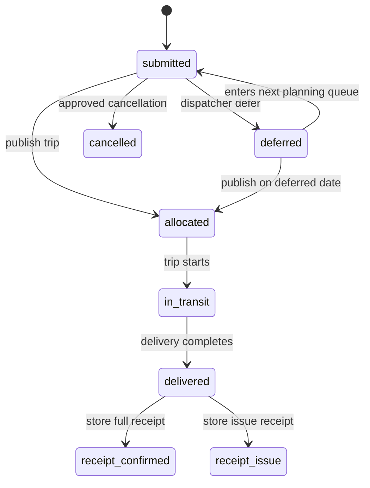

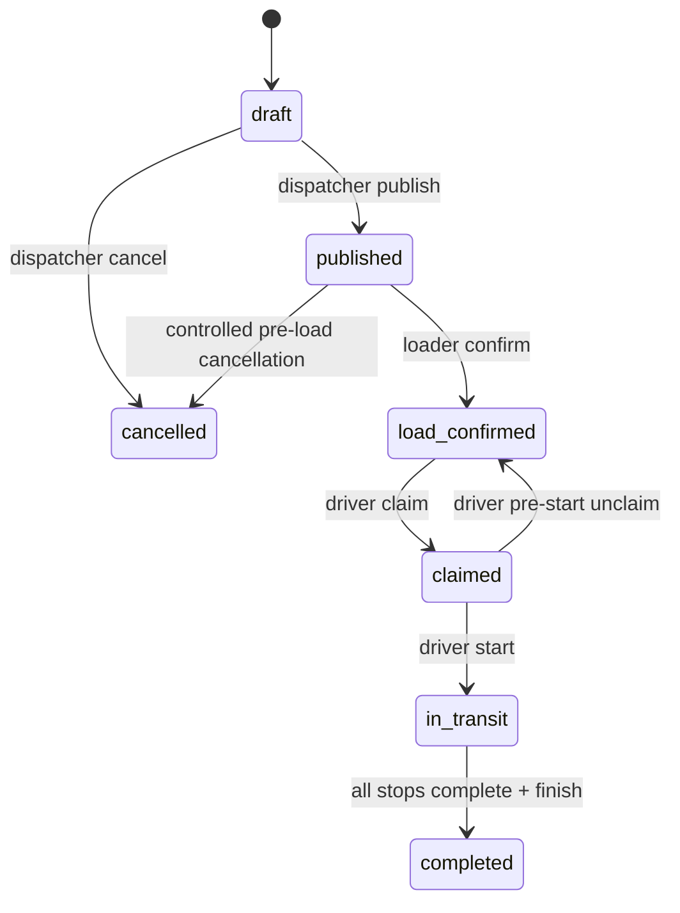

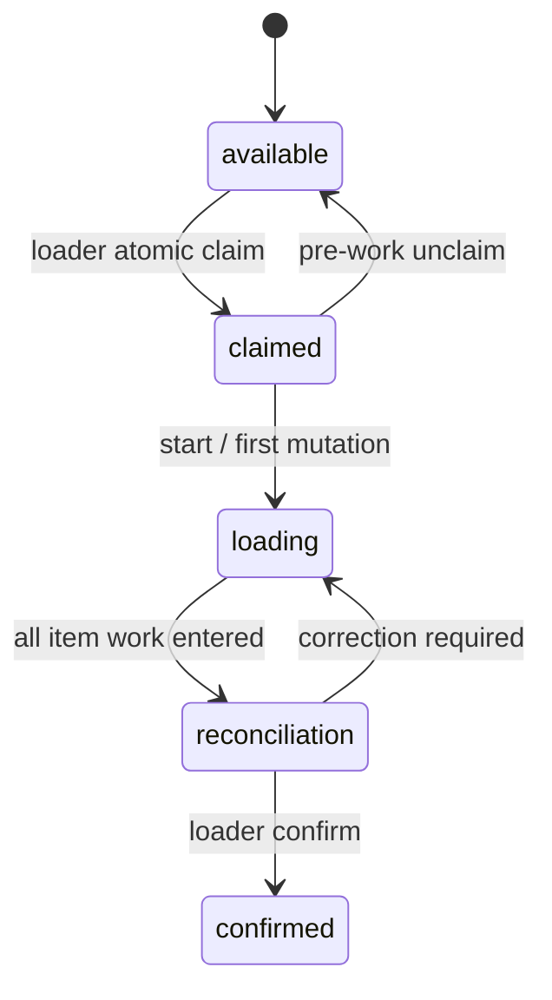

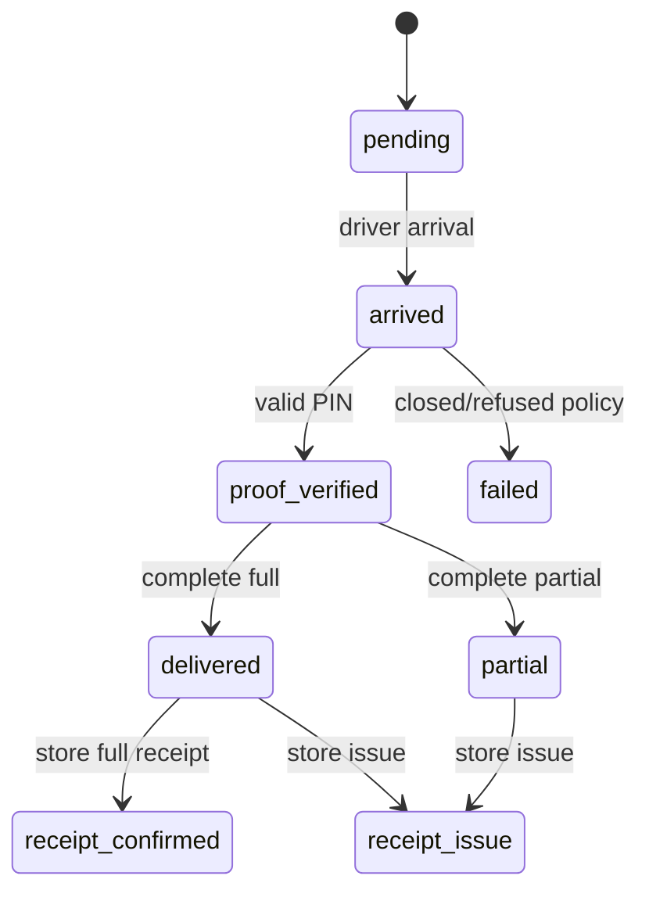

TripStop uses `pending -> arrived -> delivered|partial|failed|deferred`; it mirrors physical-visit progress but DeliveryRecord owns proof/item outcomes. It must not acquire independent statuses such as `ready_for_driver` without a contract change.

### 9.2 Transition catalogue

| Aggregate transition | Actor / command endpoint | Preconditions | Atomic database changes | Event / downstream | Offline? / conflict |
|---|---|---|---|---|---|
| Order create → submitted | Store `/orders` | own active outlet; valid products/date | insert Order + idempotency result + event | Planning queue | Online; duplicate key returns original |
| submitted → deferred | Dispatcher defer | unallocated; future operating day; version | Order deferral/history/event | Store dashboard; future queue | Online; 409 stale |
| deferred → submitted | System queue projection or explicit requeue command **UNVERIFIED** | deferredTo equals service date | Decide whether stored status changes or projection treats deferred as eligible | Planning | Must approve; avoid hidden cron |
| submitted/deferred → allocated | Dispatcher publish | valid current draft/rules; all orders free | transaction: Trip published, Order allocations, LoadRecord, histories/events | Loader/Store | Online; rollback all, 409 race |
| Trip published → load_confirmed | Loader confirm | claimed/reconciled/all accounted/version | transaction: LoadRecord confirmed + Trip state + event | Driver/monitor | Online sync; duplicate returns result |
| Load available → claimed | Loader claim | same depot/current version | atomic find-and-update | Loader ownership | Online-only; one winner |
| claimed → available | Loader unclaim | same owner/no mutations/start/version | atomic update + audit metadata/event | Other Loaders | Online-only; 409 after boundary |
| Trip load_confirmed → claimed | Driver claim | assigned/current/load confirmed | atomic update + Sync/bootstrap response | Driver local bootstrap | Online-only; one winner |
| claimed → in_transit | Driver start | vehicle/evidence/bootstrap/GPS policy/version | Trip state/history/event; validate FileAsset | monitor/Store | Direct or sync; idempotent mutation |
| Stop pending → arrived | Driver arrive | active assigned trip/ordered-stop policy | upsert DeliveryRecord + TripStop arrived + event | Store can issue PIN | Offline queue; duplicate returns existing |
| arrived → proof_verified | Driver verify PIN | active challenge/not expired/attempts | atomic challenge attempt + Delivery proof state/event | Driver complete enabled | Server authoritative; conflict/lock explicit |
| proof_verified → delivered/partial/failed | Driver complete | quantities accounted/version | transaction: Delivery + TripStop + related Orders + event | Store receipt/monitor | Offline replay; stale/cancel conflict preserved |
| Trip in_transit → completed | Driver finish | all stops terminal; end evidence; version | Trip completion/history/event | histories/monitor | Offline replay; duplicate safe |
| Delivery terminal → receipt_* | Store receipt | own outlet/no receipt/version/evidence ownership | Delivery receipt + Orders receipt state/read projection + event | Dispatcher issue feed | Online or queued draft only; duplicate safe |

**UNVERIFIED / NEEDS CONFIRMATION:** exact Order requeue state after deferral; cancellation authority after publish; failed/refused stop PIN requirement; whether one receipt applies to a consolidated stop or per order. Resolve in Gate 1 contract workshop.

---

## 10. Cross-role workflow map

### 10.1 End-to-end workflow

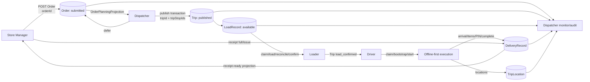

### 10.2 Workflow A — Store → Dispatcher

- Identity: Store creates `orderId`; Planning never replaces it.
- Boundary: `POST /orders` produces `OrderPlanningProjection`; `/planning/orders` consumes it.
- Persistence: Order owner validates outlet/catalogue/cutoff and stores immutable item snapshots/totals.
- Transition: submit; then Dispatcher either defers through Order port or allocates during Trip publish transaction.
- Integration test: authenticated manager creates order; another outlet cannot read it; Dispatcher sees exact same ID/totals; two publish attempts race and only one allocates it; deferral appears only on its next date.

### 10.3 Workflow B — Dispatcher → Loader

- Identity: `vehicleId` is physical fleet asset; `tripId` is the run; `loadRecordId` is the warehouse job.
- Boundary: publish transaction creates Trip/TripStops and one LoadRecord from immutable manifest snapshots.
- Claim: Loader's depot must match Trip depot; atomic CAS sets claimedBy/version.
- Integration test: publish valid trip; Load job appears at correct depot; two Loaders claim concurrently; exactly one succeeds; winner unclaims before work; cannot unclaim after first local/server loading mutation.

### 10.4 Workflow C — Loader → Driver

- Boundary: Loader confirm transaction changes LoadRecord to confirmed and Trip to load_confirmed; Driver bootstrap consumes `PublishedTripManifest + LoadConfirmationProjection`.
- Driver data: vehicle, ordered stop IDs, outlet/deadline snapshots, orders/items and final shortages/damage, versions, server time, relevant history.
- Cache: Driver must persist full bootstrap before start.
- Integration test: shortage changes Driver manifest; unconfirmed load is invisible/unclaimable to Driver; confirmed load is claimable; bootstrap survives offline reload.

### 10.5 Workflow D — Driver → Store Manager

- Delivery owner: Delivery module owns DeliveryRecord and PinChallenge; Store owns the receipt command interface, not the delivery persistence model.
- Boundary: arrival creates/activates DeliveryRecord; Store issues a PIN; Driver verifies and completes; Store receives a role-safe projection and submits receipt/evidence.
- Offline: arrival/items/completion may queue; authoritative PIN/receipt policy follows approval item 3.
- Integration test: wrong outlet cannot issue PIN; correct PIN expires/locks correctly; duplicate completion is idempotent; Store sees timing/items; issue receipt creates Dispatcher event.

### 10.6 Workflow E — Dispatcher monitoring

Monitor projection joins, without owning writes:

- Trip and TripStop state from Planning;
- Loader claim/status/exceptions from Loading;
- Driver DeliveryRecord, locations, tracking gaps and sync conflicts from Delivery;
- Store receipt issue from Delivery/Store command;
- deferral and order state from Store/Planning port;
- remarks/audit events from Operations.

The projection includes canonical IDs and last update timestamps. Polling returns honest `live`, `delayed`, `offline_unknown`, or `tracking_degraded`; it never invents live coordinates.

### 10.7 Integration sequence

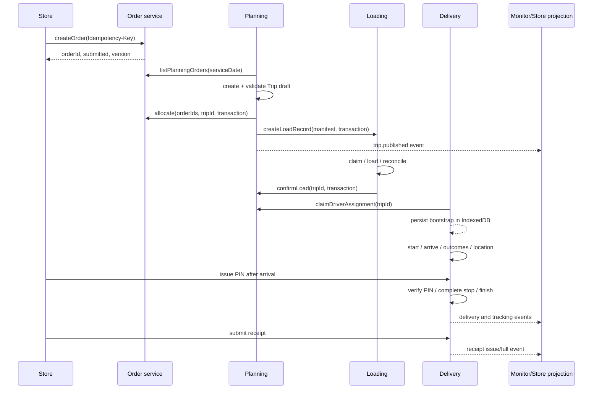

---

## 11. Parallel development strategy

### 11.1 Foundation phase: mandatory before branching

The four feature branches must not start until all items below are merged and tagged:

1. Current-state baseline and contract-decision log approved.
2. Target folder/module skeleton and one module plugin per owner.
3. App bootstrap/registration stable; module developers never edit `app/create-app.ts`.
4. Identity rules and branded ID transport types frozen.
5. Order/Trip/TripStop/LoadRecord/DeliveryRecord schemas, indexes, state enums, and cross-module ports frozen.
6. Migrations/index runner and schema migration ledger operational.
7. Deterministic reference/user/scenario seed and reset commands.
8. Auth handoff/JWT claims, generic guards, actor context, and resource-policy interface.
9. Standard errors, response envelope, pagination, ObjectId/date validators, request IDs/log redaction.
10. Idempotency/OCC/transaction helpers with reference tests.
11. Named request/response schemas, OpenAPI export, and contract changelog.
12. Mongo replica-set integration harness and isolated fixture namespaces.
13. Docker/environment baseline and root verification commands.
14. Event catalogue and audit-write convention.

This is not permission to perfect every module. It is the minimum stable platform that removes shared-file pressure.

### 11.2 Work lanes

| Module | Prerequisites | Files owned | Expected outputs | Required tests | Merge dependencies |
|---|---|---|---|---|---|
| Store | Foundation tag; Reference read port; Order schema/ports | `modules/store/**`, `tests/fixtures/store/**`, Store contract docs | order/dashboard/history; receipt command facade/projections; correct cutoff/outlet rules | Order policy/unit; outlet auth; create idempotency; Store→Planning integration | Merge early because Planning consumes order port |
| Dispatcher/Planning | Order planning contract; Vehicle/Calendar/User ports; transaction helper | `modules/planning/**`, planning fixtures/docs | draft/edit/validate/publish/defer; Trip ports; monitor sources | all constraints; publish rollback/race; deferral date; role scope | After Store contract, before Loading E2E |
| Loader | PublishedTripManifest; LoadRecord schema; transaction helper | `modules/loading/**`, loading fixtures/docs | list/claim/unclaim/start/items/exceptions/reconcile/confirm | claim race; unclaim boundary; accounting; confirm rollback | After publish contract; can code from fixtures in parallel |
| Driver/Delivery | Trip/Load projections; File auth port; offline mutation contract | `modules/delivery/**`, delivery fixtures/docs | assignment/bootstrap/start/GPS/stops/PIN/finish/sync/histories | claim race; proof; replay/dedupe/conflict; ownership | After manifest freeze; can code from contract fixtures |
| Integration | All published ports | `modules/operations/**`, `tests/e2e/**`, generated OpenAPI | monitoring/audit/remarks and full workflow proof | cross-role, authorization, offline, release smoke | Continuously merges module slices |

### 11.3 Vertical integration cadence

Do not wait for four “finished” branches. Merge thin compatible slices:

1. Order submit + planning read.
2. Publish transaction + Loader available job.
3. Loader confirm + Driver assignment/bootstrap.
4. Driver arrival/complete + Store delivery projection.
5. Store receipt + Dispatcher audit/monitor.
6. Offline replay through the same command handlers.

Each slice includes contract, database integration, and one cross-role assertion.

---

## 12. Git and branching strategy

### 12.1 Alternatives evaluated

| Alternative | Benefit | Problem | Decision |
|---|---|---|---|
| Four branches directly from `codex_2` | Fast start | Shared schemas/app/auth/contracts diverge immediately | Reject |
| One long `backend-foundation`, then four long branches | Stable starting point | Large late merges; integration branch unclear | Improve with reviewed base + short integration PRs |
| Trunk-based feature flags only | Lowest long-lived divergence | Requires disciplined CI and very small commits; team may need isolated work | Use principles, but retain short feature branches |
| Separate package/service per role | Strong file separation | Duplicates domain logic and creates distributed consistency | Reject |

### 12.2 Recommended graph

```mermaid
gitGraph
  commit id: "codex_2 f0b065b"
  branch foundation/backend-v1
  checkout foundation/backend-v1
  commit id: "module skeleton + contracts"
  commit id: "models + migrations + seed"
  commit id: "auth + test harness"
  branch integration/backend-base
  checkout integration/backend-base
  commit id: "reviewed backend-contract-v1"
  branch feature/store-backend
  checkout integration/backend-base
  branch feature/planning-backend
  checkout integration/backend-base
  branch feature/loading-backend
  checkout integration/backend-base
  branch feature/delivery-backend
  checkout integration/backend-base
  branch integration/backend-v1
  checkout integration/backend-v1
  merge feature/store-backend id: "store slice"
  merge feature/planning-backend id: "planning slice"
  merge feature/loading-backend id: "loading slice"
  merge feature/delivery-backend id: "delivery slice"
  commit id: "cross-role E2E"
```

Operational rules:

- `foundation/backend-v1` is owned by foundation/database/auth stewards and is short-lived.
- `integration/backend-base` is the reviewed immutable branching point; tag it `backend-contract-v1`.
- Feature branches are created only after Gate 3 and live days, not weeks.
- Developers rebase on `integration/backend-v1` at least daily and before every PR; never rewrite a branch after others base work on its published commit without coordination.
- Merge order follows dependencies: Store contract/slice → Planning → Loading → Delivery. Implementation can happen in parallel against fixtures.
- Integration owner resolves composition; domain owner resolves semantics. A Git integrator may not invent a new status to resolve a conflict.
- Contract changes land first in a dedicated `contract/<topic>` PR approved by every affected owner; then all branches rebase.

| Branch | Owner | Starts from | Allowed scope | Merge target / lifetime |
|---|---|---|---|---|
| `foundation/backend-v1` | Foundation/database/auth stewards | `codex_2@f0b065b` | shared foundation, boundaries, migrations, seed, contracts | `integration/backend-base`; short-lived |
| `integration/backend-base` | Integration owner | reviewed foundation head | review fixes and contract tag only | immutable base after `backend-contract-v1` |
| `feature/store-backend` | Store developer | contract tag | `modules/store`, owned tests/docs/seed fragment | frequent PRs to `integration/backend-v1` |
| `feature/planning-backend` | Dispatcher developer | contract tag | `modules/planning`, owned tests/docs/seed fragment | frequent PRs to integration |
| `feature/loading-backend` | Loader developer | contract tag | `modules/loading`, owned tests/docs/seed fragment | frequent PRs to integration |
| `feature/delivery-backend` | Driver developer | contract tag | `modules/delivery`, owned tests/docs/seed fragment | frequent PRs to integration |
| `contract/<topic>` | Contract steward + affected owners | current integration | one approved cross-module contract/migration change | merge first; all branches immediately rebase |
| `integration/backend-v1` | Integration owner | contract tag | accepted slices, operations projections, E2E fixes | release candidate; continuously green |

### 12.3 Shared-file protection

| Shared file/family | Owner | Parallel-change rule |
|---|---|---|
| `backend/package.json`, lockfile | Platform steward | Dependency request lands separately; all branches rebase before feature code uses it. |
| app/server registration | Foundation integrator | Frozen registry imports pre-created module entry points; feature developers only edit their module plugin. |
| common/config/db helpers | Foundation steward | Change proposal, tests, separate PR. |
| contract common/enums | Contract steward + affected owners | CODEOWNERS approval and changelog. |
| migration ledger | Database steward | Owners submit migration proposal; steward assigns sequence to prevent number collision. |
| root Compose/.env examples | Platform steward | Batch environment changes; no domain branch edits. |
| seed composer/manifest | Data steward | Module developers add fragments only. |
| OpenAPI artifact | CI generated | Never hand-edit. |
| global test harness | QA steward | Module tests consume it; no local forks. |

---

## 13. Merge-conflict and semantic-conflict prevention

### 13.1 Git conflict prevention

- CODEOWNERS maps every module and shared family to one owner/reviewer.
- One file contains one aggregate schema; no centralized hand-edited model mega-file.
- Pre-register module plugins before branching.
- Scenario and test fixtures are composable per-module files.
- Dependency additions are isolated platform commits.
- Generated OpenAPI/client artifacts are regenerated only on the integration branch/CI.
- PRs remain small and vertical; no drive-by formatting or renames.
- A feature branch does not refactor another owner's directory.

### 13.2 Semantic conflict prevention

Git can merge `load_confirmed` and `ready_for_driver` without complaint. Prevent this by:

1. One canonical state catalogue and transition table in `contracts`/domain owner.
2. Contract tests asserting exact enum values and legal transitions.
3. One state-transition command implementation per aggregate owner.
4. No raw `$set: {status}` outside owner repositories.
5. Architecture decision record for any new field/state/identity.
6. Consumer-driven contract fixtures for each cross-role DTO.
7. Compatibility CI: all module contract tests run on every PR.
8. Integration event catalogue with unique event semantics.
9. Database validator/index drift checks.
10. Daily cross-role smoke scenario, not only unit tests.

### 13.3 API/type policy

- DTO owner: endpoint-owning module; cross-role DTO changes require producer and all consumers.
- Domain type owner: aggregate module.
- Persistence type owner: module repository; never exported to frontend.
- API client types: generated from OpenAPI into each frontend or a generated workspace package.
- Errors/role/ID wrapper types: small foundation contract package.
- Intentional duplication is acceptable in UI view models; frontend must map DTO → view model rather than import Mongoose schema types.
- For the hackathon, do not introduce a publishable npm monorepo package unless generation proves simpler than per-app generated files.

---

## 14. Authentication and authorization foundation

### 14.1 Foundation-owned

- Argon2 password verification and normalized employee ID/email login.
- Origin-bound one-use handoff and atomic exchange.
- JWT issue/verify with configurable issuer, audience, TTL, `sub`, employeeId, role, optional outlet/depot claims, iat/exp/jti.
- Active-user lookup policy (at minimum on exchange and sensitive commands; preferred cached/rechecked middleware).
- Generic `requireRole`, `CurrentActor`, rate limits, redaction, CORS allowlist.
- Account lock fields/policy if enabled; do not partially implement silently.
- Auth/audit event catalogue.

### 14.2 Domain-owned authorization

| Role | Policy |
|---|---|
| Store Manager | Actor's current `outletId` must equal Order/Delivery outlet. Brand derives from Outlet. |
| Dispatcher | Broad planning reads/writes, but cannot bypass state, capacity, allocation, or version guards. |
| Loader | Actor depot equals LoadRecord/Trip depot; after claim, `claimedBy == actor.userId`. |
| Driver | `trip.driverId == actor.userId` and, after claim, `claimedByDriverId == actor.userId`; active state required. |
| File consumer | Related domain policy authorizes the asset's Trip/Delivery; role alone is insufficient. |

Frontend route guards are display logic only. Cross-origin handoff is authentication transport, not authorization. Passwords, JWTs, handoff codes, PINs, hashes, and private URLs never appear in logs/events.

---

## 15. Transactions, concurrency, OCC, and idempotency

| Scenario | Boundary and mechanism | Unique/index support | Retry result |
|---|---|---|---|
| Store order create | Idempotency record keyed by actor/operation/key; server payload hash | unique idempotency tuple; orderNumber | Return original response; reject different payload |
| Two Dispatchers allocate same Order | Transaction publishes Trip, allocates every Order with eligible filter, creates LoadRecord/event | active allocation query/index; unique load trip | One commit; loser 409; no partial allocation |
| Trip draft edit/validate/publish | Version/If-Match; state filter | Mongoose version; unique vehicle/date/routeIndex | Stale 409 with current version/link to refresh |
| Vehicle two-route rule | Publish transaction rechecks count and unique routeIndex | unique vehicle/date/routeIndex | 422 capacity/rule or 409 duplicate |
| Two Loaders claim | One `findOneAndUpdate` on available/version/depot | unique trip LoadRecord | One winner; loser 409 |
| Loader unclaim vs item mutation | Atomic state/owner/version/loadingStarted filter | version | Exactly one transition wins |
| Loader confirm | Transaction updates LoadRecord + Trip + event | versions | Duplicate idempotency returns existing confirmed result |
| Two Drivers claim/start | Atomic assignment/version/state; start idempotency | Trip version, mutation receipt | One winner; duplicate safe |
| Stop arrival/completion | Mutation UUID + OCC; transaction updates Delivery/TripStop/Order/events | unique trip/stop Delivery; unique sync receipt | applied/duplicate/conflict |
| GPS replay | Append with point UUID, unordered batch | unique pointId | duplicates counted, not errors |
| PIN attempts/rotation | Atomic challenge version/attempt increment/active partial unique | one active challenge per Delivery | Wrong attempt persists; expired/locked explicit |
| Store receipt | Idempotency + Delivery version + receipt absent guard; event transaction | receipt uniqueness embedded/partial index if separate | duplicate returns original; changed payload rejected |
| File complete | Idempotent provider/publicId after provider verification | unique provider/publicId | return existing owned asset |
| Offline batch | Unique actor/clientMutationId + payload hash; causal order; same online handlers | unique sync receipt | per-item applied/duplicate/conflict/rejected |

Transactions require Mongo replica set locally and in production. Never catch a transaction error and manually apply remaining writes. Race tests must use truly concurrent promises/clients, then assert database invariants.

---

## 16. Offline architecture

### 16.1 Canonical flow

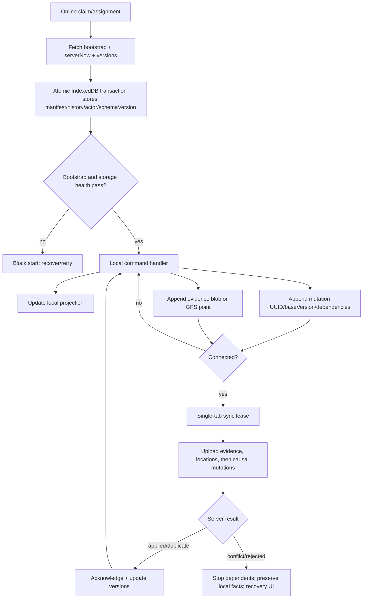

### 16.2 Device stores

Driver IndexedDB: actor/device metadata; bootstrap manifest; orders/stops/products; Load confirmation snapshot; Trip/Delivery local projections; histories needed offline; mutation queue; location queue; evidence blobs/upload receipts; sync receipts/conflicts; cache/schema version and server-clock offset.

Loader IndexedDB after online claim: claimed job/manifest; item accounting; exceptions; versions; mutation queue; sync outcomes. Claim/unclaim remain online because global ownership requires atomic server authority.

Store Manager: drafts and stale-labelled safe GET projections may be cached; order and receipt submissions require authoritative validation or an explicit queued-draft state, never fake success.

### 16.3 Mutation contract and conflict rules

Every mutation contains `clientMutationId`, deviceId, entity type/ID, named operation, baseVersion, clientRecordedAt, queuedAt, payload, dependency IDs, retry count, and schema version. Server derives actor/role from JWT.

- Process in causal order; independent locations may batch separately.
- Exponential backoff with jitter only for transient network/5xx/429; never retry 4xx conflicts blindly.
- Duplicate ID + same hash returns original result; same ID + different hash is rejected/security logged.
- Preserve device time and server received/applied time.
- A physical delivered fact with valid proof is never silently discarded by a later deferral/cancel; expose conflict for Dispatcher review.
- Stale ordinary checklist updates after cancellation are rejected with current server projection.
- Evidence blobs upload before commands that reference FileAsset IDs.
- App restart restores queues. Service worker Background Sync is enhancement only; foreground/manual sync is mandatory.
- Logout/update warns when pending work exists; synchronized sensitive cache is scoped and cleared according to retention policy.
- GPS gaps are explicit. Browser suspension cannot be described as continuous live tracking.

**Offline PIN:** unresolved approval item. Recommended hackathon-safe default is online server verification at proof time. If queued PIN is approved, encrypt locally with Web Crypto, never log/display it, and delete after terminal receipt; completion remains locally pending, not verified, until server acknowledgment.

---

## 17. Testing strategy

### 17.1 Layers

| Layer | Scope | Examples | Runtime |
|---|---|---|---|
| Unit | Pure domain policies/state machines/mappers | cutoff/window, constraints, legal transitions, quantities, retry ordering, policy decisions | Vitest, no DB |
| Module integration | Routes + services + real repository | auth ownership, CRUD/state command, projection | Disposable replica-set DB |
| Database | Indexes, validators, migration/seed, transactions | unique keys, TTL, rollback, repeated seed | Real Mongo 8 replica set |
| Concurrency | Simultaneous clients | publish same Order, claim same load/trip, receipt replay, PIN attempts | Real Mongo; barriers/promises |
| Contract | Named schemas/OpenAPI and consumer fixtures | success/errors/version/page/enum compatibility | CI schema validation |
| Browser E2E | Five origins and real API | login handoff and complete workflow | Playwright + Compose/test stack |
| Offline/PWA | Reload/network loss/storage upgrade | Driver bootstrap/replay, Loader recovery, service-worker update | Playwright browser contexts |
| Security/resilience | Abuse/failure | role matrix, CORS, NoSQL input, body limits, log redaction, provider auth | API + log assertions |

### 17.2 Minimum E2E

1. Store login/handoff, live cutoff, order create/history.
2. Dispatcher sees same ID, demonstrates one failed rule, allocates one and defers one.
3. Loader double-claim race, pre-work unclaim, reclaim, shortage, reconcile, confirm.
4. Driver claim/vehicle attestation/bootstrap, then network offline and reload.
5. Driver records GPS/arrival/items offline; reconnects; mutations apply once.
6. Store issues PIN under approved policy; Driver completes; uploads meter evidence; finishes.
7. Store submits issue receipt; Store/Driver histories and Dispatcher monitor/audit show the linked result.

Negative cases: wrong role/outlet/depot/assignment, invalid/non-operating dates, capacity/temperature/access/fuel/third vehicle route, Driver overlap, stale versions, publish rollback, wrong/expired/locked PIN, duplicate mutation, missing/foreign file, tracking gap, service-worker schema upgrade with pending work.

### 17.3 Local and CI commands target

```text
npm run bootstrap
npm run data:preflight
npm run db:test:up
npm run db:migrate:test
npm run test:unit
npm run test:integration
npm run test:contract
npm run build
npm run test:e2e:smoke
```

PR gates: install from lockfiles; preflight; typecheck; unit; module integration; migration/index drift; OpenAPI compatibility; builds; Compose config; selected E2E. Full offline/race/security suites run on integration and release candidates.

---

## 18. Local Docker/database environment

### 18.1 Standard setup

```text
git clone
  -> checkout approved branch
  -> npm run bootstrap
  -> copy .env.example to .env
  -> npm run data:preflight
  -> docker compose up --build
  -> Mongo replica set healthy
  -> migrations complete
  -> deterministic seed manifest complete
  -> API /health/ready 200
  -> five frontends healthy
```

Services/ports remain: API 3000, Login 5173, Dispatcher 5174, Loader 5175, Driver 5176, Store 5177, Mongo 27017. Transactions require the existing single-node `rs0` replica set. Add a Compose `test` profile with isolated volume/database name and no production-like frontend dependency.

Environment foundation must validate: Mongo URI/database, JWT secret/issuer/audience/TTL, exact origins, handoff TTL, reference/product paths, seed scenario/password, location intervals, file provider/limits, log level, and environment. Keep frontend `VITE_*` values build-time and secrets server-only.

Reset safeguards:

- refuse URI/database names not ending `_dev` or `_test` unless an explicit allowlisted override exists;
- print resolved target and require `--confirm <dbName>`;
- never drop a broad server/root path or production database;
- seed is idempotent, but reset is the only accepted way to remove operational scenario drift.

---

## 19. Observability and debugging

### 19.1 Structured fields

Every request log: timestamp, level, service/version/environment, requestId, route template, method/status/duration, actor userId/role (after auth), safe error code.

Every domain transition event: eventId, requestId, clientMutationId if any, actor ID/role, aggregate type/ID, parent IDs (`orderId`, `tripId`, `tripStopId`, `loadRecordId`, `deliveryRecordId` as applicable), from/to state, reasonCode, serviceDate, createdAt.

Never log request bodies globally. Redact tokens, passwords, email/phone, handoff codes, PIN, hashes, private asset URLs, and image data.

### 19.2 Trace procedure

Given an `orderId`:

```text
Order.statusHistory / events
  -> allocation.tripId + tripStopId
  -> Trip history + constraint results
  -> LoadRecord(tripId) claim/exceptions/confirmation
  -> DeliveryRecord(tripId, tripStopId) proof/outcome/receipt
  -> TripLocations(tripId) and FileAssets(domain IDs)
  -> requestId/clientMutationId for originating logs
```

Provide an internal Dispatcher/support trace query or documented Mongo script; do not add a public debug endpoint. Transaction logs record transaction name/attempt/outcome and IDs, not sensitive payloads.

---

## 20. Phased implementation roadmap

### Phase 0 — Repository/current-state audit

- **Objective:** approve what exists, what is target, and what is unverified.
- **Deliverables:** route/model/index/seed/frontend-bridge inventory; this plan; decision log; baseline commands/results; contract gap list.
- **Dependencies:** `codex_2` clean baseline.
- **Files/owner:** docs only; architect/integration owner.
- **Parallel/blocking:** repository reading may parallelize; no feature implementation starts.
- **Tests/evidence:** record commit SHA, clean tree, route/model/test counts, current build/test/Compose evidence.
- **Acceptance/exit:** architecture revision and unresolved questions approved; no implementation claim based only on file presence.
- **Risk:** stale architecture/status documents; mitigate by repository evidence and `UNVERIFIED` labels.

### Phase 1 — Backend foundation

- **Objective:** create stable composition and low-conflict module boundaries.
- **Deliverables:** target folder skeleton; module entry plugins; generic errors/envelopes/validation/request IDs; transaction/idempotency/OCC helpers; dependency policy; CODEOWNERS.
- **Dependencies:** Phase 0 decisions.
- **Files/owner:** `src/app`, `config`, `common`, `contracts`, module skeletons; foundation steward.
- **Parallelizable:** logging, error schemas, module skeleton, test harness can divide; app composition is single-owner.
- **Blocking:** identity/state/contract naming.
- **Tests:** foundation HTTP, error envelope, validation, dependency-boundary lint/tests.
- **Acceptance/exit:** modules register without developers editing app; static checks/build pass; shared files assigned/frozen.
- **Risk:** a large refactor breaks existing routes; preserve endpoint behavior with characterization tests.

### Phase 2 — Database architecture and deterministic seed

- **Objective:** make schema/index/data reproducible and cross-role identities stable.
- **Deliverables:** split owned schemas; stable TripStop; multi-order stops; versioned migrations/indexes; schema ledger; reference/user/scenario seed; guarded reset; manifest hash.
- **Dependencies:** identity and state freeze from Phase 1.
- **Files/owner:** `src/db`, module persistence, `database/seed`; database/data steward with aggregate owners.
- **Parallelizable:** reference import and per-module scenario fragments; migration sequence is single-owner.
- **Blocking:** CSC source approval and consolidated-stop decision.
- **Tests:** fresh/repeated migration/seed, index/validator checks, reference checksum/counts, scenario assertions.
- **Acceptance/exit:** fresh replica set reaches identical manifest; reset recreates exact scenario; no dump dependency.
- **Risk:** destructive index/schema migration; rehearse against disposable DB and document rollback.

### Phase 3 — Authentication/authorization foundation

- **Objective:** freeze actor identity and policy boundaries.
- **Deliverables:** auth module boundary; JWT/handoff claims; active-user policy; resource authorization interfaces; exact CORS; audit/redaction; role matrix tests.
- **Dependencies:** User/Outlet identity and database harness.
- **Files/owner:** `modules/auth`, `common/auth`, policy ports; auth steward/domain owners.
- **Parallelizable:** generic auth and each module's policy tests.
- **Blocking:** token lifetime/session decision; unique email migration.
- **Tests:** handoff origin/expiry/replay, disabled user, every role/resource allow/deny, hostile CORS.
- **Acceptance/exit:** every protected route family has policy coverage; no domain authorization hidden in UI.
- **Risk:** role-only access leaks records; deny by default and require relation queries.

### Phase 4 — API contract freeze

- **Objective:** give all four developers stable commands, projections, errors, and events.
- **Deliverables:** named schemas; cross-role DTO fixtures; endpoint catalogue; OpenAPI export; transition/event catalogue; compatibility CI; contract tag.
- **Dependencies:** Phases 1–3.
- **Files/owner:** `contracts`, each module HTTP schemas, generated OpenAPI; contract steward + all owners.
- **Parallelizable:** module schemas drafted in parallel; cross-role review is blocking.
- **Blocking:** five approval questions in section 8.4.
- **Tests:** schema validation, representative success/error snapshots, consumer fixture tests.
- **Acceptance/exit:** `backend-contract-v1` tagged; feature branches created from exact base.
- **Risk:** over-freezing implementation details; freeze only public semantics and invariants.

### Phase 5 — Store module

- **Objective:** own Store order and receipt-facing behavior without reaching other repositories.
- **Deliverables:** Order aggregate/service/repository; context/dashboard/history; catalogue binding; cutoff/date rules; receipt facade/projections; events.
- **Dependencies:** Foundation/DB/Auth/Contracts; Reference ports.
- **Files/owner:** `modules/store/**`; Store developer.
- **Parallelizable:** command and query paths; frontend connection may proceed from generated contract.
- **Blocking:** Order planning projection required by Phase 6.
- **Tests:** create/idempotency/totals/cutoff/outlet ownership/history and Store→Planning contract.
- **Acceptance/exit:** real order survives refresh and is visible under same ID to Planning; no mock fallback in critical path.
- **Risk:** Store directly mutates Delivery; enforce Delivery receipt command port.

### Phase 6 — Dispatcher/planning module

- **Objective:** own Trip planning, hard constraints, allocation, and deferral.
- **Deliverables:** Trip aggregate/repository; constraint services; draft/edit/validate/publish transaction; deferral commands; trip reads; monitor source.
- **Dependencies:** Order contract, Vehicle/Calendar/User ports, migration/transaction helper.
- **Files/owner:** `modules/planning/**`; Dispatcher developer.
- **Parallelizable:** pure constraints and HTTP/query projections.
- **Blocking:** published manifest/load-creation port for Loader.
- **Tests:** every rule boundary; publish rollback/race; vehicle route unique index; deferral date; Driver overlap.
- **Acceptance/exit:** valid publish atomically allocates and creates LoadRecord; invalid publish changes nothing; rule results explain failure.
- **Risk:** calculations duplicated in UI; server remains authoritative.

### Phase 7 — Loader module

- **Objective:** own LoadRecord claim/accounting/reconciliation/confirmation.
- **Deliverables:** atomic claim/unclaim, item and typed exception commands, reconcile, confirm transaction, read projections, local-sync contract.
- **Dependencies:** PublishedTripManifest and LoadRecord creation contract.
- **Files/owner:** `modules/loading/**`; Loader developer.
- **Parallelizable:** can develop against frozen manifest fixtures while Planning implementation completes.
- **Blocking:** confirmation projection needed by Driver.
- **Tests:** claim race, wrong depot/owner, no-unclaim boundary, stale version, accounting invariants, confirm rollback.
- **Acceptance/exit:** exactly one claimant; confirmed load and Trip transition together; Driver sees final load snapshot.
- **Risk:** local UI says confirmed before server transaction; distinguish pending sync from confirmed.

### Phase 8 — Driver/delivery module

- **Objective:** own assignment, executable bootstrap, delivery proof, GPS, histories, and sync.
- **Deliverables:** claim/unclaim/vehicle attestation; bootstrap; start/arrive/items/PIN/complete/finish; DeliveryRecord/PinChallenge; locations; files authorization ports; history; sync handlers.
- **Dependencies:** Trip and Load confirmation projections; offline contract; FileAsset port.
- **Files/owner:** `modules/delivery/**`; Driver developer.
- **Parallelizable:** online commands, GPS ingestion, and sync orchestration after contract freeze.
- **Blocking:** offline policy/PIN approval; receipt projection for Store.
- **Tests:** assignment and file ownership, PIN expiry/attempts, item accounting, stop/Trip transactions, dedupe/conflict, location point dedupe.
- **Acceptance/exit:** online Driver path works entirely on canonical IDs and downstream Store/monitor sees it.
- **Risk:** separate online/offline business logic; both must call the same application command handlers.

### Phase 9 — Cross-role integration

- **Objective:** merge thin vertical slices and build shared projections.
- **Deliverables:** operations monitor/audit/remarks; full workflow fixtures; integration E2E; compatibility fixes through formal change process.
- **Dependencies:** usable slices from Phases 5–8.
- **Files/owner:** `modules/operations`, `tests/e2e`; integration owner with domain owners.
- **Parallelizable:** read projections and browser automation; semantic fixes remain owner-led.
- **Blocking:** any contract/state mismatch.
- **Tests:** Store→Planning, Planning→Loading, Loading→Delivery, Delivery→Store, monitoring trace.
- **Acceptance/exit:** online full path passes twice from reset with no direct DB edits/sample data.
- **Risk:** late big-bang integration; merge slices continuously.

### Phase 10 — Offline/recovery integration

- **Objective:** connect durable device queues to canonical server transitions.
- **Deliverables:** Driver/Loader IndexedDB schemas/migrations; bootstrap restore; causal sync; evidence/GPS ordering; conflict UI/contracts; service-worker upgrade safeguards.
- **Dependencies:** stable online command services and sync contract.
- **Files/owner:** Delivery/Loading backend plus respective frontend storage; Driver/Loader developers, reviewed by integration owner.
- **Parallelizable:** device stores and server sync handlers against fixtures.
- **Blocking:** offline PIN decision and evidence provider testing.
- **Tests:** offline reload, duplicate replay, interrupted batch, stale conflict, pending update/logout, GPS gap.
- **Acceptance/exit:** Driver completes agreed segment offline and syncs exactly once; Loader refresh restores pending work honestly.
- **Risk:** PWA claims beyond browser capability; document and surface tracking degradation.

### Phase 11 — E2E, security, and release-quality testing

- **Objective:** promote claims from CODE/CONNECTED to RUNTIME/E2E.
- **Deliverables:** full unit/integration/contract/race/Playwright/offline/security suites; CI gates; defect evidence.
- **Dependencies:** integrated online/offline slices.
- **Files/owner:** `tests/**`, CI; QA/integration owner with module test ownership.
- **Parallelizable:** test families across modules.
- **Blocking:** stable test environment and seed.
- **Tests:** section 17 complete matrix.
- **Acceptance/exit:** all P0 suites pass on one commit; no quarantined critical tests.
- **Risk:** flaky multi-origin/offline tests; deterministic time/data and explicit readiness waits.

### Phase 12 — Deployment/release verification

- **Objective:** deploy the same verified artifacts and rehearse recovery.
- **Deliverables:** production config; migrations/seed report; API/frontends; health/CORS/handoff smoke; backups/rollback; two rehearsals; known limitations.
- **Dependencies:** Gate 7 E2E candidate.
- **Files/owner:** deployment/runbooks/environment templates; platform/release owner.
- **Parallelizable:** documentation and monitoring setup; deployment order remains serial.
- **Blocking:** official CSC, Atlas/Cloudinary/HTTPS origins/secrets.
- **Tests:** hosted online/offline smoke, fresh Compose judge run, rollback rehearsal.
- **Acceptance/exit:** two complete rehearsals from reset; deployed SHA and seed manifest recorded.
- **Risk:** environment drift; immutable builds and exact environment validation.

---

## 21. Dependency graph

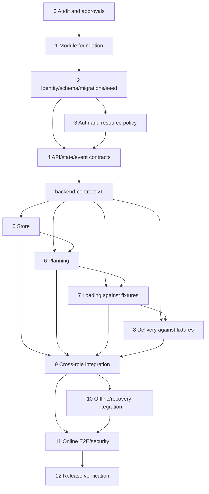

Can run in parallel after the contract tag: Store queries/commands; Planning pure constraint engine; Loader against PublishedTrip fixtures; Driver IndexedDB and command handlers against bootstrap fixtures; QA builds contract/race harnesses. Cannot parallelize safely: identity/schema freeze, migration numbering, cross-role DTO decisions, app registry, or contract-breaking changes.

---

## 22. Definition of Done

| Scope | Minimum evidence | Definition of Done |
|---|---|---|
| Foundation | RUNTIME | Clean build/tests; module registry stable; shared files owned; replica-set harness and deterministic app startup work. |
| Store | E2E for Store→Dispatcher | Authorized real catalogue/order/receipt data; persisted refresh; idempotency/cutoff/outlet tests; Planning sees exact Order. |
| Dispatcher | E2E for publish/defer→Loader | Every hard rule tested; publish atomic/race-safe; deferral visible on correct date; Load job created. |
| Loader | E2E for confirm→Driver | Claim race one winner; unclaim boundary; accounting/reconcile; transactional confirm; local refresh recovery at approved scope. |
| Driver | E2E | Assignment/bootstrap persisted; GPS/proof/items/finish; ownership; histories; agreed offline segment replays once. |
| Integration | E2E | One reset scenario traverses all roles; monitor/audit/remarks link canonical IDs; no direct DB fix. |
| Offline | E2E | Reload/network loss/interrupted sync/duplicate/conflict and update/logout protection pass; limitations explicit. |
| E2E suite | E2E | Positive judge path plus negative authorization/race/PIN/file/date/capacity cases pass deterministically. |
| Production | E2E hosted + fresh Compose | Exact artifacts deployed, health/CORS/secrets/migrations verified, backup/rollback documented, two rehearsals pass. |

Code presence is only CODE. A frontend calling an endpoint is CONNECTED. A route passing against real Mongo is RUNTIME. Only the complete producer→consumer assertion is E2E.

---

## 23. Integration and release gates

| Gate | Required proof | Blocks |
|---|---|---|
| G0 Baseline known | Clean `codex_2` SHA, audit inventory, architecture revision confirmed | Foundation changes |
| G1 Decisions approved | Identity, states, consolidated stops, PIN/offline/deferral/vehicle policies approved | Schema/contracts |
| G2 Foundation stable | Module skeleton, shared primitives, ownership/CODEOWNERS, unit/build green | Parallel branching |
| G3 Database reproducible | Fresh/reset migration + reference/user/scenario seed hash; replica-set tests | Operational modules |
| G4 Contract v1 frozen | Named schemas/OpenAPI/ports/events/state tests; tag created | Four feature branches |
| G5 Module runtime | Each module authorization/domain/integration/concurrency tests pass | Cross-role merge |
| G6 Online integration | Full online four-role path passes twice | Offline/release work |
| G7 Offline/recovery | Driver and Loader approved recovery/replay cases pass | Release candidate |
| G8 Complete E2E/security | Positive/negative/race/file/PIN/contract suites pass | Deployment |
| G9 Release environment | Fresh Compose and hosted stacks healthy; official inputs/secrets/origins | Demo freeze |
| G10 Demo freeze | Two reset rehearsals, rollback/backup, deployed SHA/manifest | Production declaration |

No gate is waived by screenshots or manual database edits.

---

## 24. Risk register

| Risk | Probability | Impact | Prevention | Detection | Mitigation | Owner |
|---|---|---|---|---|---|---|
| Git conflicts in central files | High without restructure | High | module ownership, frozen registry, split models | PR conflict/churn | integrate foundation first; small PRs | Integration |
| Semantic state divergence | High | Critical | canonical state machine/commands | contract/state tests | contract PR + rebase all branches | Contract steward |
| Schema drift | High | Critical | migrations/index exports/validators | CI drift test | forward migration and scenario rebuild | DB steward |
| API contract drift | High | High | named schemas/OpenAPI fixtures | breaking-change CI | compatibility adapter/version | Contract steward |
| Shared-type drift | Medium | High | generated transport types | compile/fixture failures | regenerate after approved contract | Contract steward |
| Duplicated business logic | High | High | aggregate owner command ports | architecture lint/review | move rule to owner; deprecate duplicate | Domain owners |
| Identity confusion vehicle vs run | High | Critical | frozen ID table and DTO names | tests/log traces | reject ambiguous fields; migration | Planning |
| Stop identity collision | High in current code | High | embedded stable ObjectId | unique/composite tests | foundation migration before branching | Planning |
| Double order allocation | Medium | Critical | transaction + eligible filter | publish race test | rollback/409/replan | Planning |
| Double Loader/Driver claim | Medium | High | atomic CAS/version | concurrent claim test | loser refresh/retry | Loading/Delivery |
| Duplicate offline mutation | High | Critical | mutation UUID + hash/receipt | replay tests | return original; reject payload mismatch | Delivery |
| Offline causal conflict | High | High | dependency ordering/base versions | interrupted/stale tests | preserve conflict and block dependents | Delivery |
| Stale frontend projection | High | Medium | versions/timestamps/poll refresh | E2E stale tests | explicit refresh/conflict UI | Each frontend owner |
| Prototype data on judge path | High currently | Critical | live-mode assertions/flags off | E2E record provenance checks | remove/hide affected route | Integration |
| Timezone/date inconsistency | Medium | High | Asia/Colombo server policy/fixed serviceDate in test | boundary tests | one time module; no device authority | Foundation |
| Different seed datasets | High | High | checksums/manifest/scenario version | startup manifest comparison | reset and reseed | Data steward |
| Local vs production Mongo behavior | Medium | Critical | both replica sets; same Mongo major | transaction/index smoke | block deploy/change tier/config | Platform |
| Dump treated as schema | Medium | High | scripts canonical | missing migration/index audit | discard dump/recreate by scripts | DB steward |
| File ownership leak | Medium | Critical | domain authorization port | matrix tests | revoke URLs/assets; security fix | Files |
| PIN leakage/weak lifecycle | Medium | Critical | hashed challenges/redaction/attempts | security/log tests | revoke/rotate; incident audit | Delivery |
| Official CSC unavailable | High | High | explicit provenance/preflight | seed source report | approved demo label; block production claim | Data/Product owner |
| Insufficient E2E coverage | High | Critical | gates and dedicated owner | evidence matrix | scope-cut polish, not workflow proof | QA |
| Dependency/lock conflicts | Medium | Medium | platform-only dependency PRs | lockfile conflict | land dependency first/rebase | Platform |
| Big-bang integration | Medium | Critical | thin vertical slices/daily integration | branch age/dashboard | pause features, integrate slice | Integration |
| Browser background GPS limits | High | High | honest PWA constraints/gap state | device/offline tests | keep app open; degrade/record gap | Delivery |

---

## 25. Change-management process after foundation freeze

When a developer discovers “Trip needs a new field/state/endpoint”:

1. Open a contract-change proposal describing requirement evidence, owner, classification `[A/B/C]`, affected schemas/DTOs/states/indexes/seeds/tests/consumers, compatibility, migration, rollback, and urgency.
2. Aggregate owner decides whether the need belongs in Trip or is a projection/local detail.
3. Contract steward lists every producer/consumer; all affected owners approve breaking semantics.
4. Database steward assigns a migration number and verifies index/data impact.
5. Update canonical domain/state/ID documentation and named API schemas first.
6. Add failing compatibility/migration/contract tests.
7. Implement schema/service/seed/scenario changes in a dedicated `contract/<topic>` branch.
8. Generate OpenAPI/types and update consumer fixtures.
9. Merge to integration, publish a contract changelog entry/version, and notify owners.
10. Affected feature branches rebase immediately and remove temporary adapters by the stated deadline.
11. Run cross-role slice tests before resuming unrelated merges.

Emergency fixes may shorten review time but not skip owner, migration, or compatibility analysis. No developer edits the shared enum/model directly in a feature PR as a “small fix.”

---

## 26. Final recommended development sequence

1. Team confirms the architecture file revision and resolves the five policy questions.
2. Create `foundation/backend-v1` from `codex_2@f0b065b`.
3. Add characterization tests around current routes before moving code.
4. Establish module skeleton, ownership, registration, common primitives, and test harness.
5. Freeze IDs, aggregate schemas/indexes, state machines, event catalogue, and ports.
6. Add migrations, deterministic scenario/reset, and prove the Mongo replica-set environment.
7. Complete auth/resource-policy foundation.
8. Freeze named API schemas/OpenAPI/cross-role fixtures and tag `backend-contract-v1`.
9. Create four owned branches from the exact tag.
10. Develop in parallel against contracts, merging thin slices in dependency order: Store → Planning → Loading → Delivery.
11. Build Operations projections and online E2E continuously.
12. Add offline sync by reusing the proven online command services.
13. Pass race, authorization, contract, browser, offline, and security gates.
14. Deploy immutable artifacts, run fresh Compose and hosted rehearsals twice, then freeze.

Practical scope cuts: animations, advanced optimization, quota editing, server PDF, and secondary dashboards. Never cut authentication/ownership, canonical identities, publish/claim safety, proof/receipt integrity, critical offline persistence promised in the demo, or E2E evidence.

---

## 27. Unresolved questions and assumptions requiring team approval

1. Confirm that `SYSTEM_REQUIREMENTS_AND_ARCHITECTURE.md` is the intended `(2)` source revision.
2. Approve current string business-key convention for `outletId`/`vehicleId`, versus migrating those relationships to ObjectId references.
3. Approve stable embedded ObjectId `tripStopId` and multiple `orderIds[]` per stop.
4. Approve partial per-order batch-deferral semantics or require all-or-none transaction.
5. Approve Driver vehicle attestation-only behavior; a different vehicle requires Dispatcher replanning/revalidation.
6. Decide offline PIN policy.
7. Decide whether Loader `start-loading` and item work may queue offline after online claim.
8. Decide failed/refused delivery proof requirements and exact receipt scope for consolidated stops.
9. Supply/approve official CSC product extract and planning attributes; current four products remain demo-only.
10. Confirm Store/Driver token session TTL (architecture says two hours; current default is eight hours).
11. Approve separate `pin_challenges` collection or equivalent embedded design.
12. Confirm cancellation/reassignment authority and transitions after publish/start.

Until approved, these remain `UNVERIFIED / NEEDS CONFIRMATION`; developers must not independently choose different answers.

---

## 28. Final self-review

| Check | Result |
|---|---|
| Every major architecture requirement has an owner | Yes; module/foundation/integration matrices assign ownership. |
| Every canonical entity has an owner | Yes; section 4. |
| Every cross-role workflow has an API boundary | Yes; sections 8 and 10. |
| Every important transition has an owner | Yes; section 9. |
| Four developers can avoid constant shared-file edits | Yes, after foundation split/registry/contracts are merged. |
| Shared files are minimized | Yes; common/contracts/app/migrations have stewards and change procedures. |
| Database is reproducible fresh | Planned with migrations, seed manifest, reset, replica set; runtime proof is a gate. |
| Indexes/constraints are reproducible | Planned as owned exports + versioned migrations/drift checks. |
| API contracts freeze first | Yes; Gate G4/tag precedes branching. |
| Semantic conflicts addressed | Yes; canonical commands, state/event catalogues, compatibility tests. |
| Loader/Driver identities unambiguous | Yes; Trip, LoadRecord, TripStop, DeliveryRecord separated. |
| Offline mutations are canonical | Yes; same command handlers and explicit receipts/conflicts. |
| Concurrency/races addressed | Yes; section 15 and mandatory race tests. |
| Complete four-role workflow testable | Yes; section 17 E2E. |
| System can reset to known state | Yes; guarded reset and deterministic scenario. |
| New developer can reproduce environment | Yes as target; G3/G9 require proof. |
| Production assumptions separated | Yes; official CSC/Cloudinary/Atlas/origins remain explicit gates. |
| Prototype/mock fallback prevented | Yes; live-mode E2E provenance and Gate G6 requirement. |
| Dependencies represented | Yes; section 21 graph and phase dependencies. |
| Plan is actionable without redesign | Yes after the listed team approvals; unresolved choices are explicitly isolated before implementation. |

---

## 29. Planning-branch completion record

- Branch created from clean `codex_2`: `backend-parallel-development-plan`.
- Base commit: `f0b065b921fcbcc2c8ba0ded5d913ed79295e020`.
- Only this planning document is intended to change on the branch.
- No application logic, schemas, routes, Docker configuration, seed implementation, or frontend code is modified by this plan.
