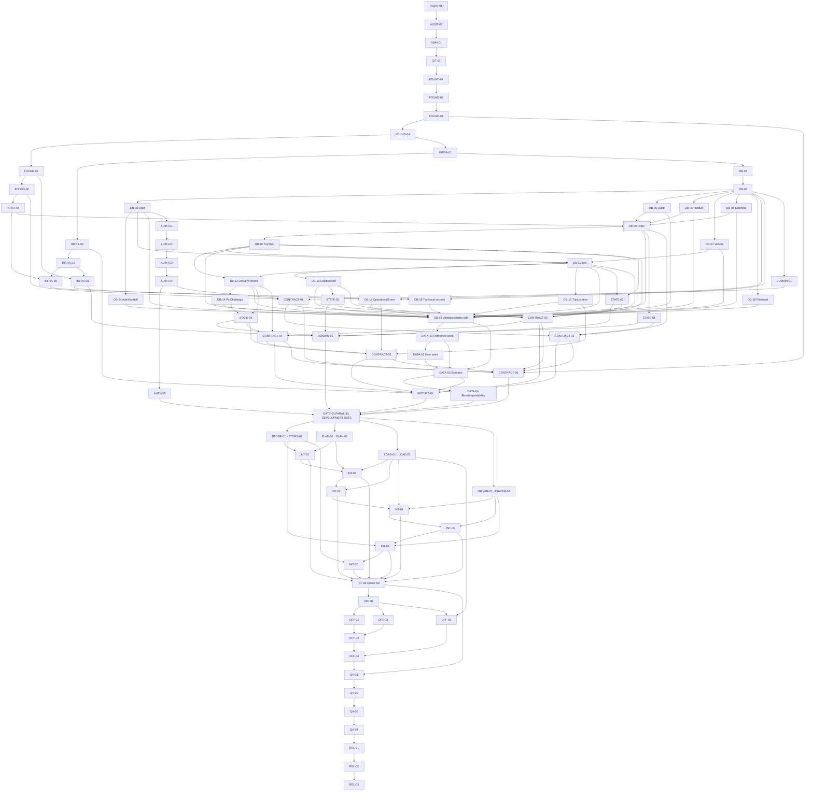

# Incremental Backend Implementation Roadmap

## 1. Purpose and authority

This is the execution checklist derived from **COMPREHENSIVE_BACKEND_PARALLEL_IMPLEMENTATION_PLAN.md**. It does not replace **SYSTEM_REQUIREMENTS_AND_ARCHITECTURE.md**, change the modular-monolith design, or mark implementation work complete. If wording conflicts, the architecture and the comprehensive plan remain authoritative until an approved contract-change record updates them.

The target remains one TypeScript/Fastify/Mongoose backend, one Mongo replica set, role applications consuming versioned REST contracts, and owner modules for Store, Planning, Loading, Delivery, Auth, Reference, Files, and Operations. No microservices, Kafka, Redis, Kubernetes, or new infrastructure are introduced.

Evidence is cumulative:

- **CODE:** source and static checks exist.
- **CONNECTED:** a real consumer calls the frozen contract without a mock.
- **RUNTIME:** behavior passes against the real replica-set test stack.
- **E2E:** producer-to-consumer behavior is proven through UI/API and persisted data.

## 2. Execution rules

1. Implement phases only when their listed prerequisites and decisions are satisfied.
2. One phase should normally produce one logical commit. Two tiny adjacent phases may share a branch, but not a semantic change.
3. Backend API means Fastify HTTP routes. Frontend API client means functions/hooks/services that consume those routes.
4. No module may import another module's repository or Mongoose model. It consumes an approved application port or DTO.
5. No raw status update may bypass the aggregate owner's named command.
6. Every integration checkpoint runs reset → migrate → seed → execute → verify, then repeats without manual database edits.
7. Generated OpenAPI/client artifacts are created on integration/CI, not hand-edited on role branches.

The current frontend package roots are **Store-Manager**, **dispatcher**, **loader**, **delivery-driver**, and **Login**. Commands named db:test:up, db:migrate:test, db:reset, scenario:verify, api:openapi, api:compat, the scoped test:* scripts, and release:* are target scripts to be added by the phase that introduces the corresponding capability; they are not claims that those scripts already exist. Until a target script lands, its phase cannot pass.

## 3. Stage overview

| Stage | Purpose | Phase range | Unlocks |
|---|---|---|---|
| A | Baseline, decisions, ownership, Git | AUDIT-01–GIT-01 | Controlled foundation work |
| B | Folder and module skeleton | FOUND-01–FOUND-06 | Stable composition boundaries |
| C | Shared infrastructure | INFRA-01–INFRA-06 | Reusable runtime mechanics |
| D | Database and deterministic data | DB-01–DATA-04 | Canonical persistence |
| E | Authentication and authorization | AUTH-01–AUTH-05 | Trusted actor and policy context |
| F | IDs, states, transition rules | DOMAIN-01–DOMAIN-02, STATE-01–STATE-04 | Stable domain semantics |
| G | Contracts, OpenAPI, fixtures | CONTRACT-01–CONTRACT-06, FIXTURE-01 | Consumer-ready contracts |
| H | Parallel Development Gate | GATE-01 | Role tracks |
| I | Store Manager track | STORE-01–STORE-07 | Store isolated acceptance |
| J | Dispatcher track | PLAN-01–PLAN-09 | Planning isolated acceptance |
| K | Loader track | LOAD-01–LOAD-07 | Loading isolated acceptance |
| L | Driver online track | DRIVER-01–DRIVER-09 | Online Driver acceptance |
| M | Thin cross-role integration | INT-01–INT-08 | Complete online workflow |
| N | Offline and recovery | OFF-01–OFF-06 | Canonical replay/recovery |
| O | Full quality/security evidence | QA-01–QA-04 | Release candidate |
| P | Deployment/release proof | REL-01–REL-03 | Production declaration |

## 4. Detailed phase definitions

## Stage A — Repository and foundation preparation

### Phase AUDIT-01 — Record the immutable baseline

**Objective** — Record commit, tree status, scripts, route/model/test counts, package locks, Compose topology, and current validation results.
**Why this phase exists** — Later changes need a trusted comparison point.
**Prerequisites** — Clean checkout of the approved base.
**Owner** — Integration lead.
**Files/directories** — docs/implementation/baseline.md only.
**Backend changes** — None.
**Frontend changes** — None.
**Database changes** — None.
**API changes** — None.
**State-machine changes** — None.
**Tests** — Run existing repository verification without changing behavior.
**Verification command(s)** — git status --short; git rev-parse HEAD; npm run verify; docker compose config.
**Evidence level** — CODE.
**Acceptance criteria** — SHA, inventory, pass/fail output, and every unverified runtime claim are recorded.
**Exit criteria** — Baseline is reviewed; failures become named work items.
**Parallelizable?** — No; all later phases depend on the same baseline.
**Git** — No branch; documentation commit on foundation/backend-v1 after creation.
**Integration impact** — Establishes evidence for every role.
**Risk** — Stale docs may be mistaken for runtime proof; label repository claims separately.

### Phase AUDIT-02 — Add current-behavior characterization map

**Objective** — Map each existing backend route, frontend caller/mock, model, index, and seed path to its future owner.
**Why this phase exists** — Refactoring without behavior coverage can silently break existing UI.
**Prerequisites** — AUDIT-01.
**Owner** — Integration lead with role owners.
**Files/directories** — docs/implementation/route-model-map.md; existing tests only for non-invasive characterization.
**Backend changes** — Add characterization tests only where current behavior is otherwise invisible.
**Frontend changes** — Identify, do not yet remove, critical mock/sample paths.
**Database changes** — Inventory only.
**API changes** — None.
**State-machine changes** — None.
**Tests** — Existing route status/envelope and registration behavior.
**Verification command(s)** — npm --prefix backend test; rg "app\\.(get|post|put|patch|delete)" backend/src.
**Evidence level** — CODE.
**Acceptance criteria** — Every route/model and judge-path frontend caller has an owner and disposition.
**Exit criteria** — No unowned critical path remains.
**Parallelizable?** — Yes; route, model, and frontend inventories can run concurrently.
**Git** — Branch foundation/audit-map from codex_2; merge to foundation/backend-v1.
**Integration impact** — Prevents accidental endpoint removal across all tracks.
**Risk** — A mock may look live; record data provenance, not component names.

### Phase OWN-01 — Freeze ownership and shared-file controls

**Objective** — Add CODEOWNERS/ownership documentation and the shared “do not touch” list in section 10.
**Why this phase exists** — File separation does not prevent semantic cross-module edits.
**Prerequisites** — AUDIT-02.
**Owner** — Integration lead and contract steward.
**Files/directories** — CODEOWNERS or equivalent; docs/implementation/ownership.md.
**Backend changes** — None.
**Frontend changes** — Assign client/UI ownership.
**Database changes** — Assign collection and migration stewards.
**API changes** — Assign producer and consumer reviewers.
**State-machine changes** — Assign aggregate owners.
**Tests** — Ownership coverage review against the route/model map.
**Verification command(s)** — npm run verify; manual CODEOWNERS path review.
**Evidence level** — CODE.
**Acceptance criteria** — Every shared family and domain module has one accountable owner and review rule.
**Exit criteria** — All four role leads acknowledge boundaries.
**Parallelizable?** — No; agreement is blocking.
**Git** — Branch foundation/ownership from foundation/backend-v1; merge back there.
**Integration impact** — Governs all later PRs.
**Risk** — Ownership without enforcement; require reviewers on protected branches.

### Phase GIT-01 — Establish incremental integration workflow

**Objective** — Create foundation/backend-v1 and integration/backend-v1 policy, short phase-branch naming, merge order, and contract-change workflow.
**Why this phase exists** — One long branch per role would defer conflicts.
**Prerequisites** — OWN-01.
**Owner** — Git/integration lead.
**Files/directories** — docs/implementation/git-workflow.md; CI branch rules if repository-managed.
**Backend changes** — None.
**Frontend changes** — None.
**Database changes** — Reserve migration numbering with the DB steward.
**API changes** — Contract changes must land before consumers.
**State-machine changes** — State changes require aggregate-owner approval.
**Tests** — Dry-run one small documentation PR through review.
**Verification command(s)** — git branch --show-current; git log --oneline --decorate -10.
**Evidence level** — CODE.
**Acceptance criteria** — Branch bases, targets, rebase cadence, reviewer rules, and rollback are explicit.
**Exit criteria** — Foundation work has a single merge target.
**Parallelizable?** — No.
**Git** — Direct policy commit on foundation/backend-v1.
**Integration impact** — Enables frequent thin integration.
**Risk** — Branch policy may exceed repository controls; document manual enforcement where necessary.

## Stage B — Backend folder and module skeleton

### Phase FOUND-01 — Create target directory skeleton

**Objective** — Create app, config, db, common, contracts, and owned module directories from the comprehensive plan.
**Why this phase exists** — Later moves need stable destinations.
**Prerequisites** — GIT-01.
**Owner** — Foundation steward.
**Files/directories** — backend/src/{app,config,db,common,contracts,modules}; backend/tests/{support,fixtures,contract,e2e}.
**Backend changes** — Empty entry files/readmes only; no behavior move.
**Frontend changes** — None.
**Database changes** — None.
**API changes** — None.
**State-machine changes** — None.
**Tests** — TypeScript path/import resolution.
**Verification command(s)** — npm --prefix backend run typecheck.
**Evidence level** — CODE.
**Acceptance criteria** — Target paths exist without changing registered routes.
**Exit criteria** — Ownership paths match OWN-01.
**Parallelizable?** — No; establishes common paths.
**Git** — Branch foundation/folder-skeleton; base/target foundation/backend-v1.
**Integration impact** — All modules.
**Risk** — Premature file movement; defer moves to owner phases.

### Phase FOUND-02 — Create one module entry plugin per owner

**Objective** — Provide stable entry plugins for auth, reference, store, planning, loading, delivery, files, and operations.
**Why this phase exists** — Role developers must not edit composition files.
**Prerequisites** — FOUND-01.
**Owner** — Foundation steward.
**Files/directories** — backend/src/modules/*/*.module.ts.
**Backend changes** — Wrap current route registration or no-op adapters while preserving paths.
**Frontend changes** — None.
**Database changes** — None.
**API changes** — No external contract change.
**State-machine changes** — None.
**Tests** — Each plugin registers exactly once.
**Verification command(s)** — npm --prefix backend test -- module-registration; npm --prefix backend run typecheck.
**Evidence level** — CODE.
**Acceptance criteria** — Every owner exports one Fastify plugin with no cross-module repository import.
**Exit criteria** — Registry can depend only on module entries.
**Parallelizable?** — Yes; plugins can be prepared by owner, integrated by foundation steward.
**Git** — Branch foundation/module-entries; merge to foundation/backend-v1.
**Integration impact** — Stable extension point for all roles.
**Risk** — Duplicate route registration; assert route uniqueness.

### Phase FOUND-03 — Stabilize create-app and module registry

**Objective** — Compose security, common plugins, module entries, and health routes in deterministic order.
**Why this phase exists** — App bootstrap is the highest-conflict shared file.
**Prerequisites** — FOUND-02.
**Owner** — Foundation/integration steward.
**Files/directories** — backend/src/app/create-app.ts; module-registry.ts; server.ts.
**Backend changes** — Move composition only; preserve process startup and route paths.
**Frontend changes** — None.
**Database changes** — Connection injection remains compatible.
**API changes** — Registration only.
**State-machine changes** — None.
**Tests** — App starts; route inventory equals AUDIT-02; duplicate registration fails.
**Verification command(s)** — npm --prefix backend test -- http-foundation module-registration; npm --prefix backend run typecheck.
**Evidence level** — RUNTIME.
**Acceptance criteria** — Modules register without future edits to create-app.
**Exit criteria** — create-app and registry become protected shared files.
**Parallelizable?** — No; one integrator owns ordering.
**Git** — Branch foundation/app-registry; merge to foundation/backend-v1.
**Integration impact** — All backend APIs.
**Risk** — Plugin order affects auth/CORS; characterize before/after.

### Phase FOUND-04 — Centralize validated configuration

**Objective** — Validate server, Mongo, JWT, origins, handoff, seed, file, location, and logging settings at startup.
**Why this phase exists** — Environment drift must fail fast.
**Prerequisites** — FOUND-03.
**Owner** — Platform/foundation steward.
**Files/directories** — backend/src/config/env.ts; .env.example; test environment factory.
**Backend changes** — Typed config injection; no domain policy.
**Frontend changes** — Document build-time VITE variables only.
**Database changes** — Validate URI/database separately.
**API changes** — None.
**State-machine changes** — None.
**Tests** — Missing/invalid secret, URI, origin, TTL, and environment cases.
**Verification command(s)** — npm --prefix backend test -- config; npm --prefix backend run typecheck.
**Evidence level** — CODE.
**Acceptance criteria** — Invalid configuration prevents startup with safe errors.
**Exit criteria** — No direct process.env reads outside config.
**Parallelizable?** — Yes; test cases and env documentation.
**Git** — Branch foundation/config; merge to foundation/backend-v1.
**Integration impact** — All runtime environments.
**Risk** — Secrets may leak in validation output; redact values.

### Phase FOUND-05 — Standardize logging and request IDs

**Objective** — Emit structured request logs with correlation while redacting secrets.
**Why this phase exists** — Cross-role failures need traceable, safe diagnostics.
**Prerequisites** — FOUND-04.
**Owner** — Foundation/observability steward.
**Files/directories** — backend/src/config/logger.ts; common/observability; app plugin registration.
**Backend changes** — Request ID propagation, route/status/duration, actor fields after auth.
**Frontend changes** — Preserve response requestId in client errors.
**Database changes** — None.
**API changes** — Error response requestId remains stable.
**State-machine changes** — None.
**Tests** — Redaction for JWT/password/PIN/handoff/hash/private URL; request ID echo.
**Verification command(s)** — npm --prefix backend test -- logging request-id.
**Evidence level** — RUNTIME.
**Acceptance criteria** — Each request has one ID and no forbidden value appears in captured logs.
**Exit criteria** — Domain events can receive request context.
**Parallelizable?** — Yes; redaction and request-ID tests.
**Git** — Branch foundation/logging; merge to foundation/backend-v1.
**Integration impact** — All roles and support traces.
**Risk** — Global body logging; explicitly disable it.

### Phase FOUND-06 — Standardize HTTP envelopes, errors, pagination, and validation

**Objective** — Implement generic Success, Page, ErrorResponse, domain-error mapping, ObjectId/date primitives, and body limits.
**Why this phase exists** — Every contract otherwise invents incompatible transport behavior.
**Prerequisites** — FOUND-05.
**Owner** — Foundation/contract steward.
**Files/directories** — backend/src/common/{errors,http,validation}; contracts/common.ts.
**Backend changes** — Generic mechanics only.
**Frontend changes** — Shared client error parser may consume the envelope.
**Database changes** — None.
**API changes** — Freeze 400/401/403/404/409/422/429/500 semantics.
**State-machine changes** — Conflict errors include current version/state.
**Tests** — Validation, concealment 404, conflict, pagination bounds, unexpected error redaction.
**Verification command(s)** — npm --prefix backend test -- http-foundation errors validation.
**Evidence level** — RUNTIME.
**Acceptance criteria** — Representative routes return the same envelope/error vocabulary.
**Exit criteria** — CONTRACT-01 can freeze it.
**Parallelizable?** — Yes; primitives and error tests.
**Git** — Branch foundation/http-contract; merge to foundation/backend-v1.
**Integration impact** — Every backend route and frontend API client.
**Risk** — Mass response breakage; use compatibility presenters until clients migrate.

## Stage C — Shared infrastructure

### Phase INFRA-01 — Isolate Mongo connection lifecycle

**Objective** — Provide one injected connection lifecycle for app, tests, migrations, and seed.
**Why this phase exists** — Direct global model access prevents isolated modules/tests.
**Prerequisites** — FOUND-04.
**Owner** — Database steward.
**Files/directories** — backend/src/db/connection.ts; app lifecycle hooks.
**Backend changes** — Connect, readiness, graceful close, retry policy.
**Frontend changes** — None.
**Database changes** — No schema change.
**API changes** — Readiness reflects writable Mongo state.
**State-machine changes** — None.
**Tests** — Connect/close/failure/readiness.
**Verification command(s)** — npm --prefix backend test -- db-connection; docker compose up -d mongo mongo-init.
**Evidence level** — RUNTIME.
**Acceptance criteria** — App and tests use the same connection abstraction.
**Exit criteria** — No new module opens its own connection.
**Parallelizable?** — No; shared database base.
**Git** — Branch foundation/mongo-connection; merge to foundation/backend-v1.
**Integration impact** — All persistence.
**Risk** — Model registration on multiple connections; bind explicitly.

### Phase INFRA-02 — Prove replica-set and disposable test database support

**Objective** — Add isolated test DB/profile and a readiness check proving transactions are supported.
**Why this phase exists** — Transaction code is unsafe if tests use standalone Mongo.
**Prerequisites** — INFRA-01.
**Owner** — Platform and database stewards.
**Files/directories** — compose test profile; backend/tests/support/database.ts; root scripts.
**Backend changes** — Test harness only.
**Frontend changes** — None.
**Database changes** — Disposable database per suite/run.
**API changes** — None.
**State-machine changes** — None.
**Tests** — Replica-set writable primary and one rollback probe.
**Verification command(s)** — npm run db:test:up; npm run db:migrate:test; npm --prefix backend test -- mongo-replica.
**Evidence level** — RUNTIME.
**Acceptance criteria** — Concurrent CI/local runs cannot share operational data.
**Exit criteria** — Harness exposes clean DB creation and teardown.
**Parallelizable?** — No.
**Git** — Branch foundation/test-mongo; merge to foundation/backend-v1.
**Integration impact** — Required for every RUNTIME phase.
**Risk** — Port/volume collision; namespace by run.

### Phase INFRA-03 — Add transaction helper

**Objective** — Implement bounded retry and session propagation for named use cases.
**Why this phase exists** — Publish, confirm, complete, and receipt need identical transaction semantics.
**Prerequisites** — INFRA-02.
**Owner** — Database steward.
**Files/directories** — backend/src/db/transaction.ts; tests/support transaction probes.
**Backend changes** — Transaction helper with safe logging and no partial fallback.
**Frontend changes** — None.
**Database changes** — Probe collection only in tests.
**API changes** — Map exhausted transient errors consistently.
**State-machine changes** — None.
**Tests** — Commit, rollback, retryable failure, non-retryable failure.
**Verification command(s)** — npm --prefix backend test -- transaction.
**Evidence level** — RUNTIME.
**Acceptance criteria** — A failed multi-write leaves zero partial writes.
**Exit criteria** — Module services can accept a session.
**Parallelizable?** — No.
**Git** — Branch foundation/transactions; merge to foundation/backend-v1.
**Integration impact** — Planning, Loading, Delivery, Store receipt.
**Risk** — Retrying non-idempotent external calls; prohibit external I/O inside transaction.

### Phase INFRA-04 — Add optimistic concurrency conventions

**Objective** — Standardize version fields, If-Match parsing, expectedVersion, stale response, and repository compare-and-set.
**Why this phase exists** — Parallel users/offline replay need explicit conflict behavior.
**Prerequisites** — FOUND-06, INFRA-01.
**Owner** — Foundation/database steward.
**Files/directories** — common/http/versioning; db conventions; repository test helper.
**Backend changes** — Reusable OCC mechanics only.
**Frontend changes** — Client transport preserves version and 409 projection.
**Database changes** — Base version convention.
**API changes** — Freeze version input and conflict envelope.
**State-machine changes** — No transition on stale version.
**Tests** — Two concurrent updates; exactly one succeeds.
**Verification command(s)** — npm --prefix backend test -- optimistic-concurrency.
**Evidence level** — RUNTIME.
**Acceptance criteria** — Stale writes return 409 and current version without mutation.
**Exit criteria** — Aggregate schema phases can adopt the convention.
**Parallelizable?** — Yes; HTTP parser and repository tests.
**Git** — Branch foundation/occ; merge to foundation/backend-v1.
**Integration impact** — All mutable aggregates and clients.
**Risk** — Mixed body/header conventions; freeze one canonical rule with compatibility parsing only if needed.

### Phase INFRA-05 — Add idempotency and sync-receipt mechanics

**Objective** — Reserve/complete mutation keys with actor, operation, payload hash, TTL, and replay result.
**Why this phase exists** — Retries must not duplicate orders or terminal commands.
**Prerequisites** — INFRA-03, INFRA-04.
**Owner** — Foundation steward; Delivery owns later sync orchestration.
**Files/directories** — common/idempotency; technical persistence model/tests.
**Backend changes** — Same-key/same-payload replay and mismatch rejection.
**Frontend changes** — Clients generate/store keys for covered commands.
**Database changes** — idempotency_records and sync_receipts finalized in DB-18.
**API changes** — Idempotency-Key/clientMutationId behavior.
**State-machine changes** — Duplicate command does not transition again.
**Tests** — Concurrent duplicate, completed replay, payload mismatch, expired key.
**Verification command(s)** — npm --prefix backend test -- idempotency sync-receipt.
**Evidence level** — RUNTIME.
**Acceptance criteria** — Exactly one business write occurs for concurrent duplicate input.
**Exit criteria** — Store/Delivery phases can compose it.
**Parallelizable?** — Yes; HTTP and persistence adapters.
**Git** — Branch foundation/idempotency; merge to foundation/backend-v1.
**Integration impact** — Store create, publish, confirm, delivery, receipt, offline.
**Risk** — Reserving a key before failed work can wedge requests; define failed/retryable lifecycle.

### Phase INFRA-06 — Add operational-event writer

**Objective** — Provide append-only event creation tied to actor/request/mutation and transaction session.
**Why this phase exists** — Audit/monitor evidence must not drift from state.
**Prerequisites** — INFRA-03, FOUND-05.
**Owner** — Operations/foundation steward.
**Files/directories** — common/observability/event-writer.ts; operations port.
**Backend changes** — Event writer interface and safe structured fields.
**Frontend changes** — None.
**Database changes** — Uses DB-17 after available.
**API changes** — None.
**State-machine changes** — Transition catalogue supplies event type/from/to.
**Tests** — Same-transaction rollback, required IDs, sensitive-data rejection.
**Verification command(s)** — npm --prefix backend test -- operational-event-writer.
**Evidence level** — RUNTIME.
**Acceptance criteria** — Rolled-back transitions leave no event; committed ones leave one.
**Exit criteria** — Aggregate services can call one event port.
**Parallelizable?** — Yes, after event schema contract is drafted.
**Git** — Branch foundation/event-writer; merge to foundation/backend-v1.
**Integration impact** — All role feeds and support tracing.
**Risk** — Loose data becomes a secret dump; validate catalogue payloads.

## Stage D — Database and canonical domain model

For DB-03 through DB-18, “migration” means an idempotent numbered forward migration plus a repair/rollback note; “indexes” are applied by the migration runner, never destructive production seed synchronization.

### Phase DB-01 — Create migration ledger and runner

**Objective** — Implement numbered migrations and schema_migrations recording.
**Why this phase exists** — Schema/index provenance cannot live in seed scripts.
**Prerequisites** — INFRA-01.
**Owner** — Database steward.
**Files/directories** — backend/src/db/migrations; migrate.ts; package scripts.
**Backend changes** — Runner, lock/concurrency guard, dry status.
**Frontend changes** — None.
**Database changes** — schema_migrations collection and initial baseline record.
**API changes** — None.
**State-machine changes** — None.
**Tests** — Fresh, repeated, out-of-order, failed migration.
**Verification command(s)** — npm run db:migrate:test; npm --prefix backend test -- migrations.
**Evidence level** — RUNTIME.
**Acceptance criteria** — Re-run is a no-op and failure does not mark completion.
**Exit criteria** — DB steward can assign the next sequence.
**Parallelizable?** — No.
**Git** — Branch foundation/db-migrations; merge to foundation/backend-v1.
**Integration impact** — All model phases.
**Risk** — Concurrent numbering; only DB steward assigns numbers.

### Phase DB-02 — Establish base Mongoose conventions

**Objective** — Standardize timestamps, versionKey, strict schemas, JSON transforms, model factories, and session-aware repositories.
**Why this phase exists** — Every collection needs identical safety defaults.
**Prerequisites** — DB-01, INFRA-04.
**Owner** — Database steward.
**Files/directories** — backend/src/db/model-conventions.ts; module persistence readmes.
**Backend changes** — Shared mechanics without domain fields.
**Frontend changes** — None.
**Database changes** — Baseline conventions only.
**API changes** — ObjectIds/dates serialize consistently.
**State-machine changes** — None.
**Tests** — Strict rejection, version increment, transform, session use.
**Verification command(s)** — npm --prefix backend test -- model-conventions.
**Evidence level** — RUNTIME.
**Acceptance criteria** — New owned schemas do not depend on the centralized model mega-file.
**Exit criteria** — Model phases can proceed in parallel.
**Parallelizable?** — No; it is their base.
**Git** — Branch foundation/model-conventions; merge to foundation/backend-v1.
**Integration impact** — All modules.
**Risk** — Existing serialization drift; retain presenters at API boundary.

### Phase DB-03 — Split User persistence

**Objective** — Move User to Auth ownership with canonical identity and account fields.
**Why this phase exists** — Authentication and resource policies require a stable actor record.
**Prerequisites** — DB-02; decision D10 before TTL-related auth tests.
**Owner** — Auth owner.
**Files/directories** — modules/auth/persistence/user.model.ts; migration; auth fixtures.
**Backend changes** — Private User model/repository.
**Frontend changes** — None.
**Database changes** — users; employeeId, normalized email, role, hash, outlet/depot, active, lock/login timestamps, version; refs outletId business key; indexes unique employeeId/email and role+active; consumers all actor policies; migration reconciles current email index.
**API changes** — None.
**State-machine changes** — Active/locked policy only.
**Tests** — Uniqueness, hidden password hash, role/outlet/depot queries, legacy migration.
**Verification command(s)** — npm --prefix backend test -- user-model; npm run db:migrate:test.
**Evidence level** — RUNTIME.
**Acceptance criteria** — Auth is sole writer; consumers receive CurrentActor/read-port data.
**Exit criteria** — AUTH-01 and policy ports can use repository.
**Parallelizable?** — Yes, with reference models after DB-02.
**Git** — Branch foundation/db-user; merge to foundation/backend-v1.
**Integration impact** — Every role.
**Risk** — Duplicate normalized email blocks migration; report repair set before unique index.

### Phase DB-04 — Split AuthHandoff persistence

**Objective** — Own one-use origin-bound login handoffs in Auth.
**Why this phase exists** — Handoff security and atomic consume are independent of User.
**Prerequisites** — DB-02, DB-03.
**Owner** — Auth owner.
**Files/directories** — modules/auth/persistence/auth-handoff.model.ts; migration/tests.
**Backend changes** — Create and atomic consume repository.
**Frontend changes** — None.
**Database changes** — auth_handoffs; userId ref, codeHash, intendedOrigin, expiresAt, consumedAt; unique hash, TTL expiry, user/time index; no domain state.
**API changes** — None.
**State-machine changes** — issued → consumed/expired semantics.
**Tests** — TTL metadata, replay race, wrong origin, expiry.
**Verification command(s)** — npm --prefix backend test -- auth-handoff-model.
**Evidence level** — RUNTIME.
**Acceptance criteria** — Two exchanges produce one winner; plaintext is never stored.
**Exit criteria** — AUTH-02 unblocked.
**Parallelizable?** — Yes.
**Git** — Branch foundation/db-auth-handoff; merge to foundation/backend-v1.
**Integration impact** — All login origins.
**Risk** — TTL deletion is asynchronous; query must always enforce expiresAt.

### Phase DB-05 — Split Outlet persistence

**Objective** — Move official outlet master data to Reference ownership.
**Why this phase exists** — Store ownership and planning constraints depend on one business-key convention.
**Prerequisites** — DB-02; decision D2.
**Owner** — Reference/data owner.
**Files/directories** — modules/reference/persistence/outlet.model.ts; migration/fixtures.
**Backend changes** — Read-only operational port.
**Frontend changes** — None.
**Database changes** — outlets; outletId, display/brand/district/depot, dock/parking/window, coordinates, active, source; unique outletId, depot+brand, district, optional 2dsphere; consumers Store/Planning/Delivery; import-owned, no workflow state.
**API changes** — None.
**State-machine changes** — None.
**Tests** — key uniqueness, window/access shape, invalid coordinates, migration.
**Verification command(s)** — npm --prefix backend test -- outlet-model.
**Evidence level** — RUNTIME.
**Acceptance criteria** — outletId representation matches D2 and all reference consumers.
**Exit criteria** — Store ownership and planning ports unblocked.
**Parallelizable?** — Yes with DB-06–DB-08.
**Git** — Branch foundation/db-outlet; merge to foundation/backend-v1.
**Integration impact** — Store, Planning, Delivery.
**Risk** — Synthetic names/coordinates presented as official; preserve source/provenance.

### Phase DB-06 — Split Product persistence

**Objective** — Create the Reference-owned product master and immutable order-planning attributes.
**Why this phase exists** — Order totals and constraints must be server-derived.
**Prerequisites** — DB-02; decision D9 before production data gate.
**Owner** — Reference/product owner.
**Files/directories** — modules/reference/persistence/product.model.ts; migration/fixtures.
**Backend changes** — Catalogue read port.
**Frontend changes** — None.
**Database changes** — products; sku, brand/name/unit/orderTypes, weight/volume/temperature/fragile, source/assumptions, active; unique SKU, brand+active+name; consumers Store/Planning snapshots; import lifecycle.
**API changes** — None.
**State-machine changes** — active/retired reference status only.
**Tests** — SKU uniqueness, positive planning attributes, brand/type filters, provenance.
**Verification command(s)** — npm --prefix backend test -- product-model.
**Evidence level** — RUNTIME.
**Acceptance criteria** — Demo products are explicitly marked and never claimed official.
**Exit criteria** — Store create can validate/snapshot products.
**Parallelizable?** — Yes.
**Git** — Branch foundation/db-product; merge to foundation/backend-v1.
**Integration impact** — Store and Planning.
**Risk** — Official CSC unavailable; D9 blocks production claim, not foundation fixtures.

### Phase DB-07 — Split Vehicle persistence

**Objective** — Create Reference-owned fleet master separate from operational trips.
**Why this phase exists** — vehicleId must never identify a load job or run.
**Prerequisites** — DB-02; decision D2.
**Owner** — Reference/data owner.
**Files/directories** — modules/reference/persistence/vehicle.model.ts; migration/fixtures.
**Backend changes** — Capability/depot read port; no route counters stored.
**Frontend changes** — None.
**Database changes** — vehicles; vehicleId, type, temperatureClass, capacities, fuel, quota, depot, active; unique vehicleId and capability index; consumers Planning/Loading/Delivery; reference lifecycle.
**API changes** — None.
**State-machine changes** — active/retired only.
**Tests** — uniqueness, positive capacities/fuel, filtering, migration.
**Verification command(s)** — npm --prefix backend test -- vehicle-model.
**Evidence level** — RUNTIME.
**Acceptance criteria** — Operational references use tripId/loadRecordId, not vehicleId.
**Exit criteria** — Planning constraints unblocked.
**Parallelizable?** — Yes.
**Git** — Branch foundation/db-vehicle; merge to foundation/backend-v1.
**Integration impact** — Planning, Loading, Driver.
**Risk** — UI-derived usage mutates master; compute from Trips.

### Phase DB-08 — Split CalendarDay persistence

**Objective** — Own immutable operating-day/cutoff reference data.
**Why this phase exists** — Store and deferral date rules require one timezone-aware source.
**Prerequisites** — DB-02.
**Owner** — Reference/data owner.
**Files/directories** — modules/reference/persistence/calendar-day.model.ts; migration/fixtures.
**Backend changes** — Exact-date and next-operating-day read port.
**Frontend changes** — None.
**Database changes** — calendar_days; imported date/week/year/weekend/payday/festival/ramp/holiday/monsoon/operating flags; unique date; consumers Store/Planning; immutable import.
**API changes** — None.
**State-machine changes** — None.
**Tests** — uniqueness, continuity, timezone boundaries, next operating day.
**Verification command(s)** — npm --prefix backend test -- calendar-model calendar-preflight.
**Evidence level** — RUNTIME.
**Acceptance criteria** — Server, not device time, decides operating dates.
**Exit criteria** — Store cutoff and Planning deferral unblocked.
**Parallelizable?** — Yes.
**Git** — Branch foundation/db-calendar; merge to foundation/backend-v1.
**Integration impact** — Store and Dispatcher.
**Risk** — Date coercion shifts day; store canonical date strings.

### Phase DB-09 — Implement Order persistence

**Objective** — Create Store-owned Order schema/repository contract.
**Why this phase exists** — Order is the first cross-role aggregate.
**Prerequisites** — DB-02, DB-05, DB-06, DB-08, DOMAIN-01 draft.
**Owner** — Store owner with DB steward review.
**Files/directories** — modules/store/persistence/order.model.ts; migration/fixtures.
**Backend changes** — Private repository with eligible planning/read methods.
**Frontend changes** — None.
**Database changes** — orders; number, outlet/creator, brand/type/date/cutoff, item snapshots, totals, priority/status, deferral, allocation, rich history, version; refs user ObjectId and outlet string, product snapshots; indexes unique number, outlet/time, status/date/brand, allocation.tripId, cutoff/status; consumers Store/Planning/projections; Order state in STATE-01.
**API changes** — None.
**State-machine changes** — Fields support submitted/deferred/allocated/in_transit/delivered/receipt_*.
**Tests** — validation, indexes, snapshots, query plans, legacy name migration.
**Verification command(s)** — npm --prefix backend test -- order-model; npm run db:migrate:test.
**Evidence level** — RUNTIME.
**Acceptance criteria** — No consumer imports model; migration preserves existing orders.
**Exit criteria** — STORE-01 and CONTRACT-02 unblocked.
**Parallelizable?** — No with STATE-01 finalization; otherwise independent of Trip code.
**Git** — Branch foundation/db-order; merge to foundation/backend-v1.
**Integration impact** — Store, Planning, Loading/Delivery projections.
**Risk** — requestedDate/createdBy rename loses compatibility; migration and adapter required.

### Phase DB-10 — Define stable embedded TripStop

**Objective** — Define one embedded physical-visit schema with stable tripStopId and orderIds[].
**Why this phase exists** — Loader/Driver identity cannot be repaired independently later.
**Prerequisites** — DB-09; decision D3; DOMAIN-01.
**Owner** — Planning owner with Loading/Delivery approval.
**Files/directories** — modules/planning/domain/trip-stop.ts; persistence/trip-stop.schema.ts; migration tests.
**Backend changes** — Stop factory preserves IDs across draft edits.
**Frontend changes** — None.
**Database changes** — embedded TripStop; ObjectId stop ID, sequence, outlet snapshot, orderIds, planned/deadline/timing/status/version; no standalone collection; indexed later through Trips; consumers Loading/Delivery/Store/Monitor.
**API changes** — Nested stop IDs serialize as strings.
**State-machine changes** — Mirrors STATE-02 physical-visit states.
**Tests** — stable ID, multi-order grouping, sequence uniqueness, edit preservation.
**Verification command(s)** — npm --prefix backend test -- trip-stop.
**Evidence level** — RUNTIME.
**Acceptance criteria** — STOP-n identity is removed/migrated; same stop may reference multiple orders.
**Exit criteria** — Trip and Delivery schemas unblocked.
**Parallelizable?** — No; D3 is a hard semantic decision.
**Git** — Branch foundation/db-trip-stop; merge to foundation/backend-v1.
**Integration impact** — Planning, Loading, Driver, Store receipt.
**Risk** — Regenerating IDs breaks offline references; prohibit after publish.

### Phase DB-11 — Implement Trip persistence

**Objective** — Create Planning-owned Trip aggregate around embedded TripStops.
**Why this phase exists** — A trip, not a vehicle, is the operational run.
**Prerequisites** — DB-07, DB-10, DB-03, STATE-02 draft.
**Owner** — Planning owner.
**Files/directories** — modules/planning/persistence/trip.model.ts; migration/fixtures.
**Backend changes** — Draft/read/compare-and-set repository.
**Frontend changes** — None.
**Database changes** — trips; number/date/depot/vehicle/driver/dispatcher/routeIndex/claim/status/times/totals/constraints/stops/location projection/history/version; refs user ObjectIds and vehicle string; indexes unique number, unique vehicle+date+routeIndex, driver+date, status+date, stops.orderIds; consumers Planning/Loading/Delivery/Operations.
**API changes** — None.
**State-machine changes** — STATE-02.
**Tests** — route uniqueness, stop containment, role queries, migration.
**Verification command(s)** — npm --prefix backend test -- trip-model.
**Evidence level** — RUNTIME.
**Acceptance criteria** — Two routes allowed, third/duplicate routeIndex rejected.
**Exit criteria** — Planning/Loading contracts can consume manifest.
**Parallelizable?** — Yes with DB-12 fixture design, not its final refs.
**Git** — Branch foundation/db-trip; merge to foundation/backend-v1.
**Integration impact** — Dispatcher, Loader, Driver, monitor.
**Risk** — Unique index conflicts with legacy data; preflight repair before creation.

### Phase DB-12 — Implement LoadRecord persistence

**Objective** — Create Loading-owned one-to-one warehouse job for a Trip.
**Why this phase exists** — Load job identity and claim state must be independent of vehicleId.
**Prerequisites** — DB-11, STATE-03 draft.
**Owner** — Loading owner.
**Files/directories** — modules/loading/persistence/load-record.model.ts; migration/fixtures.
**Backend changes** — Job query and owner/version repository primitives.
**Frontend changes** — None.
**Database changes** — load_records; tripId, depot, status, claim/unclaim/start/confirm actors/times, item snapshots with tripStop/order/SKU quantities/status, typed exception, variance, version; unique tripId, depot+status+created, claimant+status; consumers Loader/Planning/Driver.
**API changes** — Responses expose loadRecordId and tripId.
**State-machine changes** — STATE-03.
**Tests** — one-to-one, item references, typed exception, owner query/indexes.
**Verification command(s)** — npm --prefix backend test -- load-record-model.
**Evidence level** — RUNTIME.
**Acceptance criteria** — No API treats vehicleId as job identity.
**Exit criteria** — LOAD-01 and CONTRACT-03 unblocked.
**Parallelizable?** — Yes after DB-11 contract.
**Git** — Branch foundation/db-load-record; merge to foundation/backend-v1.
**Integration impact** — Planning publish, Loader, Driver bootstrap.
**Risk** — Mixed exception data survives; migrate or quarantine invalid shapes.

### Phase DB-13 — Implement DeliveryRecord persistence

**Objective** — Create Delivery-owned execution record per TripStop.
**Why this phase exists** — Delivery outcome/proof/receipt must support consolidated stops.
**Prerequisites** — DB-10, DB-11; decisions D3 and D8; STATE-04 draft.
**Owner** — Delivery owner.
**Files/directories** — modules/delivery/persistence/delivery-record.model.ts; migration/fixtures.
**Backend changes** — Upsert/read/OCC repository.
**Frontend changes** — None.
**Database changes** — delivery_records; trip/stop/outlet/driver, status, device/server times, deadline/timing/outcome, multi-order item outcomes, proof ref, mutation IDs/sync status, receipt/evidence, version; unique trip+stop, outlet+state+time, driver+state; consumers Driver/Store/Dispatcher.
**API changes** — None.
**State-machine changes** — STATE-04.
**Tests** — unique upsert, consolidated items, receipt uniqueness, legacy one-order migration.
**Verification command(s)** — npm --prefix backend test -- delivery-record-model.
**Evidence level** — RUNTIME.
**Acceptance criteria** — One record represents one physical visit and all its orders.
**Exit criteria** — DRIVER-01, CONTRACT-05 unblocked.
**Parallelizable?** — No until D8 scope is chosen.
**Git** — Branch foundation/db-delivery-record; merge to foundation/backend-v1.
**Integration impact** — Driver, Store, monitor.
**Risk** — Per-order receipt assumptions conflict with stop receipt; D8 blocks final schema.

### Phase DB-14 — Implement PIN challenge persistence

**Objective** — Persist challenge hash, lifecycle, attempts, and one-active-challenge rule.
**Why this phase exists** — PIN security must not be an unbounded embedded convenience field.
**Prerequisites** — DB-13; decisions D6 and D11.
**Owner** — Delivery/security owner.
**Files/directories** — modules/delivery/persistence/pin-challenge.model.ts; migration/tests.
**Backend changes** — Issue/verify/rotate/consume atomic repository.
**Frontend changes** — None.
**Database changes** — pin_challenges or approved equivalent; delivery ref, hash, issuer/times/attempts/max/verified/revoked/version; delivery/time and one-active indexes; consumer Delivery commands; issued/verified/locked/expired/revoked lifecycle.
**API changes** — None.
**State-machine changes** — Integrates STATE-04 proof transition.
**Tests** — concurrent issue, attempt increment, expiry, lock, rotation, no plaintext.
**Verification command(s)** — npm --prefix backend test -- pin-challenge.
**Evidence level** — RUNTIME.
**Acceptance criteria** — Exactly one active challenge and no plaintext persistence/log.
**Exit criteria** — DRIVER-07 proof work unblocked.
**Parallelizable?** — No; D11 is blocking.
**Git** — Branch contract/pin-persistence; merge to foundation/backend-v1.
**Integration impact** — Store PIN issue and Driver proof.
**Risk** — TTL removes audit history; retention decision must be explicit.

### Phase DB-15 — Implement TripLocation persistence

**Objective** — Persist deduplicated geospatial Driver points.
**Why this phase exists** — Monitoring requires honest append-only telemetry.
**Prerequisites** — DB-11, DOMAIN-01.
**Owner** — Delivery owner.
**Files/directories** — modules/delivery/persistence/trip-location.model.ts; migration/tests.
**Backend changes** — Unordered deduplicating batch repository.
**Frontend changes** — None.
**Database changes** — trip_locations; UUID pointId, trip/driver/vehicle, GeoJSON, accuracy/speed/heading, recorded/received/source; unique pointId, trip+time, driver+time, 2dsphere; consumers Driver/Monitor; append-only.
**API changes** — None.
**State-machine changes** — None.
**Tests** — point dedupe, ordering, geometry, assignment query.
**Verification command(s)** — npm --prefix backend test -- trip-location-model.
**Evidence level** — RUNTIME.
**Acceptance criteria** — Replayed point counts as duplicate, not a failure.
**Exit criteria** — DRIVER-06 unblocked.
**Parallelizable?** — Yes.
**Git** — Branch foundation/db-trip-location; merge to foundation/backend-v1.
**Integration impact** — Driver and Dispatcher monitor.
**Risk** — Retention/privacy is unresolved optional policy; do not add TTL silently.

### Phase DB-16 — Implement FileAsset persistence

**Objective** — Persist verified provider metadata with domain ownership references.
**Why this phase exists** — Raw provider IDs must not become public domain identity.
**Prerequisites** — DB-02, DOMAIN-01.
**Owner** — Files/foundation owner.
**Files/directories** — modules/files/persistence/file-asset.model.ts; migration/tests.
**Backend changes** — Complete/find repository; authorization remains domain-port based.
**Frontend changes** — None.
**Database changes** — file_assets; provider/publicId/kind/mime/bytes/dimensions, owner, trip/delivery refs, times/status/verification; unique provider+publicId and domain/kind indexes; consumers Delivery/Store/Files; upload lifecycle.
**API changes** — None.
**State-machine changes** — pending → verified/rejected.
**Tests** — uniqueness, provider verification metadata, relation query.
**Verification command(s)** — npm --prefix backend test -- file-asset-model.
**Evidence level** — RUNTIME.
**Acceptance criteria** — Model never authorizes by role alone.
**Exit criteria** — DRIVER-04 and receipt evidence unblocked.
**Parallelizable?** — Yes.
**Git** — Branch foundation/db-file-asset; merge to foundation/backend-v1.
**Integration impact** — Driver, Store, Files.
**Risk** — Private URL leakage; store metadata, issue short-lived reads.

### Phase DB-17 — Implement OperationalEvent persistence

**Objective** — Create append-only catalogue-backed audit/read-feed events.
**Why this phase exists** — Cross-role monitoring needs traceable facts, not ad hoc Mixed data.
**Prerequisites** — DB-02, INFRA-06, DOMAIN-02 draft.
**Owner** — Operations owner.
**Files/directories** — modules/operations/persistence/operational-event.model.ts; migration/tests.
**Backend changes** — Append/query repository.
**Frontend changes** — None.
**Database changes** — operational_events; type/entity/actor/audiences/summary/typed data/request/mutation/created; entity timeline, audience feed, type indexes; consumers all feeds/audit; append-only.
**API changes** — None.
**State-machine changes** — Transition events use catalogue.
**Tests** — immutability, catalogue validation, audience/time queries.
**Verification command(s)** — npm --prefix backend test -- operational-event-model.
**Evidence level** — RUNTIME.
**Acceptance criteria** — Existing mutable remark exception is migrated or explicitly approved.
**Exit criteria** — Monitor and audit phases unblocked.
**Parallelizable?** — Yes.
**Git** — Branch foundation/db-events; merge to foundation/backend-v1.
**Integration impact** — All roles.
**Risk** — Event used as source of truth; aggregate remains authoritative.

### Phase DB-18 — Implement technical idempotency and sync collections

**Objective** — Finalize storage for retry results and offline mutation receipts.
**Why this phase exists** — INFRA-05 needs enforceable uniqueness and retention.
**Prerequisites** — DB-02, INFRA-05.
**Owner** — Foundation for idempotency; Delivery for sync receipts.
**Files/directories** — common/idempotency persistence; delivery/persistence/sync-receipt.model.ts; migration.
**Backend changes** — Storage adapters only.
**Frontend changes** — None.
**Database changes** — idempotency_records unique actor+operation+key with hash/result/TTL; sync_receipts unique actor+clientMutationId with trip/operation/hash/result/times; consumers all mutations/offline; immutable terminal lifecycle.
**API changes** — None.
**State-machine changes** — Duplicate has no new transition.
**Tests** — unique races, TTL metadata, hash mismatch, retained conflict response.
**Verification command(s)** — npm --prefix backend test -- idempotency-model sync-receipt-model.
**Evidence level** — RUNTIME.
**Acceptance criteria** — Database uniqueness, not process memory, decides duplicate.
**Exit criteria** — Online idempotent commands and OFF phases unblocked.
**Parallelizable?** — Yes.
**Git** — Branch foundation/db-technical-records; merge to foundation/backend-v1.
**Integration impact** — Store, Planning, Loading, Driver/offline.
**Risk** — TTL shorter than retry window; document and test policy.

### Phase DB-19 — Apply validators and index-drift verification

**Objective** — Apply declared indexes and core Mongo validators reproducibly.
**Why this phase exists** — Mongoose-only constraints can be bypassed and indexes can drift.
**Prerequisites** — DB-03–DB-18.
**Owner** — Database steward with aggregate owners.
**Files/directories** — db/migrations; per-module persistence/indexes.ts; drift test.
**Backend changes** — Index manifest export.
**Frontend changes** — None.
**Database changes** — Validators for Order, Trip, LoadRecord, DeliveryRecord, PinChallenge, SyncReceipt; all declared indexes.
**API changes** — None.
**State-machine changes** — Database rejects invalid enum shapes; services still own transitions.
**Tests** — Fresh apply, drift detection, invalid direct write, existing-data compatibility.
**Verification command(s)** — npm run db:migrate:test; npm --prefix backend test -- index-drift mongo-validators.
**Evidence level** — RUNTIME.
**Acceptance criteria** — Fresh DB matches manifest; destructive drift is reported, not silently synchronized.
**Exit criteria** — Database reproducibility can be proven.
**Parallelizable?** — No; integration of all schema manifests.
**Git** — Branch foundation/db-index-validation; merge to foundation/backend-v1.
**Integration impact** — All role persistence.
**Risk** — Validator blocks legacy records; repair migration must precede enforcement.

### Phase DATA-01 — Make reference seed deterministic

**Objective** — Import outlets, vehicles, calendar, and approved product source with checksums/counts.
**Why this phase exists** — Developers must share identical reference facts.
**Prerequisites** — DB-05–DB-08, DB-19.
**Owner** — Data/reference steward.
**Files/directories** — backend/database/seed/reference; input manifests; preflight.
**Backend changes** — Idempotent reference import only.
**Frontend changes** — None.
**Database changes** — Upsert reference collections; no operational data.
**API changes** — None.
**State-machine changes** — None.
**Tests** — Counts, checksums, continuity, repeated import, provenance.
**Verification command(s)** — npm run data:preflight; npm run seed:reference; npm run seed:reference.
**Evidence level** — RUNTIME.
**Acceptance criteria** — Second run changes nothing; manifest identifies demo versus official data.
**Exit criteria** — Reference ports have stable fixtures.
**Parallelizable?** — Yes by source file; composer is single-owner.
**Git** — Branch foundation/reference-seed; merge to foundation/backend-v1.
**Integration impact** — Store/Planning/Loading/Driver.
**Risk** — D9 prevents official production claim until resolved.

### Phase DATA-02 — Make role-user seed deterministic

**Objective** — Seed role accounts from fixed employee IDs and environment-provided password.
**Why this phase exists** — Multi-origin E2E needs stable actors without source credentials.
**Prerequisites** — DB-03, DB-05, DATA-01.
**Owner** — Auth/data steward.
**Files/directories** — backend/database/seed/users; .env.example; manifest.
**Backend changes** — Idempotent user seed.
**Frontend changes** — None.
**Database changes** — Upsert role users and outlet/depot relationships.
**API changes** — None.
**State-machine changes** — Active users only.
**Tests** — No plaintext source secret, role/outlet/depot linkage, repeated seed.
**Verification command(s)** — npm run seed:users; npm --prefix backend test -- user-seed.
**Evidence level** — RUNTIME.
**Acceptance criteria** — Semantic credentials stable; salted hashes may differ.
**Exit criteria** — Auth/E2E actor fixtures available.
**Parallelizable?** — Yes after reference keys exist.
**Git** — Branch foundation/user-seed; merge to foundation/backend-v1.
**Integration impact** — All roles.
**Risk** — Password embedded in Git; require environment input.

### Phase DATA-03 — Compose versioned operational scenario

**Objective** — Build scenario-v1 from owner fragments with fixed IDs/times/states and cross-reference validation.
**Why this phase exists** — Role work must not depend on personal databases.
**Prerequisites** — DB-09–DB-18, DATA-01, DATA-02, decisions D3/D8/D11.
**Owner** — Data steward; each module owns its fragment.
**Files/directories** — backend/database/seed/scenarios/{store,planning,loading,delivery}; scenario-manifest.json; composer.
**Backend changes** — Seed composition only.
**Frontend changes** — None.
**Database changes** — Known submitted/deferred/draft/published/claimed/confirmed/in-transit/completed/conflict fixtures.
**API changes** — None.
**State-machine changes** — Fixtures must be legal under STATE phases.
**Tests** — Cross-references, counts, fixed IDs/timezone, manifest hash, repeated compose.
**Verification command(s)** — npm run seed:scenario -- scenario-v1; npm --prefix backend test -- scenario-v1.
**Evidence level** — RUNTIME.
**Acceptance criteria** — Every thin slice has a starting fixture without direct DB editing.
**Exit criteria** — FIXTURE-01 can publish consumer fixtures.
**Parallelizable?** — Yes; fragments parallel, composer validation serial.
**Git** — Branch foundation/scenario-v1; merge to foundation/backend-v1.
**Integration impact** — All roles and QA.
**Risk** — Invalid state shortcuts; validate through domain fixture builders.

### Phase DATA-04 — Add guarded reset and reproducibility proof

**Objective** — Safely rebuild a named dev/test DB and prove identical scenario output twice.
**Why this phase exists** — Repeatability is a release property, not a manual habit.
**Prerequisites** — DB-19, DATA-01–DATA-03.
**Owner** — Database/data steward.
**Files/directories** — backend/database/seed/reset.ts; root scripts; test runbook.
**Backend changes** — Guard database suffix/allowlist and exact confirmation.
**Frontend changes** — None.
**Database changes** — Drop only validated target, migrate, seed, print hash/counts.
**API changes** — None.
**State-machine changes** — None.
**Tests** — Reject production/broad URI; reset twice yields same manifest.
**Verification command(s)** — npm run db:reset -- --confirm waylink_test; npm run scenario:verify; repeat both.
**Evidence level** — RUNTIME.
**Acceptance criteria** — Identical IDs/counts/hash; no manual edit; unsafe name is refused.
**Exit criteria** — Database gate eligible.
**Parallelizable?** — No.
**Git** — Branch foundation/reset-repro; merge to foundation/backend-v1.
**Integration impact** — Required by all INT/QA/REL phases.
**Risk** — Destructive target error; resolve and print exact URI/database before action.

## Stage E — Authentication and authorization

### Phase AUTH-01 — Implement password login and lock policy

**Objective** — Authenticate normalized employee ID/password with Argon2 and generic failures.
**Why this phase exists** — Handoff creation requires a trusted login result.
**Prerequisites** — DB-03, FOUND-06.
**Owner** — Auth owner.
**Files/directories** — modules/auth/domain; application/login; HTTP schema/tests.
**Backend changes** — Verify active/lock state, update safe counters/timestamps.
**Frontend changes** — None yet.
**Database changes** — User login metadata via repository.
**API changes** — POST /api/v1/auth/login contract implementation.
**State-machine changes** — Account lock policy only if fully approved/configured.
**Tests** — Correct/wrong/inactive/locked user, timing-safe generic response, rate limit.
**Verification command(s)** — npm --prefix backend test -- auth-login.
**Evidence level** — RUNTIME.
**Acceptance criteria** — Password/hash never returned/logged; inactive user cannot proceed.
**Exit criteria** — AUTH-02 unblocked.
**Parallelizable?** — Yes with policy-interface design.
**Git** — Branch foundation/auth-login; merge to foundation/backend-v1.
**Integration impact** — Every role login.
**Risk** — Partial lock behavior; disable until fully tested rather than silently inconsistent.

### Phase AUTH-02 — Implement origin-bound handoff exchange

**Objective** — Issue a 60-second one-use handoff and exchange it atomically for JWT.
**Why this phase exists** — Cross-origin login transport has unique replay risk.
**Prerequisites** — AUTH-01, DB-04.
**Owner** — Auth owner.
**Files/directories** — auth application/handoff; routes/schemas; tests.
**Backend changes** — Hash code, bind origin, atomic consume.
**Frontend changes** — Existing login and role callback consume frozen fields.
**Database changes** — AuthHandoff writes/consume.
**API changes** — POST /auth/login and POST /auth/exchange finalized.
**State-machine changes** — issued → consumed/expired.
**Tests** — Wrong origin, expiry, concurrent replay, redirect allowlist.
**Verification command(s)** — npm --prefix backend test -- auth-handoff; npm run test:e2e:auth-smoke.
**Evidence level** — CONNECTED and RUNTIME.
**Acceptance criteria** — One exchange wins and intended role origin receives token.
**Exit criteria** — Current actor work unblocked.
**Parallelizable?** — No for endpoint integration.
**Git** — Branch foundation/auth-handoff; merge to foundation/backend-v1.
**Integration impact** — Five frontend origins.
**Risk** — Open redirect/CORS confusion; exact origins only.

### Phase AUTH-03 — Implement JWT CurrentActor and active-user enforcement

**Objective** — Verify issuer/audience/expiry and build CurrentActor from active User.
**Why this phase exists** — Claims alone can outlive role/active changes.
**Prerequisites** — AUTH-02; decision D10.
**Owner** — Auth/foundation owner.
**Files/directories** — common/auth; auth application/current-actor; Fastify types.
**Backend changes** — JWT middleware and active-user policy.
**Frontend changes** — Auth stores expiry and clears invalid sessions.
**Database changes** — Read User by JWT sub.
**API changes** — GET /auth/me; standard 401.
**State-machine changes** — None.
**Tests** — Bad issuer/audience/signature/expiry, disabled user, role/outlet/depot context.
**Verification command(s)** — npm --prefix backend test -- jwt current-actor.
**Evidence level** — RUNTIME.
**Acceptance criteria** — Protected routes receive one typed actor and disabled users fail.
**Exit criteria** — Role/resource policies unblocked.
**Parallelizable?** — No; common auth base.
**Git** — Branch foundation/current-actor; merge to foundation/backend-v1.
**Integration impact** — All protected APIs/clients.
**Risk** — D10 TTL drift; freeze before contract tag.

### Phase AUTH-04 — Freeze generic guards and resource-policy ports

**Objective** — Implement requireRole plus Store outlet, Loader depot/claimant, Driver assignment, and file relation policy interfaces.
**Why this phase exists** — UI role guards are not authorization.
**Prerequisites** — AUTH-03, DB-05, DB-09, DB-11–DB-16.
**Owner** — Auth steward for generic guard; domain owners for policies.
**Files/directories** — common/auth/require-role; each module/application/policies.
**Backend changes** — Deny-by-default interfaces; conceal unauthorized lookups where specified.
**Frontend changes** — None beyond handling 401/403/404.
**Database changes** — Read-only relation queries.
**API changes** — Freeze authorization/error behavior by route family.
**State-machine changes** — Actor eligibility becomes a transition precondition.
**Tests** — Full role/resource allow-deny matrix.
**Verification command(s)** — npm --prefix backend test -- authorization-matrix.
**Evidence level** — RUNTIME.
**Acceptance criteria** — Every protected route family maps to a tested policy.
**Exit criteria** — Role routes can be implemented safely.
**Parallelizable?** — Yes; domain policy adapters can run concurrently.
**Git** — Branch foundation/resource-policies; merge to foundation/backend-v1.
**Integration impact** — All roles and Files.
**Risk** — Role-only checks leak cross-outlet/depot records; relation tests mandatory.

### Phase AUTH-05 — Verify CORS, rates, redaction, profile, and logout

**Objective** — Complete auth boundary behavior and adversarial tests.
**Why this phase exists** — Authentication is not ready until transport and logs are safe.
**Prerequisites** — AUTH-01–AUTH-04, FOUND-05.
**Owner** — Auth/security owner.
**Files/directories** — auth routes/services/tests; security plugin configuration.
**Backend changes** — Profile email update, logout audit, exact CORS, rate limits.
**Frontend changes** — Profile/logout clients use real endpoints.
**Database changes** — User email and event writes.
**API changes** — PATCH /auth/profile/email; POST /auth/logout frozen.
**State-machine changes** — None.
**Tests** — Hostile origin/preflight, brute force, duplicate email, wrong password, log capture.
**Verification command(s)** — npm --prefix backend test -- auth-security cors profile.
**Evidence level** — CONNECTED and RUNTIME.
**Acceptance criteria** — Approved origins work; hostile origins and secret logging fail closed.
**Exit criteria** — Auth gate eligible.
**Parallelizable?** — Yes; profile and transport tests.
**Git** — Branch foundation/auth-hardening; merge to foundation/backend-v1.
**Integration impact** — All role apps.
**Risk** — CORS wildcard with credentials; explicitly prohibit.

## Stage F — Canonical IDs, state machines, and rules

### Phase DOMAIN-01 — Freeze canonical identity types

**Objective** — Encode userId, outletId, vehicleId, orderId, tripId, tripStopId, loadRecordId, deliveryRecordId, fileAssetId, eventId, challengeId, mutationId, and pointId conventions.
**Why this phase exists** — Ambiguous IDs cause invisible cross-role defects.
**Prerequisites** — Decisions D2 and D3; DB model drafts.
**Owner** — Contract steward with all domain owners.
**Files/directories** — contracts/common.ts; domain ID parsers; ADR.
**Backend changes** — Branded/validated transport primitives; no Mongoose export.
**Frontend changes** — Generated clients consume strings, not database documents.
**Database changes** — Align references/migrations with approved convention.
**API changes** — Freeze names and serialization.
**State-machine changes** — None.
**Tests** — Parser/schema contract and vehicle-vs-trip misuse examples.
**Verification command(s)** — npm --prefix backend test -- canonical-ids.
**Evidence level** — CODE.
**Acceptance criteria** — Every cross-role DTO uses unambiguous field names.
**Exit criteria** — Contract DTOs can freeze.
**Parallelizable?** — No; shared semantic freeze.
**Git** — Branch contract/canonical-ids; merge to foundation/backend-v1.
**Integration impact** — All roles.
**Risk** — Convenience aliases become permanent ambiguity; document compatibility sunset.

### Phase STATE-01 — Implement Order state machine

**Objective** — Encode legal Order transitions and required actors/preconditions.
**Why this phase exists** — Planning and Delivery must not raw-update Store-owned status.
**Prerequisites** — DB-09, decisions D4 and D12.
**Owner** — Store owner with Planning/Delivery approval.
**Files/directories** — modules/store/domain/order-state-machine.ts; tests.
**Backend changes** — Pure transition function and named Order command-port signatures.
**Frontend changes** — None.
**Database changes** — No new fields beyond DB-09.
**API changes** — Conflict/validation outcomes map through common errors.
**State-machine changes** — submitted, deferred, allocated, in_transit, delivered, receipt_confirmed, receipt_issue, approved cancellation.
**Tests** — Every legal/illegal edge and actor/precondition.
**Verification command(s)** — npm --prefix backend test -- order-state-machine.
**Evidence level** — CODE.
**Acceptance criteria** — No generic setStatus export.
**Exit criteria** — Store/Planning contracts may depend on exact enum.
**Parallelizable?** — No; D4/D12 block final catalogue.
**Git** — Branch contract/order-states; merge to foundation/backend-v1.
**Integration impact** — Store, Dispatcher, Driver.
**Risk** — Hidden deferred requeue behavior; keep unresolved until explicitly approved.

### Phase STATE-02 — Implement Trip and TripStop state machines

**Objective** — Encode operational-run and physical-stop transitions.
**Why this phase exists** — Loading/Delivery update Planning-owned state through commands.
**Prerequisites** — DB-10, DB-11; decisions D5/D8/D12.
**Owner** — Planning owner with Loading/Delivery approval.
**Files/directories** — modules/planning/domain/{trip,trip-stop}-state-machine.ts; tests.
**Backend changes** — Named transition functions/ports.
**Frontend changes** — None.
**Database changes** — Enums align with validators.
**API changes** — Exact enum/error semantics frozen later.
**State-machine changes** — Trip draft→published→load_confirmed→claimed→in_transit→completed plus controlled cancellation; Stop pending→arrived→delivered|partial|failed|deferred.
**Tests** — Every edge, all-stops-terminal finish, pre-start unclaim/cancel guards.
**Verification command(s)** — npm --prefix backend test -- trip-state-machine trip-stop-state-machine.
**Evidence level** — CODE.
**Acceptance criteria** — Loading/Delivery receive command ports, not model access.
**Exit criteria** — Manifest contracts may freeze.
**Parallelizable?** — No; cross-owner review is blocking.
**Git** — Branch contract/trip-states; merge to foundation/backend-v1.
**Integration impact** — Dispatcher, Loader, Driver.
**Risk** — ready_for_driver drift; use only canonical states.

### Phase STATE-03 — Implement LoadRecord state machine and accounting invariants

**Objective** — Encode claim, work boundary, reconciliation, and confirmation rules.
**Why this phase exists** — UI flags cannot define warehouse authority.
**Prerequisites** — DB-12; decision D7 for offline boundary.
**Owner** — Loading owner.
**Files/directories** — modules/loading/domain/load-state-machine.ts; accounting.ts; tests.
**Backend changes** — Pure transitions and quantity accounting.
**Frontend changes** — None.
**Database changes** — Enum aligns with DB-12.
**API changes** — Conflict versus 422 rule failures defined.
**State-machine changes** — available→claimed→loading→reconciliation→confirmed; pre-work unclaim only.
**Tests** — Owner/version guard, shortage/damage accounting, reconcile correction, no-unclaim boundary.
**Verification command(s)** — npm --prefix backend test -- load-state-machine load-accounting.
**Evidence level** — CODE.
**Acceptance criteria** — Every expected quantity is accounted exactly once.
**Exit criteria** — Loader contracts may freeze.
**Parallelizable?** — Yes with Delivery states.
**Git** — Branch contract/load-states; merge to foundation/backend-v1.
**Integration impact** — Loader, Driver.
**Risk** — Offline local “confirmed” treated authoritative; only server transition confirms.

### Phase STATE-04 — Implement Delivery, proof, and receipt state rules

**Objective** — Encode arrival, proof, item outcome, completion, and Store receipt rules.
**Why this phase exists** — Proof/receipt semantics cross Driver and Store.
**Prerequisites** — DB-13, DB-14; decisions D6, D8, D11, D12.
**Owner** — Delivery owner with Store/security approval.
**Files/directories** — modules/delivery/domain/{delivery,proof,receipt}-state-machine.ts; tests.
**Backend changes** — Pure rules and named command ports.
**Frontend changes** — None.
**Database changes** — Align Delivery/Pin enums/required fields.
**API changes** — Exact proof/receipt conflict behavior.
**State-machine changes** — pending→arrived→proof_verified→delivered|partial; failed path; terminal→receipt_confirmed|receipt_issue.
**Tests** — Wrong/expired/locked proof, outcome totals, failed/refused rule, one receipt.
**Verification command(s)** — npm --prefix backend test -- delivery-state-machine proof receipt-rules.
**Evidence level** — CODE.
**Acceptance criteria** — Failed/refused and consolidated receipt scope reflect D8, not an implicit choice.
**Exit criteria** — Delivery contracts may freeze.
**Parallelizable?** — No where D8/D11 remain unresolved.
**Git** — Branch contract/delivery-states; merge to foundation/backend-v1.
**Integration impact** — Driver, Store, Dispatcher monitor.
**Risk** — Proof bypass on failure path; security review required.

### Phase DOMAIN-02 — Freeze transition and event catalogue

**Objective** — Map every named command to actor, prerequisites, atomic writes, event, idempotency/OCC, and offline eligibility.
**Why this phase exists** — State enums alone do not prevent semantic divergence.
**Prerequisites** — STATE-01–STATE-04, INFRA-06.
**Owner** — Contract steward and aggregate owners.
**Files/directories** — contracts/events.ts; docs/contracts/transition-catalogue.md.
**Backend changes** — Typed event payload catalogue.
**Frontend changes** — Read-only event DTOs only.
**Database changes** — Validator alignment with DB-17.
**API changes** — Command-to-event mapping frozen.
**State-machine changes** — Catalogue becomes canonical reference.
**Tests** — Every transition has one unique event type and required IDs.
**Verification command(s)** — npm --prefix backend test -- transition-catalogue event-contracts.
**Evidence level** — CODE.
**Acceptance criteria** — No command/state/event is unowned or duplicated.
**Exit criteria** — API contract stage unblocked.
**Parallelizable?** — No; cross-module freeze.
**Git** — Branch contract/transition-events; merge to foundation/backend-v1.
**Integration impact** — All roles/Operations.
**Risk** — Overly generic event data; use typed payloads.

## Stage G — API contracts and shared fixtures

### Phase CONTRACT-01 — Freeze common transport and error contracts

**Objective** — Finalize Success, Page, ErrorResponse, IDs, versions, dates, roles, and error codes.
**Why this phase exists** — Module DTOs need one transport vocabulary.
**Prerequisites** — FOUND-06, DOMAIN-01, AUTH-04.
**Owner** — Contract steward.
**Files/directories** — contracts/common.ts; contract tests.
**Backend changes** — Named schemas exported for registration.
**Frontend changes** — Common generated/mapped transport types.
**Database changes** — None.
**API changes** — Freeze envelopes/status/error/version behavior.
**State-machine changes** — State conflicts carry current state/version.
**Tests** — Schema fixtures for every error family and page boundaries.
**Verification command(s)** — npm --prefix backend test -- common-contracts.
**Evidence level** — CODE.
**Acceptance criteria** — No role module defines a competing common envelope.
**Exit criteria** — Cross-role DTOs can freeze.
**Parallelizable?** — No.
**Git** — Branch contract/common-v1; merge to foundation/backend-v1.
**Integration impact** — All backend APIs/clients.
**Risk** — Freezing internal persistence fields; expose transport only.

### Phase CONTRACT-02 — Freeze Store-to-Planning contracts

**Objective** — Define create-order input/output and OrderPlanningProjection.
**Why this phase exists** — Planning must code against Store-owned facts.
**Prerequisites** — DB-09, STATE-01, CONTRACT-01.
**Owner** — Store producer; Planning consumer approves.
**Files/directories** — modules/store/http/schemas; application/ports; contracts fixtures.
**Backend changes** — Named Zod schemas and read/command port signatures.
**Frontend changes** — Define storeApi transport shape, not implementation.
**Database changes** — None.
**API changes** — POST /orders, GET /orders, GET /planning/orders shapes.
**State-machine changes** — submitted/deferred/allocation fields exact.
**Tests** — Producer/consumer fixture validation, error/idempotency examples.
**Verification command(s)** — npm --prefix backend test -- contract-store-planning.
**Evidence level** — CODE.
**Acceptance criteria** — Same orderId/totals/snapshots/version cross boundary.
**Exit criteria** — Store and Planning track contracts stable.
**Parallelizable?** — No; producer-consumer signoff.
**Git** — Branch contract/store-planning; merge to foundation/backend-v1.
**Integration impact** — Store and Dispatcher.
**Risk** — Planning asks for raw Product/Order model; projection only.

### Phase CONTRACT-03 — Freeze Planning-to-Loading contracts

**Objective** — Define PublishedTripManifest, load creation port, and Load job DTOs.
**Why this phase exists** — Loader must implement before publish is complete.
**Prerequisites** — DB-10–DB-12, STATE-02, STATE-03, CONTRACT-01.
**Owner** — Planning producer; Loading consumer approves.
**Files/directories** — planning/loading ports, HTTP schemas, fixtures.
**Backend changes** — Named manifest/load-job schemas.
**Frontend changes** — Define loaderApi shapes.
**Database changes** — None.
**API changes** — Publish response; GET/commands under /load-jobs/:tripId.
**State-machine changes** — published/available/claim version semantics.
**Tests** — Stable stop IDs, multi-order item snapshots, canonical trip/load IDs.
**Verification command(s)** — npm --prefix backend test -- contract-planning-loading.
**Evidence level** — CODE.
**Acceptance criteria** — Manifest cannot identify job by vehicleId.
**Exit criteria** — Planning/Loader tracks can parallelize.
**Parallelizable?** — No for freeze.
**Git** — Branch contract/planning-loading; merge to foundation/backend-v1.
**Integration impact** — Dispatcher and Loader.
**Risk** — Mutable planning fields leak after publish; snapshot immutable facts.

### Phase CONTRACT-04 — Freeze Loading-to-Driver contracts

**Objective** — Define LoadConfirmationProjection and DriverBootstrap.
**Why this phase exists** — Driver online work needs the confirmed warehouse truth.
**Prerequisites** — CONTRACT-03, DB-13, STATE-03/STATE-04.
**Owner** — Loading producer; Delivery consumer approves.
**Files/directories** — loading/delivery ports, HTTP schemas, fixtures.
**Backend changes** — Named load confirmation/bootstrap schemas.
**Frontend changes** — Define driverApi bootstrap shape.
**Database changes** — None.
**API changes** — Confirm response; assignment/bootstrap response.
**State-machine changes** — load_confirmed and claim prerequisites exact.
**Tests** — Shortage/damage propagates; unconfirmed trip is ineligible.
**Verification command(s)** — npm --prefix backend test -- contract-loading-driver.
**Evidence level** — CODE.
**Acceptance criteria** — Bootstrap includes versions, server time, histories, exact IDs.
**Exit criteria** — Driver online track can start against fixture.
**Parallelizable?** — No for signoff.
**Git** — Branch contract/loading-driver; merge to foundation/backend-v1.
**Integration impact** — Loader and Driver.
**Risk** — Bootstrap too thin for offline later; include required facts, not UI state.

### Phase CONTRACT-05 — Freeze Delivery-to-Store/Monitor contracts

**Objective** — Define DeliveryReceiptProjection and MonitorTripProjection.
**Why this phase exists** — Downstream views must not query Delivery models.
**Prerequisites** — CONTRACT-04, STATE-04, DB-15–DB-17; decision D8.
**Owner** — Delivery producer; Store/Operations consumers approve.
**Files/directories** — delivery/store/operations ports, HTTP schemas, fixtures.
**Backend changes** — Named read projection schemas.
**Frontend changes** — Define storeApi and dispatcherApi transport shapes.
**Database changes** — None.
**API changes** — Store delivery/PIN/receipt and monitor contract shapes.
**State-machine changes** — timing/proof/receipt/tracking freshness semantics.
**Tests** — Consolidated order refs, delayed/offline_unknown/tracking_degraded, role-safe proof.
**Verification command(s)** — npm --prefix backend test -- contract-delivery-store-monitor.
**Evidence level** — CODE.
**Acceptance criteria** — Projections carry canonical IDs and update timestamps without private data.
**Exit criteria** — Store delivery and Operations work unblocked.
**Parallelizable?** — No.
**Git** — Branch contract/delivery-consumers; merge to foundation/backend-v1.
**Integration impact** — Driver, Store, Dispatcher.
**Risk** — Monitor invents live state; freshness must be explicit.

### Phase FIXTURE-01 — Publish shared contract fixtures and integration harness

**Objective** — Create producer-owned JSON/builders and an in-process Fastify + disposable replica-set harness.
**Why this phase exists** — Role branches need stable real and synthetic boundaries before producers finish.
**Prerequisites** — INFRA-02, CONTRACT-01–CONTRACT-05, DATA-03.
**Owner** — QA/contract steward; producers own fixture content.
**Files/directories** — backend/tests/support; fixtures/{foundation,store,planning,loading,delivery}; contract fixtures.
**Backend changes** — Test-only harness.
**Frontend changes** — Client tests consume contract fixtures.
**Database changes** — Per-test database and builders.
**API changes** — None.
**State-machine changes** — Builders reject illegal states.
**Tests** — Harness isolation, fixture schema validation, no cross-suite residue.
**Verification command(s)** — npm --prefix backend test -- test-harness fixtures.
**Evidence level** — RUNTIME.
**Acceptance criteria** — Each role can test without editing another role's fixture defaults.
**Exit criteria** — Parallel gate has a working harness.
**Parallelizable?** — Yes by fixture namespace.
**Git** — Branch foundation/contract-fixtures; merge to foundation/backend-v1.
**Integration impact** — All role tracks/QA.
**Risk** — Fixtures drift from producer; validate them in producer contract CI.

### Phase CONTRACT-06 — Register schemas and export OpenAPI/client inputs

**Objective** — Register named route schemas, export OpenAPI, and verify compatibility.
**Why this phase exists** — Frontend clients must be generated/mapped from backend contracts, not Mongoose.
**Prerequisites** — CONTRACT-01–CONTRACT-05, FOUND-03.
**Owner** — Contract/integration steward.
**Files/directories** — module HTTP schema registration; backend/docs/api.openapi.json generated path; scripts.
**Backend changes** — Schema registry/export.
**Frontend changes** — Generation/mapping command only; no screen integration.
**Database changes** — None.
**API changes** — Contract v1 snapshot and changelog.
**State-machine changes** — Exact enums published.
**Tests** — OpenAPI validity, operation uniqueness, breaking-change diff, fixture compatibility.
**Verification command(s)** — npm run api:openapi; npm run test:contract; npm run api:compat.
**Evidence level** — CODE.
**Acceptance criteria** — Generated artifact matches registered runtime schemas and is not hand-edited.
**Exit criteria** — Contract v1 is tag-ready.
**Parallelizable?** — No; integrated output.
**Git** — Branch foundation/openapi-v1; merge to foundation/backend-v1.
**Integration impact** — All frontend API clients.
**Risk** — Spec claims routes that are only skeletons; evidence matrix distinguishes CODE from RUNTIME.

## Stage H — Foundation verification and branching gate

### Phase GATE-01 — PARALLEL DEVELOPMENT GATE

**Objective** — Prove and freeze the shared backend base, then tag backend-contract-v1.
**Why this phase exists** — Four branches cannot safely choose shared semantics independently.
**Prerequisites** — AUDIT-01–CONTRACT-06, including DATA-04 and all decisions required by those phases.
**Owner** — Integration lead; approvals from foundation, DB, auth, contract, and four role owners.
**Files/directories** — No feature changes; evidence report, contract changelog, tag metadata.
**Backend changes** — None beyond gate fixes in their owning phase branches.
**Frontend changes** — Client generation inputs verified.
**Database changes** — Fresh/reset manifests and migration/index evidence frozen.
**API changes** — Common/errors/cross-role DTOs/OpenAPI v1 frozen.
**State-machine changes** — Order, Trip/Stop, Load, Delivery/proof/receipt catalogues frozen.
**Tests** — Full foundation typecheck/unit/contract/database/authorization and reset twice.
**Verification command(s)** — npm run verify; npm run db:reset -- --confirm waylink_test; npm run scenario:verify; npm run test:contract; npm run db:reset -- --confirm waylink_test; npm run scenario:verify.
**Evidence level** — RUNTIME.
**Acceptance criteria** — Folder boundaries, ownership, IDs, schemas, indexes, states, auth/policies, errors, DTOs, fixtures, seed/reset, registry, harness, and Git base all pass review.
**Exit criteria** — Merge foundation/backend-v1 to integration/backend-base, tag backend-contract-v1, create integration/backend-v1 from the tag.
**Parallelizable?** — No; this is the hard blocking gate.
**Git** — No separate feature branch; signed/reviewed merge and tag. Role phase branches start from backend-contract-v1 and target integration/backend-v1.
**Integration impact** — Unlocks all four tracks.
**Risk** — Waiving one unresolved semantic item creates divergent role implementations; blocked items remain blocked.

**Mandatory gate statement:** After this gate, developers may implement their individual workflows without independently redesigning shared backend semantics.

## Stage I — Track A: Store Manager

Owned module: **backend/src/modules/store**. Owned collection: orders. Consumes Reference catalogue/calendar/outlet ports and Delivery projections/commands. Backend APIs are Fastify routes; frontend clients belong under **Store-Manager/src** using its existing API/state pattern.

### Phase STORE-01 — Create Order repository and module adapters

**Objective** — Replace Store route-level model access with the private Order repository.
**Why this phase exists** — HTTP and persistence must be separable before commands grow.
**Prerequisites** — GATE-01, DB-09.
**Owner** — Store developer.
**Files/directories** — backend/src/modules/store/{persistence,application}; store fixtures.
**Backend changes** — Own-outlet queries, planning projection query, insert/OCC command methods.
**Frontend changes** — None.
**Database changes** — No schema/index change.
**API changes** — None externally.
**State-machine changes** — Repository cannot accept arbitrary status.
**Tests** — Query scoping, projection mapping, OCC, session propagation.
**Verification command(s)** — npm --prefix backend test -- store-repository.
**Evidence level** — RUNTIME.
**Acceptance criteria** — Store routes no longer import the global Order model.
**Exit criteria** — Application commands can depend on repository interface.
**Parallelizable?** — Yes with PLAN-02 pure constraints.
**Git** — feature/store-repository from backend-contract-v1; merge integration/backend-v1.
**Integration impact** — Planning consumes its projection, not repository.
**Risk** — Projection logic leaks persistence types; map explicitly.

### Phase STORE-02 — Implement create-order domain/application command

**Objective** — Validate actor outlet, brand/type, products, totals, date/cutoff, and construct submitted Order.
**Why this phase exists** — Business validation must be testable without HTTP.
**Prerequisites** — STORE-01, STATE-01, Reference ports.
**Owner** — Store developer.
**Files/directories** — store/domain; application/commands/create-order.ts.
**Backend changes** — Server-derived snapshots/totals/cutoff; Order event and idempotency composition.
**Frontend changes** — None.
**Database changes** — Order/event/idempotency writes.
**API changes** — Internal command input/output implements CONTRACT-02.
**State-machine changes** — Creation enters submitted only.
**Tests** — Ownership, inactive/wrong-brand product, non-operating date, cutoff boundary, totals, duplicate key/payload mismatch.
**Verification command(s)** — npm --prefix backend test -- create-order.
**Evidence level** — RUNTIME.
**Acceptance criteria** — No caller-supplied total/outlet/brand overrides authoritative values.
**Exit criteria** — HTTP route can be thin.
**Parallelizable?** — Yes with STORE-04 queries.
**Git** — feature/store-create-command from current integration; merge integration/backend-v1.
**Integration impact** — Produces Planning queue records.
**Risk** — Device clock controls cutoff; use server/Calendar.

### Phase STORE-03 — Implement Store order backend API

**Objective** — Wire POST /api/v1/orders, GET /orders, GET /orders/:orderId, and order history to Store services.
**Why this phase exists** — HTTP validation/auth mapping is distinct from domain command behavior.
**Prerequisites** — STORE-02, CONTRACT-02, AUTH-04.
**Owner** — Store developer.
**Files/directories** — store/http/{routes,schemas,presenters}.ts; route tests.
**Backend changes** — Thin handlers, idempotency header, pagination and ownership.
**Frontend changes** — None.
**Database changes** — None beyond services.
**API changes** — Implement frozen Order route contracts.
**State-machine changes** — No new transitions.
**Tests** — 400/401/403/404/409/422/success envelopes and persistence refresh.
**Verification command(s)** — npm --prefix backend test -- store-order-routes.
**Evidence level** — RUNTIME.
**Acceptance criteria** — Route behavior matches OpenAPI and survives app restart.
**Exit criteria** — Store client may connect.
**Parallelizable?** — Yes with Planning constraint work.
**Git** — feature/store-order-api from integration/backend-v1; merge same.
**Integration impact** — Enables INT-01.
**Risk** — Route duplicates legacy registration; characterization test must pass.

### Phase STORE-04 — Implement Store dashboard and order projections

**Objective** — Serve real dashboard/history summaries from Order and published Delivery read ports.
**Why this phase exists** — Read models should not be mixed into create command.
**Prerequisites** — STORE-01, CONTRACT-02; Delivery fixture from CONTRACT-05.
**Owner** — Store developer.
**Files/directories** — store/application/queries; store/http dashboard/history presenters.
**Backend changes** — Outlet-scoped totals, recent orders, stale-labelled delivery projection.
**Frontend changes** — None.
**Database changes** — Read-only.
**API changes** — GET /store/dashboard and /store/order-history implementation.
**State-machine changes** — None.
**Tests** — Outlet isolation, empty state, pagination, projection freshness.
**Verification command(s)** — npm --prefix backend test -- store-dashboard store-history.
**Evidence level** — RUNTIME.
**Acceptance criteria** — No sample fallback and no cross-outlet counts.
**Exit criteria** — Dashboard client can connect.
**Parallelizable?** — Yes with STORE-02/PLAN work.
**Git** — feature/store-read-models from integration/backend-v1; merge same.
**Integration impact** — Store UI; later Delivery data.
**Risk** — Cross-module join imports models; use ports.

### Phase STORE-05 — Implement Store delivery/PIN/receipt facade

**Objective** — Expose outlet-authorized Delivery projections and commands without owning Delivery persistence.
**Why this phase exists** — Store participates in proof/receipt but must not mutate DeliveryRecord directly.
**Prerequisites** — CONTRACT-05, STATE-04, decisions D6/D8/D11; Delivery fixtures.
**Owner** — Store developer with Delivery owner.
**Files/directories** — store application delivery facade; HTTP routes/presenters; tests.
**Backend changes** — List/detail queries; issue-PIN and submit-receipt call Delivery ports.
**Frontend changes** — None.
**Database changes** — Delivery/Event writes occur inside owner service.
**API changes** — GET Store deliveries/detail; POST pin; POST receipt.
**State-machine changes** — Proof issue and receipt transitions delegated to Delivery.
**Tests** — Wrong outlet, one-time PIN response, receipt idempotency/OCC/evidence ownership.
**Verification command(s)** — npm --prefix backend test -- store-delivery-facade.
**Evidence level** — RUNTIME.
**Acceptance criteria** — No Store import of Delivery model/repository.
**Exit criteria** — INT-06/INT-07 can connect.
**Parallelizable?** — Yes against Delivery fixture after gate.
**Git** — feature/store-delivery-facade; merge integration/backend-v1.
**Integration impact** — Driver/Delivery and Operations.
**Risk** — Plain PIN exposed after creation; return once only.

### Phase STORE-06 — Connect Store frontend API client and state

**Objective** — Implement storeApi methods/hooks for frozen Store routes and honest loading/empty/error/conflict states.
**Why this phase exists** — A backend route is not a connected workflow.
**Prerequisites** — STORE-03, STORE-04; STORE-05 for delivery methods.
**Owner** — Store frontend developer.
**Files/directories** — existing Store app API/state/auth layers; generated transport types.
**Backend changes** — None.
**Frontend changes** — createOrder, list/detail/history/dashboard, delivery/PIN/receipt clients; request/idempotency/version handling.
**Database changes** — None.
**API changes** — Consumes, does not own, frozen backend APIs.
**State-machine changes** — UI derives allowed actions from server state.
**Tests** — Client mapping, error envelope, auth expiry, duplicate submit prevention.
**Verification command(s)** — npm --prefix Store-Manager run build; npm run test:e2e:store-client.
**Evidence level** — CONNECTED.
**Acceptance criteria** — Real client returns DTOs and no component calls fetch ad hoc.
**Exit criteria** — Screens can replace mocks.
**Parallelizable?** — Yes after API contracts; delivery methods may land later.
**Git** — feature/store-api-client; merge integration/backend-v1.
**Integration impact** — Store UI and INT checkpoints.
**Risk** — Actual frontend path differs; use repository's existing Store package and patterns.

### Phase STORE-07 — Connect Store screens and prove isolated acceptance

**Objective** — Use real clients on judge-path order/dashboard/history/delivery screens without redesign.
**Why this phase exists** — Connected UI and isolated runtime proof are the Store track exit.
**Prerequisites** — STORE-03–STORE-06, DATA-04.
**Owner** — Store developer; QA verifies.
**Files/directories** — existing Store pages/components/state; Store browser tests.
**Backend changes** — Defect fixes only in owned module.
**Frontend changes** — Replace critical sample/mock providers; preserve layout/design.
**Database changes** — None.
**API changes** — No breaking change.
**State-machine changes** — None.
**Tests** — Login, create, refresh, own history, empty/error, wrong-outlet negative.
**Verification command(s)** — npm run db:reset -- --confirm waylink_test; npm run test:e2e:store-isolated.
**Evidence level** — CONNECTED and RUNTIME.
**Acceptance criteria** — Store operates entirely on persisted API data; no critical-path fallback.
**Exit criteria** — Store isolated gate passes and INT-01 is eligible.
**Parallelizable?** — Yes with other isolated tracks.
**Git** — feature/store-ui-connect; merge integration/backend-v1.
**Integration impact** — Produces first E2E order.
**Risk** — Removing mock breaks secondary pages; scope judge path and show honest empty state.

## Stage J — Track B: Dispatcher

Owned module: **backend/src/modules/planning**. Owned collection: trips with embedded TripStops. It writes Order allocation/deferral and LoadRecord creation only through owner command ports. Its frontend client and screens remain under **dispatcher/src**.

### Phase PLAN-01 — Create Planning repository and order-query adapter

**Objective** — Isolate Trip persistence and consume OrderPlanningProjection.
**Why this phase exists** — Planning must not query Store models.
**Prerequisites** — GATE-01, CONTRACT-02, DB-11.
**Owner** — Dispatcher developer.
**Files/directories** — planning/persistence; application/ports/queries; fixtures.
**Backend changes** — Draft/trip queries and Store port adapter.
**Frontend changes** — None.
**Database changes** — Read/write existing Trips only.
**API changes** — Internal port consumption.
**State-machine changes** — Repository filters enforce draft/version where needed.
**Tests** — Service-date/depot/status filters, projection mapping, no raw Order import.
**Verification command(s)** — npm --prefix backend test -- planning-repository planning-order-adapter.
**Evidence level** — RUNTIME.
**Acceptance criteria** — Planning sees eligible orders solely through Store port.
**Exit criteria** — Constraint/draft services can use stable inputs.
**Parallelizable?** — Yes with Store implementation against fixtures.
**Git** — feature/planning-repository from backend-contract-v1; merge integration/backend-v1.
**Integration impact** — Store→Dispatcher.
**Risk** — Deferred eligibility semantics unresolved; D4 blocks final filter behavior.

### Phase PLAN-02 — Implement load/capability constraint primitives

**Objective** — Calculate weight, volume, temperature compatibility, and depot eligibility.
**Why this phase exists** — Pure deterministic rules should be proven before draft/publish.
**Prerequisites** — CONTRACT-02/03, DB-06/07.
**Owner** — Dispatcher developer.
**Files/directories** — planning/domain/constraints/{weight,volume,temperature,depot}.ts; tests.
**Backend changes** — Pure rule results with codes/measurements.
**Frontend changes** — None.
**Database changes** — None.
**API changes** — Rule result shape follows contract.
**State-machine changes** — None.
**Tests** — Exact boundary, mixed temperature, inactive/wrong-depot vehicle.
**Verification command(s)** — npm --prefix backend test -- planning-capacity-constraints.
**Evidence level** — CODE.
**Acceptance criteria** — Server results are explainable and deterministic.
**Exit criteria** — Draft validation can compose them.
**Parallelizable?** — Yes with PLAN-03/04 and other roles.
**Git** — feature/planning-capacity-rules; merge integration/backend-v1.
**Integration impact** — Planning UI displays server results.
**Risk** — UI duplicates calculations; UI may preview but publish revalidates server-side.

### Phase PLAN-03 — Implement access/time/freshness constraints

**Objective** — Validate dock/parking/mall windows, planned arrivals, deadlines, and fresh-before-8.
**Why this phase exists** — These rules depend on outlet/calendar/time semantics, not capacity.
**Prerequisites** — DB-05/08, CONTRACT-02.
**Owner** — Dispatcher developer.
**Files/directories** — planning/domain/constraints/{access,windows,freshness}.ts; tests.
**Backend changes** — Pure timezone-aware rule results.
**Frontend changes** — None.
**Database changes** — None.
**API changes** — No route yet.
**State-machine changes** — None.
**Tests** — Window edges, Asia/Colombo day boundary, missing coordinates/window data.
**Verification command(s)** — npm --prefix backend test -- planning-access-time-constraints.
**Evidence level** — CODE.
**Acceptance criteria** — Missing required reference data fails honestly, never invents a window.
**Exit criteria** — Validation service can compose these.
**Parallelizable?** — Yes with PLAN-02/04.
**Git** — feature/planning-time-rules; merge integration/backend-v1.
**Integration impact** — Store requested dates and Driver deadline projection.
**Risk** — Device timezone used; use server policy.

### Phase PLAN-04 — Implement route/fuel/driver constraints

**Objective** — Validate routeIndex limit, fuel quota, driver overlap, active assignment, and planned vehicle eligibility.
**Why this phase exists** — Cross-trip constraints require repository-backed checks.
**Prerequisites** — DB-07/11, AUTH-04, decision D5.
**Owner** — Dispatcher developer.
**Files/directories** — planning/domain/constraints; application constraint adapters; tests.
**Backend changes** — Query-backed rules with publish-time recheck.
**Frontend changes** — None.
**Database changes** — Read Trips/Vehicle/User; no schema change.
**API changes** — Rule results only.
**State-machine changes** — Publish preconditions.
**Tests** — Third route, duplicate routeIndex, fuel edge, overlapping driver, inactive actor/vehicle.
**Verification command(s)** — npm --prefix backend test -- planning-route-driver-constraints.
**Evidence level** — RUNTIME.
**Acceptance criteria** — Unique index and domain result agree under race.
**Exit criteria** — Draft/publish validation complete.
**Parallelizable?** — Yes with PLAN-02/03.
**Git** — feature/planning-operational-rules; merge integration/backend-v1.
**Integration impact** — Driver assignment/attestation.
**Risk** — D5 changes vehicle semantics; decide before final contract use.

### Phase PLAN-05 — Implement trip draft create/edit/validate backend APIs

**Objective** — Create stable-stop drafts, edit allowed fields with OCC, and return composed rule results.
**Why this phase exists** — Draft authoring must work before allocation side effects.
**Prerequisites** — PLAN-01–PLAN-04, STATE-02.
**Owner** — Dispatcher developer.
**Files/directories** — planning/application/{create,edit,validate}; HTTP routes/schemas/tests.
**Backend changes** — Idempotent draft create; stop identity preservation; versioned edits.
**Frontend changes** — None.
**Database changes** — Trip drafts/history.
**API changes** — POST /planning/trips; PATCH /planning/trips/:tripId; POST validate.
**State-machine changes** — Remains draft.
**Tests** — Stable stop IDs, stale edit, illegal published edit, every rule result.
**Verification command(s)** — npm --prefix backend test -- planning-draft-routes.
**Evidence level** — RUNTIME.
**Acceptance criteria** — Validation has no allocation/load side effects.
**Exit criteria** — Publish can consume a valid draft.
**Parallelizable?** — Yes with PLAN-06 deferral.
**Git** — feature/planning-draft-api; merge integration/backend-v1.
**Integration impact** — Dispatcher UI and Loading manifest preparation.
**Risk** — Edit regenerates stop IDs; preserve by identity/group mapping.

### Phase PLAN-06 — Implement Order deferral commands

**Objective** — Defer one/batch eligible Order through Store's command port.
**Why this phase exists** — Planning decides deferral but Store owns Order state.
**Prerequisites** — PLAN-01, STATE-01, DB-08; decisions D4 and D12.
**Owner** — Dispatcher developer with Store owner.
**Files/directories** — planning application/deferral adapter; Store Order command port; routes/tests.
**Backend changes** — Future operating-day validation, reason/note/version, deterministic batch behavior.
**Frontend changes** — None.
**Database changes** — Order history/event via Store owner.
**API changes** — POST /orders/:orderId/defer; POST /orders/defer-batch.
**State-machine changes** — submitted→deferred and approved requeue semantics.
**Tests** — Allocated/wrong version/non-operating date; partial or transactional policy per D4.
**Verification command(s)** — npm --prefix backend test -- order-deferral.
**Evidence level** — RUNTIME.
**Acceptance criteria** — Response and writes exactly match approved D4.
**Exit criteria** — Deferral UI/client may connect.
**Parallelizable?** — Yes after D4.
**Git** — feature/planning-deferral; merge integration/backend-v1.
**Integration impact** — Store dashboard and planning queue.
**Risk** — Silent partial success; per-order outcomes or transaction must be explicit.

### Phase PLAN-07 — Implement atomic publish transaction

**Objective** — Revalidate and atomically publish Trip, allocate Orders, create LoadRecord, histories/events.
**Why this phase exists** — It is the highest-risk cross-aggregate Planning command.
**Prerequisites** — PLAN-01–PLAN-05, CONTRACT-03, INFRA-03–05.
**Owner** — Dispatcher developer with Store/Loading owners.
**Files/directories** — planning/application/publish-trip.ts; owner port adapters; route/tests.
**Backend changes** — All-or-none transaction, idempotency, OCC, eligibility race filters.
**Frontend changes** — None.
**Database changes** — Trip/Orders/LoadRecord/Event atomically.
**API changes** — POST /planning/trips/:tripId/publish.
**State-machine changes** — Trip draft→published; Orders→allocated; LoadRecord starts available.
**Tests** — Success, rollback at each write, two publishers/same order, duplicate request, third route.
**Verification command(s)** — npm --prefix backend test -- publish-trip publish-race.
**Evidence level** — RUNTIME.
**Acceptance criteria** — One winner; loser 409; zero partial records.
**Exit criteria** — INT-02 eligible.
**Parallelizable?** — No for owner-port integration.
**Git** — feature/planning-publish; merge integration/backend-v1.
**Integration impact** — Store and Loader.
**Risk** — Port implementations ignore shared session; assert transaction participation.

### Phase PLAN-08 — Implement trip reads and monitor source

**Objective** — Serve role-scoped Trip details/lists and Planning-owned monitor fields.
**Why this phase exists** — Read projection work is independent of publish command.
**Prerequisites** — PLAN-01, CONTRACT-03/05, AUTH-04.
**Owner** — Dispatcher developer.
**Files/directories** — planning/application/queries; HTTP presenters/routes/tests.
**Backend changes** — Dispatcher full view; Loader depot and Driver assignment projections.
**Frontend changes** — None.
**Database changes** — Read-only.
**API changes** — GET /trips; GET /trips/:tripId; monitor source port.
**State-machine changes** — None.
**Tests** — Scope by role/depot/assignment; canonical stop/order IDs.
**Verification command(s)** — npm --prefix backend test -- trip-query-routes.
**Evidence level** — RUNTIME.
**Acceptance criteria** — Role projections reveal only required data.
**Exit criteria** — Dispatcher/Loader/Driver clients can consume trip facts.
**Parallelizable?** — Yes.
**Git** — feature/planning-read-models; merge integration/backend-v1.
**Integration impact** — Loader, Driver, Operations.
**Risk** — One oversized response leaks data; use role presenters.

### Phase PLAN-09 — Connect Dispatcher client/UI and prove isolated acceptance

**Objective** — Add dispatcherApi functions/state, connect planning screens, and run draft/rule/defer/publish acceptance.
**Why this phase exists** — Backend routes alone are not a usable Dispatcher track.
**Prerequisites** — PLAN-05–PLAN-08, DATA-04.
**Owner** — Dispatcher developer.
**Files/directories** — existing Dispatcher API/state/pages; planning browser tests.
**Backend changes** — Owned defects only.
**Frontend changes** — API client consumes backend routes; UI preserves design and removes critical mocks.
**Database changes** — None.
**API changes** — Consumes frozen contracts; does not own them.
**State-machine changes** — UI actions follow server states.
**Tests** — Empty/error/conflict, failed constraint, defer, publish persistence.
**Verification command(s)** — npm --prefix dispatcher run build; npm run db:reset -- --confirm waylink_test; npm run test:e2e:dispatcher-isolated.
**Evidence level** — CONNECTED and RUNTIME.
**Acceptance criteria** — Valid publish persists; invalid publish changes nothing; UI uses exact DTO IDs.
**Exit criteria** — Dispatcher isolated gate passes.
**Parallelizable?** — Yes with other track acceptance.
**Git** — feature/planning-ui-connect; merge integration/backend-v1.
**Integration impact** — Enables INT-01/02.
**Risk** — Actual package path differs; follow current app layout, not this label.

## Stage K — Track C: Loader

Owned module: **backend/src/modules/loading**. Owned collection: load_records. Operational identity is loadRecordId linked one-to-one to tripId; vehicleId is display/reference only. Its frontend client and screens remain under **loader/src**.

### Phase LOAD-01 — Implement Load job repository and read APIs

**Objective** — List/detail depot-scoped available/owned jobs by canonical trip/load IDs.
**Why this phase exists** — Claim commands need trusted projections and scope.
**Prerequisites** — GATE-01, DB-12, CONTRACT-03, AUTH-04.
**Owner** — Loader developer.
**Files/directories** — loading/persistence; application/queries; HTTP routes/tests.
**Backend changes** — Repository and GET /load-jobs, GET /load-jobs/:tripId.
**Frontend changes** — None.
**Database changes** — Read-only.
**API changes** — Implement frozen job-card/detail DTOs.
**State-machine changes** — None.
**Tests** — Depot/role scope, empty state, trip/load/stop identity.
**Verification command(s)** — npm --prefix backend test -- load-job-queries.
**Evidence level** — RUNTIME.
**Acceptance criteria** — vehicleId is never route/job key.
**Exit criteria** — Claim/client phases unblocked.
**Parallelizable?** — Yes against Planning manifest fixture.
**Git** — feature/loading-queries from backend-contract-v1; merge integration/backend-v1.
**Integration impact** — Planning publish output.
**Risk** — Detail leaks another claimant's work; enforce relation policy.

### Phase LOAD-02 — Implement atomic claim and unclaim

**Objective** — Claim with one winner and release only before work starts.
**Why this phase exists** — Ownership races need isolated proof.
**Prerequisites** — LOAD-01, STATE-03, INFRA-04.
**Owner** — Loader developer.
**Files/directories** — loading/application/{claim,unclaim}; HTTP routes/tests.
**Backend changes** — Atomic CAS by state/version/depot/actor; audited unclaim reason.
**Frontend changes** — None.
**Database changes** — LoadRecord claim metadata/event.
**API changes** — POST claim/unclaim.
**State-machine changes** — available↔claimed under guards.
**Tests** — Concurrent Loaders, wrong depot, stale version, non-owner, after-work rejection.
**Verification command(s)** — npm --prefix backend test -- load-claim-race.
**Evidence level** — RUNTIME.
**Acceptance criteria** — Exactly one claimant; release preserves audit.
**Exit criteria** — Item work unblocked.
**Parallelizable?** — Yes with LOAD-04 exception mapper.
**Git** — feature/loading-claim; merge integration/backend-v1.
**Integration impact** — Dispatcher monitor and Loader UI.
**Risk** — Read-then-write race; use single conditional update.

### Phase LOAD-03 — Implement start and item accounting commands

**Objective** — Start work and record loaded/short/damaged quantities with OCC.
**Why this phase exists** — First item mutation establishes no-unclaim boundary.
**Prerequisites** — LOAD-02, STATE-03; decision D7 only affects later queueability.
**Owner** — Loader developer.
**Files/directories** — loading/application/{start-loading,update-item}; routes/tests.
**Backend changes** — Claimant guard, expected quantities, accounting and event writes.
**Frontend changes** — None.
**Database changes** — Load item/status/version updates.
**API changes** — POST start-loading; PATCH item.
**State-machine changes** — claimed→loading; item changes remain loading.
**Tests** — Quantity bounds, wrong item/owner, stale version, unclaim after first mutation.
**Verification command(s)** — npm --prefix backend test -- load-item-accounting.
**Evidence level** — RUNTIME.
**Acceptance criteria** — Expected quantity is partitioned without negative/extra totals.
**Exit criteria** — Exception/reconcile work unblocked.
**Parallelizable?** — No with claim boundary semantics.
**Git** — feature/loading-item-work; merge integration/backend-v1.
**Integration impact** — Driver final manifest.
**Risk** — Client optimistic state looks authoritative; label pending until response.

### Phase LOAD-04 — Implement typed exceptions and reconciliation

**Objective** — Replace Mixed exception payloads and calculate server-authoritative reconciliation.
**Why this phase exists** — Exceptions/accounting need independently testable validation.
**Prerequisites** — LOAD-03.
**Owner** — Loader developer.
**Files/directories** — loading/domain/exceptions; application/{set-exception,reconcile}; routes/tests.
**Backend changes** — Typed reason/evidence/note policy and reconcile command.
**Frontend changes** — None.
**Database changes** — Typed embedded exception; no new collection.
**API changes** — PUT item exception; POST reconcile.
**State-machine changes** — loading↔reconciliation.
**Tests** — Shortage/damage requirements, missing evidence policy, incomplete/corrected totals.
**Verification command(s)** — npm --prefix backend test -- load-exceptions reconciliation.
**Evidence level** — RUNTIME.
**Acceptance criteria** — Confirmation remains impossible while any item is unaccounted.
**Exit criteria** — Confirm command unblocked.
**Parallelizable?** — Yes with frontend client scaffolding.
**Git** — feature/loading-reconcile; merge integration/backend-v1.
**Integration impact** — Driver bootstrap shortage/damage.
**Risk** — Evidence policy overreaches architecture; enforce only approved requirements.

### Phase LOAD-05 — Implement transactional load confirmation

**Objective** — Atomically confirm LoadRecord, transition Trip, emit event, and return confirmation projection.
**Why this phase exists** — Loader→Driver boundary must never partially commit.
**Prerequisites** — LOAD-04, CONTRACT-04, INFRA-03/05.
**Owner** — Loader developer with Planning owner.
**Files/directories** — loading/application/confirm-load; Planning Trip command adapter; route/tests.
**Backend changes** — Transaction, OCC, idempotency, owner/accounting guards.
**Frontend changes** — None.
**Database changes** — LoadRecord confirmed + Trip load_confirmed + event.
**API changes** — POST /load-jobs/:tripId/confirm.
**State-machine changes** — reconciliation→confirmed; Trip published→load_confirmed.
**Tests** — Rollback each write, duplicate, stale, non-owner, unaccounted item.
**Verification command(s)** — npm --prefix backend test -- confirm-load confirm-load-rollback.
**Evidence level** — RUNTIME.
**Acceptance criteria** — Both aggregates and event commit together; Driver projection matches final items.
**Exit criteria** — INT-04 and Driver bootstrap eligible.
**Parallelizable?** — No for owner-port integration.
**Git** — feature/loading-confirm; merge integration/backend-v1.
**Integration impact** — Planning, Driver, monitor.
**Risk** — Trip adapter opens another session; assert shared session.

### Phase LOAD-06 — Connect Loader frontend API client and online recovery

**Objective** — Implement loaderApi/state for list/detail/claim/start/items/exceptions/reconcile/confirm and refresh recovery.
**Why this phase exists** — Online client work must precede offline queue behavior.
**Prerequisites** — LOAD-01–LOAD-05.
**Owner** — Loader developer.
**Files/directories** — existing Loader API/state/local cache layer; client tests.
**Backend changes** — None.
**Frontend changes** — Version/conflict handling; reload active job from server; no offline authority yet.
**Database changes** — None.
**API changes** — Consumes frozen APIs.
**State-machine changes** — UI mirrors server transitions.
**Tests** — Claim conflict, refresh, stale version, retry-safe confirm, empty/error.
**Verification command(s)** — npm --prefix loader run build; npm run test:e2e:loader-client.
**Evidence level** — CONNECTED.
**Acceptance criteria** — Client uses tripId/loadRecordId correctly and never vehicleId as job key.
**Exit criteria** — Screens/acceptance unblocked.
**Parallelizable?** — Yes after routes exist.
**Git** — feature/loading-api-client; merge integration/backend-v1.
**Integration impact** — Loader judge path.
**Risk** — Local cache mistaken for OFF-04 queue; online recovery only here.

### Phase LOAD-07 — Connect Loader UI and prove isolated acceptance

**Objective** — Preserve UI while proving claim→work→reconcile→confirm against real Mongo.
**Why this phase exists** — It closes the online Loader track.
**Prerequisites** — LOAD-01–LOAD-06, DATA-04.
**Owner** — Loader developer; QA verifies.
**Files/directories** — Loader pages/components; browser tests.
**Backend changes** — Owned defects only.
**Frontend changes** — Remove critical mocks; loading/empty/error/conflict/pending states.
**Database changes** — None.
**API changes** — No breaking changes.
**State-machine changes** — None.
**Tests** — Two-loader race, pre-work unclaim, shortage/damage, refresh, confirm.
**Verification command(s)** — npm run db:reset -- --confirm waylink_test; npm run test:e2e:loader-isolated.
**Evidence level** — CONNECTED and RUNTIME.
**Acceptance criteria** — One claimant; final confirmed record/Trip persist after refresh.
**Exit criteria** — Loader isolated gate passes.
**Parallelizable?** — Yes with other tracks.
**Git** — feature/loading-ui-connect; merge integration/backend-v1.
**Integration impact** — INT-03/04.
**Risk** — UI reports confirmed before response; use pending state.

## Stage L — Track D: Driver online

Owned module: **backend/src/modules/delivery**. Owned collections: delivery_records, pin_challenges, trip_locations, sync_receipts. Files remain a separate module. The Driver client and screens remain under **delivery-driver/src**. Offline mutation work is prohibited until Stage N.

### Phase DRIVER-01 — Implement assignment queries and bootstrap

**Objective** — List assigned loaded Trips and return complete DriverBootstrap.
**Why this phase exists** — A trusted online bootstrap is prerequisite for online and offline execution.
**Prerequisites** — GATE-01, CONTRACT-04, AUTH-04.
**Owner** — Driver developer.
**Files/directories** — delivery application/queries; HTTP routes/presenters/tests.
**Backend changes** — GET routes/today and assignment detail/bootstrap from Planning/Loading ports.
**Frontend changes** — None.
**Database changes** — Read-only.
**API changes** — GET /driver/routes/today and bootstrap response.
**State-machine changes** — Only load_confirmed assignments eligible.
**Tests** — Assignment scope, unconfirmed exclusion, final shortage propagation, server time/version.
**Verification command(s)** — npm --prefix backend test -- driver-bootstrap.
**Evidence level** — RUNTIME.
**Acceptance criteria** — Bootstrap contains all canonical IDs and no unrelated trip.
**Exit criteria** — Claim/client work unblocked.
**Parallelizable?** — Yes against frozen fixtures.
**Git** — feature/delivery-bootstrap from backend-contract-v1; merge integration/backend-v1.
**Integration impact** — Loader confirmation and Driver client.
**Risk** — Bootstrap silently omits offline-required fact; validate CONTRACT-04.

### Phase DRIVER-02 — Implement Driver claim and unclaim

**Objective** — Atomically claim assigned loaded Trip and release only before start.
**Why this phase exists** — Driver ownership is separate from planned assignment.
**Prerequisites** — DRIVER-01, STATE-02, INFRA-04/05.
**Owner** — Driver developer.
**Files/directories** — delivery application/{claim,unclaim}; Planning command port; routes/tests.
**Backend changes** — CAS, idempotency, assignment/version/state checks.
**Frontend changes** — None.
**Database changes** — Trip claim metadata/event.
**API changes** — POST assignment claim/unclaim.
**State-machine changes** — load_confirmed↔claimed before start.
**Tests** — Concurrent claim, wrong driver, stale/duplicate, unclaim after start.
**Verification command(s)** — npm --prefix backend test -- driver-claim-race.
**Evidence level** — RUNTIME.
**Acceptance criteria** — Exactly one claimant and complete bootstrap returned.
**Exit criteria** — Vehicle/start work unblocked.
**Parallelizable?** — Yes with location repository API.
**Git** — feature/delivery-claim; merge integration/backend-v1.
**Integration impact** — Planning monitor.
**Risk** — Planned driver and claimant conflated; test both.

### Phase DRIVER-03 — Implement vehicle attestation

**Objective** — Confirm planned vehicle under approved policy before start.
**Why this phase exists** — Different-vehicle behavior changes planning constraints and authority.
**Prerequisites** — DRIVER-02; decision D5.
**Owner** — Driver developer with Planning owner.
**Files/directories** — delivery application/confirm-vehicle; route/tests.
**Backend changes** — Attestation-only or approved reassignment command.
**Frontend changes** — None.
**Database changes** — Trip attestation metadata/event.
**API changes** — POST /driver/assignments/:tripId/confirm-vehicle.
**State-machine changes** — Precondition flag, not an invented Trip state.
**Tests** — Correct/wrong/inactive vehicle, non-claimant, repeat.
**Verification command(s)** — npm --prefix backend test -- vehicle-attestation.
**Evidence level** — RUNTIME.
**Acceptance criteria** — Behavior exactly matches D5; Driver cannot bypass revalidation.
**Exit criteria** — Start command unblocked.
**Parallelizable?** — No until D5.
**Git** — feature/delivery-vehicle-attestation; merge integration/backend-v1.
**Integration impact** — Planning/Dispatcher.
**Risk** — Silent reassignment invalidates plan; default block unless approved.

### Phase DRIVER-04 — Implement file evidence authorization flow

**Objective** — Sign, complete, verify, and read FileAssets through domain relation policies.
**Why this phase exists** — Start/finish/issue evidence needs safe identity before commands.
**Prerequisites** — DB-16, AUTH-04.
**Owner** — Files owner with Driver/Store owners.
**Files/directories** — files application/routes/policies/tests; Delivery file port.
**Backend changes** — Signature, provider verification, idempotent completion, short-lived read.
**Frontend changes** — None yet.
**Database changes** — FileAsset lifecycle/event.
**API changes** — POST /files/upload-signature; POST /files/complete; GET /files/:id.
**State-machine changes** — pending→verified/rejected.
**Tests** — Foreign relation, wrong kind/mime/size, forged provider result, duplicate publicId.
**Verification command(s)** — npm --prefix backend test -- file-assets file-authorization.
**Evidence level** — RUNTIME.
**Acceptance criteria** — Role alone cannot read a file; returned IDs are fileAssetId.
**Exit criteria** — Start/finish/receipt evidence unblocked.
**Parallelizable?** — Yes with DRIVER-01/02.
**Git** — feature/files-domain-auth; merge integration/backend-v1.
**Integration impact** — Driver and Store.
**Risk** — External provider unavailable in tests; use provider adapter, real smoke at release.

### Phase DRIVER-05 — Implement Trip start

**Objective** — Validate claim, vehicle, bootstrap, GPS/evidence and transition Trip to in_transit.
**Why this phase exists** — Start is the online authority boundary before stop work.
**Prerequisites** — DRIVER-02–DRIVER-04, STATE-02.
**Owner** — Driver developer.
**Files/directories** — delivery application/start-trip; Planning port; route/tests.
**Backend changes** — Idempotent/OCC command and event.
**Frontend changes** — None.
**Database changes** — Trip history/state/event; File relation check.
**API changes** — POST /trips/:tripId/start.
**State-machine changes** — claimed→in_transit.
**Tests** — Missing evidence/attestation, wrong driver, duplicate, stale, transaction rollback.
**Verification command(s)** — npm --prefix backend test -- start-trip.
**Evidence level** — RUNTIME.
**Acceptance criteria** — Start happens once and monitor sees canonical transition.
**Exit criteria** — Stop commands unblocked.
**Parallelizable?** — No with vehicle policy.
**Git** — feature/delivery-start; merge integration/backend-v1.
**Integration impact** — Dispatcher monitor and Store tracking.
**Risk** — External upload inside transaction; verify asset before transaction.

### Phase DRIVER-06 — Implement online GPS batch ingestion

**Objective** — Accept assigned Driver location batches with point UUID dedupe.
**Why this phase exists** — Telemetry can be developed independently of delivery outcomes.
**Prerequisites** — DB-15, DRIVER-02, AUTH-04.
**Owner** — Driver developer.
**Files/directories** — delivery application/ingest-locations; route/schema/tests.
**Backend changes** — Validate assignment/times/GeoJSON, unordered insert, lastLocation projection.
**Frontend changes** — None.
**Database changes** — TripLocation inserts; Trip last-location projection.
**API changes** — POST /trips/:tripId/location-batch.
**State-machine changes** — None.
**Tests** — Duplicate points, mixed invalid batch policy, wrong assignment, ordering/freshness.
**Verification command(s)** — npm --prefix backend test -- location-batch.
**Evidence level** — RUNTIME.
**Acceptance criteria** — Retry creates no duplicate and reports accepted/duplicate counts.
**Exit criteria** — INT-05 monitor slice can use locations.
**Parallelizable?** — Yes.
**Git** — feature/delivery-location; merge integration/backend-v1.
**Integration impact** — Operations monitor.
**Risk** — Claims continuous tracking; expose lastSeen/freshness/gaps.

### Phase DRIVER-07 — Implement arrival, item outcomes, and PIN verification

**Objective** — Upsert DeliveryRecord on arrival, record multi-order outcomes, and verify active PIN.
**Why this phase exists** — These commands prepare but do not complete delivery.
**Prerequisites** — DRIVER-05, DB-13/14, STATE-04; decisions D6/D8/D11.
**Owner** — Driver developer with Store/security owner.
**Files/directories** — delivery application/{arrive,update-items,verify-pin}; routes/tests.
**Backend changes** — Idempotent arrival, OCC accounting, atomic challenge attempt.
**Frontend changes** — None.
**Database changes** — DeliveryRecord, TripStop, PinChallenge, events.
**API changes** — POST arrive; PATCH items; POST verify-pin.
**State-machine changes** — pending→arrived→proof_verified.
**Tests** — Duplicate arrival, wrong stop/order, quantities, wrong/expired/locked PIN, no PIN logging.
**Verification command(s)** — npm --prefix backend test -- delivery-arrival-items pin-verification.
**Evidence level** — RUNTIME.
**Acceptance criteria** — Store can issue only after arrival; proof result is server-authoritative.
**Exit criteria** — Completion unblocked.
**Parallelizable?** — No for proof integration.
**Git** — feature/delivery-stop-work; merge integration/backend-v1.
**Integration impact** — Store PIN and monitor.
**Risk** — Offline PIN mixed prematurely; this phase is online only.

### Phase DRIVER-08 — Implement stop completion, Trip finish, and histories

**Objective** — Atomically complete a stop/Orders, then finish Trip only when all stops terminal; expose Driver histories.
**Why this phase exists** — Terminal multi-aggregate writes require separate transaction proof.
**Prerequisites** — DRIVER-07, INFRA-03/05, decisions D8/D12.
**Owner** — Driver developer with Store/Planning owners.
**Files/directories** — delivery application/{complete-stop,finish-trip,history}; owner adapters; routes/tests.
**Backend changes** — Transactional completion/finish, idempotency/OCC, queries.
**Frontend changes** — None.
**Database changes** — Delivery, TripStop, related Orders, Trip, File, events.
**API changes** — POST complete; POST finish; GET order/delivery history.
**State-machine changes** — proof_verified→delivered|partial|failed; Orders/Stop terminal; Trip→completed.
**Tests** — Rollback, duplicate, incomplete items/stops, failed/refused policy, wrong actor/evidence.
**Verification command(s)** — npm --prefix backend test -- complete-delivery finish-trip driver-history.
**Evidence level** — RUNTIME.
**Acceptance criteria** — Canonical IDs link every record/event and no partial terminal write exists.
**Exit criteria** — Store delivery projection/online full path eligible.
**Parallelizable?** — No for cross-owner transaction adapters.
**Git** — feature/delivery-complete-finish; merge integration/backend-v1.
**Integration impact** — Store and Dispatcher.
**Risk** — Cancellation race loses physical fact; D12 conflict policy must preserve/review fact.

### Phase DRIVER-09 — Connect Driver client/UI and prove online acceptance

**Objective** — Implement driverApi/state and connect assignment→finish screens using only online commands.
**Why this phase exists** — Canonical online flow must be stable before offline replay.
**Prerequisites** — DRIVER-01–DRIVER-08, DATA-04.
**Owner** — Driver developer; QA verifies.
**Files/directories** — existing Driver API/state/pages; online browser tests.
**Backend changes** — Owned defects only.
**Frontend changes** — API client, versions/idempotency/errors, real screens; no offline queue yet.
**Database changes** — None.
**API changes** — Consumes backend contracts.
**State-machine changes** — UI action guards derive from server state.
**Tests** — Claim, attestation, evidence, start, GPS, arrive, items, online PIN, complete, finish, refresh.
**Verification command(s)** — npm --prefix delivery-driver run build; npm run db:reset -- --confirm waylink_test; npm run test:e2e:driver-online.
**Evidence level** — CONNECTED and RUNTIME.
**Acceptance criteria** — Complete online flow persists; critical mocks absent; offline claims are not made.
**Exit criteria** — Driver online gate passes and Stage N may later begin after INT-08.
**Parallelizable?** — Yes with other isolated tracks.
**Git** — feature/delivery-online-ui; merge integration/backend-v1.
**Integration impact** — INT-04–INT-08.
**Risk** — Existing PWA queue intercepts requests; disable/bypass it for explicit online test mode.

## Stage M — Thin cross-role integration checkpoints

Every INT phase starts with DATA-04 reset/seed, executes through public services/UI, verifies persisted IDs/states/events, resets, and repeats. A direct database edit invalidates the checkpoint.

### Phase INT-01 — Store creates Order; Dispatcher reads the same Order

**Objective** — Prove Store→Planning with identical canonical Order facts.
**Why this phase exists** — It is the first real producer-consumer boundary.
**Prerequisites** — STORE-07, PLAN-01, PLAN-09 order-query portion.
**Owner** — Integration lead; Store and Dispatcher owners.
**Files/directories** — backend/tests/e2e/store-planning; Operations trace assertion if available.
**Backend changes** — Integration defects only through owning modules.
**Frontend changes** — Store submit and Dispatcher planning-list calls.
**Database changes** — One submitted Order/event.
**API changes** — POST /orders → GET /planning/orders.
**State-machine changes** — New Order is submitted.
**Tests** — Same ID/items/totals/date/version; wrong outlet hidden; refresh.
**Verification command(s)** — npm run db:reset -- --confirm waylink_test; npm run test:e2e -- int-01; repeat.
**Evidence level** — E2E.
**Acceptance criteria** — Dispatcher sees the exact persisted Order without mock/fallback.
**Exit criteria** — Store→Dispatcher gate passes twice.
**Parallelizable?** — No for checkpoint; unrelated role work continues.
**Git** — integration/int-01-store-planning from integration/backend-v1; merge same.
**Integration impact** — Store and Dispatcher.
**Risk** — Test reads DB directly instead of API; DB may be used only for final invariant assertion.

### Phase INT-02 — Dispatcher publishes Trip; Loader sees exact job

**Objective** — Prove publish creates one LoadRecord and visible depot-scoped job.
**Why this phase exists** — Planning→Loading should integrate before either track “finishes.”
**Prerequisites** — INT-01, PLAN-07, LOAD-01.
**Owner** — Integration lead; Planning/Loading owners.
**Files/directories** — tests/e2e/planning-loading.
**Backend changes** — Owner-led compatibility fixes only.
**Frontend changes** — Dispatcher publish and Loader job list/detail.
**Database changes** — Trip published, Orders allocated, LoadRecord available, events.
**API changes** — Publish → GET load jobs/detail.
**State-machine changes** — draft→published; Order→allocated; Load available.
**Tests** — Exact tripId/loadRecordId/tripStopIds/orderIds; wrong depot; rollback path.
**Verification command(s)** — npm run db:reset -- --confirm waylink_test; npm run test:e2e -- int-02; repeat.
**Evidence level** — E2E.
**Acceptance criteria** — Loader sees exactly one job and never uses vehicleId as identity.
**Exit criteria** — Publish→Loader gate passes twice.
**Parallelizable?** — No for checkpoint.
**Git** — integration/int-02-publish-load-job; merge integration/backend-v1.
**Integration impact** — Store, Dispatcher, Loader.
**Risk** — Stale contract adapter hides identity mismatch; assert raw DTO field names.

### Phase INT-03 — Loader claim and canonical load-state visibility

**Objective** — Prove claim race and Loader work states appear in Dispatcher monitoring source.
**Why this phase exists** — Ownership/state can integrate before confirmation.
**Prerequisites** — INT-02, LOAD-02–LOAD-04, PLAN-08.
**Owner** — Integration lead; Loading/Operations owners.
**Files/directories** — tests/e2e/loading-state.
**Backend changes** — Monitor projection adapter for load state.
**Frontend changes** — Loader actions; Dispatcher monitor/read projection.
**Database changes** — Load claim/work/reconciliation/events.
**API changes** — claim/start/item/exception/reconcile → monitor query.
**State-machine changes** — available→claimed→loading→reconciliation.
**Tests** — Two-loader race, unclaim boundary, shortage and exact versions.
**Verification command(s)** — npm run db:reset -- --confirm waylink_test; npm run test:e2e -- int-03; repeat.
**Evidence level** — E2E.
**Acceptance criteria** — One winner and monitor reports persisted canonical state/claimant.
**Exit criteria** — Loader state checkpoint passes twice.
**Parallelizable?** — No for checkpoint.
**Git** — integration/int-03-loader-state; merge integration/backend-v1.
**Integration impact** — Loader and Dispatcher.
**Risk** — Monitor caches stale state; assert timestamps/version/freshness.

### Phase INT-04 — Loader confirms; Driver receives exact bootstrap

**Objective** — Prove confirmed load facts flow to assigned Driver.
**Why this phase exists** — It validates the Loader→Driver boundary independently.
**Prerequisites** — INT-03, LOAD-05, DRIVER-01/02.
**Owner** — Integration lead; Loading/Driver owners.
**Files/directories** — tests/e2e/loading-driver.
**Backend changes** — Port adapter fixes only.
**Frontend changes** — Loader confirm; Driver list/claim/bootstrap.
**Database changes** — Load confirmed; Trip load_confirmed/claimed; events.
**API changes** — Confirm → Driver assignment/claim.
**State-machine changes** — Load→confirmed; Trip published→load_confirmed→claimed.
**Tests** — Shortage/damage propagation, unconfirmed invisibility, exact stop/order/version IDs.
**Verification command(s)** — npm run db:reset -- --confirm waylink_test; npm run test:e2e -- int-04; repeat.
**Evidence level** — E2E.
**Acceptance criteria** — Driver bootstrap equals confirmation projection and persists after refresh.
**Exit criteria** — Loader→Driver gate passes twice.
**Parallelizable?** — No for checkpoint.
**Git** — integration/int-04-loader-driver; merge integration/backend-v1.
**Integration impact** — Loader, Driver, Dispatcher.
**Risk** — Driver refetches pre-confirm manifest; assert final quantities.

### Phase INT-05 — Driver starts/arrives; monitor sees progress

**Objective** — Prove start, GPS, arrival, and tracking freshness reach Dispatcher.
**Why this phase exists** — Monitoring can integrate before delivery completion.
**Prerequisites** — INT-04, DRIVER-03–DRIVER-07, CONTRACT-05.
**Owner** — Integration lead; Driver/Operations/Planning owners.
**Files/directories** — operations monitor query; tests/e2e/driver-monitor.
**Backend changes** — Compose Trip/Load/Delivery/location ports without aggregate writes.
**Frontend changes** — Driver online actions and Dispatcher monitor client.
**Database changes** — Trip in_transit, Delivery arrived, locations/events.
**API changes** — Start/location/arrive → GET /monitor/trips.
**State-machine changes** — claimed→in_transit; stop pending→arrived.
**Tests** — Exact IDs, lastSeen/live/delayed/tracking_degraded, wrong driver.
**Verification command(s)** — npm run db:reset -- --confirm waylink_test; npm run test:e2e -- int-05; repeat.
**Evidence level** — E2E.
**Acceptance criteria** — Monitor shows honest persisted progress and never invents location.
**Exit criteria** — Driver→monitor gate passes twice.
**Parallelizable?** — No for checkpoint.
**Git** — integration/int-05-driver-monitor; merge integration/backend-v1.
**Integration impact** — Driver and Dispatcher.
**Risk** — Projection writes aggregate status; it must remain read-only.

### Phase INT-06 — Driver completes; Store sees delivery projection

**Objective** — Prove proof/completion reaches correct outlet with exact outcome.
**Why this phase exists** — Driver→Store is a separate authorization and data boundary.
**Prerequisites** — INT-05, DRIVER-08, STORE-05/06.
**Owner** — Integration lead; Driver/Store owners.
**Files/directories** — tests/e2e/driver-store.
**Backend changes** — Projection/policy fixes only.
**Frontend changes** — Driver completion and Store delivery list/detail.
**Database changes** — Delivery/Stop/Orders terminal events.
**API changes** — Complete → Store delivery queries.
**State-machine changes** — proof_verified→delivered|partial|failed; related Orders update.
**Tests** — Correct/wrong outlet, consolidated orders, timing/items/proof visibility, duplicate completion.
**Verification command(s)** — npm run db:reset -- --confirm waylink_test; npm run test:e2e -- int-06; repeat.
**Evidence level** — E2E.
**Acceptance criteria** — Correct Store sees exact persisted outcome; other Store cannot infer it.
**Exit criteria** — Driver→Store gate passes twice.
**Parallelizable?** — No for checkpoint.
**Git** — integration/int-06-driver-store; merge integration/backend-v1.
**Integration impact** — Driver, Store, Dispatcher.
**Risk** — Proof details leak; return role-safe projection.

### Phase INT-07 — Store receipt/issue reaches Operations monitor

**Objective** — Prove Store receipt command generates linked Dispatcher-visible event.
**Why this phase exists** — Receipt closes the final producer-consumer slice.
**Prerequisites** — INT-06, STORE-05–STORE-07, DB-17.
**Owner** — Integration lead; Store/Delivery/Operations owners.
**Files/directories** — operations receipt/issue projection; tests/e2e/receipt-monitor.
**Backend changes** — Monitor/audit/remark projection and command adapters.
**Frontend changes** — Store receipt and Dispatcher issue/monitor views.
**Database changes** — Receipt state/evidence/event.
**API changes** — POST receipt → monitor/audit queries.
**State-machine changes** — Delivery terminal→receipt_confirmed|receipt_issue; Order receipt state.
**Tests** — Duplicate receipt, evidence ownership, issue event canonical links/audience.
**Verification command(s)** — npm run db:reset -- --confirm waylink_test; npm run test:e2e -- int-07; repeat.
**Evidence level** — E2E.
**Acceptance criteria** — One receipt and one linked event appear to authorized Dispatcher.
**Exit criteria** — Receipt→monitor gate passes twice.
**Parallelizable?** — No for checkpoint.
**Git** — integration/int-07-receipt-monitor; merge integration/backend-v1.
**Integration impact** — Store, Driver/Delivery, Dispatcher.
**Risk** — Mutable event review corrupts audit; append review event unless approved otherwise.

### Phase INT-08 — Complete online Store→Dispatcher→Loader→Driver→Store workflow

**Objective** — Execute the entire production workflow twice from clean reset.
**Why this phase exists** — Passed slices do not alone prove sequence compatibility.
**Prerequisites** — INT-01–INT-07 and all four isolated acceptance phases.
**Owner** — QA/integration lead; all role owners.
**Files/directories** — tests/e2e/full-online-workflow; evidence report.
**Backend changes** — Owner-led defects only; contract change process for semantics.
**Frontend changes** — All role apps through real clients.
**Database changes** — Full persisted scenario; no manual edits.
**API changes** — No new contract.
**State-machine changes** — Entire canonical path.
**Tests** — Positive workflow plus one deferral, publish/claim race, issue receipt, ID trace.
**Verification command(s)** — npm run db:reset -- --confirm waylink_test; npm run test:e2e:online-full; npm run db:reset -- --confirm waylink_test; npm run test:e2e:online-full.
**Evidence level** — E2E.
**Acceptance criteria** — Both runs pass with same scenario hash and linked IDs/events.
**Exit criteria** — Complete online gate passes; Stage N may begin.
**Parallelizable?** — No; integrated gate.
**Git** — integration/int-08-online-full; merge integration/backend-v1.
**Integration impact** — All roles.
**Risk** — Big-bang fixes bypass owners; fix in smallest owner branch and rerun affected earlier checkpoint.

## Stage N — Offline and recovery integration

### Phase OFF-01 — Freeze offline mutation and conflict contract

**Objective** — Finalize mutation/receipt fields, ordering, retry classes, dependency blocking, and conflict payloads.
**Why this phase exists** — Offline must replay online commands, not create a second domain.
**Prerequisites** — INT-08; decisions D6 and D7.
**Owner** — Delivery owner with Loading/contract/QA.
**Files/directories** — contracts/offline.ts; delivery sync schemas; frontend queue interfaces.
**Backend changes** — Contract only.
**Frontend changes** — Queue type/schema only.
**Database changes** — Uses SyncReceipt.
**API changes** — POST /sync/batch frozen.
**State-machine changes** — No new states; pending/conflict are sync/UI states.
**Tests** — Schema, payload hash, dependency graph, terminal result fixtures.
**Verification command(s)** — npm --prefix backend test -- offline-contract; npm run test:contract.
**Evidence level** — CODE.
**Acceptance criteria** — Every offline operation maps to an existing online command handler.
**Exit criteria** — Server/device implementation can proceed.
**Parallelizable?** — No; shared freeze.
**Git** — contract/offline-v1 from integration/backend-v1; merge same.
**Integration impact** — Driver and Loader; Store only safe drafts if approved.
**Risk** — Inventing queued-success domain states; prohibit.

### Phase OFF-02 — Implement server sync orchestration

**Objective** — Process ordered mutations through canonical command handlers with immutable receipts.
**Why this phase exists** — Server dedupe/conflict authority should be proven before device queues.
**Prerequisites** — OFF-01, DB-18, all online command services.
**Owner** — Driver/Delivery developer.
**Files/directories** — delivery/application/sync; HTTP route/tests.
**Backend changes** — Actor derivation, same-hash replay, per-item result, dependency stop.
**Frontend changes** — None.
**Database changes** — SyncReceipt writes; normal command writes.
**API changes** — POST /sync/batch.
**State-machine changes** — Same online transitions only.
**Tests** — Duplicate/different payload, stale version, interrupted batch, mixed locations/commands, unauthorized mutation.
**Verification command(s)** — npm --prefix backend test -- sync-batch offline-replay.
**Evidence level** — RUNTIME.
**Acceptance criteria** — Online and sync paths invoke identical handlers and results.
**Exit criteria** — Driver queue can sync.
**Parallelizable?** — Yes with IndexedDB schema after OFF-01.
**Git** — feature/delivery-sync-server; merge integration/backend-v1.
**Integration impact** — Driver, Operations conflicts.
**Risk** — Batch transaction across independent commands; process per command/causal dependency as specified.

### Phase OFF-03 — Implement Driver IndexedDB bootstrap and migrations

**Objective** — Atomically persist actor/bootstrap/manifests/history/versions/schema metadata and restore after reload.
**Why this phase exists** — Durable facts are prerequisite to queueing work.
**Prerequisites** — OFF-01, DRIVER-09.
**Owner** — Driver frontend developer.
**Files/directories** — Driver storage/migrations/bootstrap health tests.
**Backend changes** — None.
**Frontend changes** — Versioned stores, server-clock offset, atomic bootstrap, storage-health/start block.
**Database changes** — Browser IndexedDB only.
**API changes** — Consumes DriverBootstrap.
**State-machine changes** — Local projection mirrors server; no authority.
**Tests** — Reload offline, quota/failure, schema upgrade, different actor, corrupt bootstrap.
**Verification command(s)** — npm --prefix delivery-driver run build; npm run test:e2e -- driver-offline-bootstrap.
**Evidence level** — CONNECTED.
**Acceptance criteria** — Complete bootstrap survives reload; start blocked on incomplete storage.
**Exit criteria** — Mutation queue unblocked.
**Parallelizable?** — Yes with OFF-02.
**Git** — feature/driver-offline-storage; merge integration/backend-v1.
**Integration impact** — Driver only.
**Risk** — Sensitive cache crosses users; scope by actor/device and clear by policy.

### Phase OFF-04 — Implement Driver queue, evidence/location ordering, replay, and recovery UI

**Objective** — Queue approved commands, blobs, and points; sync causally; surface pending/conflict/rejected.
**Why this phase exists** — Durable storage alone does not provide correct replay.
**Prerequisites** — OFF-02, OFF-03; decision D6.
**Owner** — Driver developer.
**Files/directories** — Driver queue/sync/evidence/location/state/UI tests.
**Backend changes** — Defect fixes in sync server only.
**Frontend changes** — UUIDs/baseVersion/dependencies/hash; single-tab lease; backoff; upload→location→command ordering; conflict recovery; update/logout guard.
**Database changes** — Browser queue/receipts/blobs.
**API changes** — Consumes files/location/sync.
**State-machine changes** — Server remains authoritative; local pending is explicit.
**Tests** — Offline reload, duplicate replay, interruption, stale cancel/deferral conflict, PIN policy, gap state, logout/update.
**Verification command(s)** — npm --prefix delivery-driver run build; npm run test:e2e -- driver-offline-replay.
**Evidence level** — E2E.
**Acceptance criteria** — Approved offline segment applies once; conflicts preserve facts and block dependents.
**Exit criteria** — Driver offline checkpoint eligible.
**Parallelizable?** — Yes with Loader offline after OFF-01.
**Git** — feature/driver-offline-replay; merge integration/backend-v1.
**Integration impact** — Driver, Store, Dispatcher.
**Risk** — PIN stored insecurely; if D6 allows queued PIN, Web Crypto and deletion are mandatory.

### Phase OFF-05 — Implement approved Loader local recovery/queue

**Objective** — Restore claimed job and, only if D7 approves, queue start/item/exception work after online claim.
**Why this phase exists** — Loader ownership acquisition remains server-authoritative.
**Prerequisites** — LOAD-07, OFF-01; decision D7.
**Owner** — Loader developer.
**Files/directories** — Loader storage/queue/sync/recovery tests.
**Backend changes** — Reuse Loading online handlers through approved sync adapter; claim/unclaim remain online.
**Frontend changes** — Cache manifest/version, pending markers, conflict recovery; confirm pending until server ack.
**Database changes** — Browser storage only; normal LoadRecord writes on sync.
**API changes** — No new duplicate business endpoints.
**State-machine changes** — No local confirmed authority.
**Tests** — Refresh/offline after claim, no offline claim, item replay, stale version, confirm loss/retry.
**Verification command(s)** — npm --prefix loader run build; npm run test:e2e -- loader-recovery.
**Evidence level** — E2E.
**Acceptance criteria** — Behavior exactly matches D7 and never reports server confirmation prematurely.
**Exit criteria** — Loader recovery checkpoint passes.
**Parallelizable?** — Yes with OFF-03/04.
**Git** — feature/loader-offline-recovery; merge integration/backend-v1.
**Integration impact** — Loader, Driver readiness.
**Risk** — Global ownership conflicts while offline; prohibit claim/unclaim offline.

### Phase OFF-06 — Prove full offline/recovery slice twice

**Objective** — Run reset→online bootstrap→network loss/reload→approved offline work→reconnect→downstream verification twice.
**Why this phase exists** — Unit queues do not prove cross-role persisted recovery.
**Prerequisites** — OFF-02–OFF-05, INT-08.
**Owner** — QA/integration lead.
**Files/directories** — tests/e2e/offline-full; evidence report.
**Backend changes** — Owner defects only.
**Frontend changes** — Driver and approved Loader recovery paths.
**Database changes** — Canonical records plus receipts; no manual edit.
**API changes** — Existing online/files/location/sync contracts.
**State-machine changes** — Same canonical transitions.
**Tests** — Duplicate, interrupted batch, stale conflict, evidence order, GPS gap, restart/update/logout.
**Verification command(s)** — npm run db:reset -- --confirm waylink_test; npm run test:e2e:offline-full; reset and repeat.
**Evidence level** — E2E.
**Acceptance criteria** — Each command applied once, downstream Store/monitor correct, same scenario hash.
**Exit criteria** — Offline/recovery gate passes.
**Parallelizable?** — No.
**Git** — integration/offline-full; merge integration/backend-v1.
**Integration impact** — All roles.
**Risk** — Browser background limitations hidden; assert and display degraded tracking honestly.

## Stage O — Full E2E, security, and release quality

### Phase QA-01 — Complete module/contract/database regression matrix

**Objective** — Run every unit, module integration, migration, index, validator, contract, and race suite.
**Why this phase exists** — Cross-role fixes can regress isolated guarantees.
**Prerequisites** — INT-08, OFF-06 if offline is in release scope.
**Owner** — QA lead; module owners repair.
**Files/directories** — backend/tests; CI matrix.
**Backend changes** — Test/defect fixes only.
**Frontend changes** — Client unit suites included.
**Database changes** — Disposable reset per suite.
**API changes** — Compatibility diff enforced.
**State-machine changes** — Complete transition matrix rerun.
**Tests** — All listed layers; no critical quarantine.
**Verification command(s)** — npm run test:unit; npm run test:integration; npm run test:contract; npm run test:race.
**Evidence level** — RUNTIME.
**Acceptance criteria** — All P0 suites green on one commit.
**Exit criteria** — Browser/security campaigns unblocked.
**Parallelizable?** — Yes by test family; final result is one SHA.
**Git** — qa/regression-matrix; merge integration/backend-v1.
**Integration impact** — All roles.
**Risk** — Flaky shared DB; isolate names and deterministic time.

### Phase QA-02 — Run authorization and abuse campaign

**Objective** — Prove role/resource isolation, input security, rate/body limits, CORS, redaction, PIN/file safety.
**Why this phase exists** — Positive E2E does not prove denial.
**Prerequisites** — QA-01, AUTH-05, DRIVER-04/07.
**Owner** — Security/QA lead.
**Files/directories** — tests/security; captured-log assertions.
**Backend changes** — Owner security fixes.
**Frontend changes** — Honest auth-expiry/forbidden handling.
**Database changes** — Security fixtures only.
**API changes** — No ad hoc exceptions.
**State-machine changes** — Unauthorized attempts produce no transition/event except security audit.
**Tests** — Every role/resource cross-product, NoSQL-like input, CSV injection, secret scans.
**Verification command(s)** — npm run test:security; npm run test:authorization.
**Evidence level** — RUNTIME.
**Acceptance criteria** — No unauthorized data/write and no forbidden secret in logs.
**Exit criteria** — Security gate passes.
**Parallelizable?** — Yes by route family.
**Git** — qa/security-campaign; merge integration/backend-v1.
**Integration impact** — All roles.
**Risk** — 403 leaks existence; follow frozen concealment policy.

### Phase QA-03 — Run full multi-origin browser workflow

**Objective** — Prove login handoff and complete online/offline workflows in real role applications.
**Why this phase exists** — API E2E cannot expose browser-origin, storage, routing, or UI-state failures.
**Prerequisites** — QA-01/02, INT-08, OFF-06.
**Owner** — QA/integration lead.
**Files/directories** — Playwright/multi-origin E2E and evidence artifacts.
**Backend changes** — Owner defects only.
**Frontend changes** — Owner defects only; no redesign.
**Database changes** — Reset scenario.
**API changes** — Frozen.
**State-machine changes** — Frozen.
**Tests** — Positive judge path and representative negative/race/offline cases.
**Verification command(s)** — npm run db:reset -- --confirm waylink_test; npm run test:e2e:full.
**Evidence level** — E2E.
**Acceptance criteria** — All five origins use real API/data and critical mock detectors remain zero.
**Exit criteria** — Release candidate can be cut.
**Parallelizable?** — No for final flow.
**Git** — qa/browser-full; merge integration/backend-v1.
**Integration impact** — All apps.
**Risk** — Readiness flake; wait on explicit health/seed markers, never arbitrary sleeps.

### Phase QA-04 — Produce release evidence and known-limitations record

**Objective** — Bind test results, scenario hash, OpenAPI, migration status, images/builds, unresolved scope, and commit SHA.
**Why this phase exists** — Production claims require auditable evidence.
**Prerequisites** — QA-01–QA-03.
**Owner** — QA/release lead.
**Files/directories** — docs/release/evidence; generated reports.
**Backend changes** — None.
**Frontend changes** — None.
**Database changes** — None.
**API changes** — None.
**State-machine changes** — None.
**Tests** — Verify artifact checksums and report links.
**Verification command(s)** — npm run verify; git status --short; git rev-parse HEAD.
**Evidence level** — E2E.
**Acceptance criteria** — Every critical claim maps to CODE/CONNECTED/RUNTIME/E2E evidence; limitations remain explicit.
**Exit criteria** — Release candidate SHA approved.
**Parallelizable?** — Yes while final suites run; finalize after them.
**Git** — release/evidence-rc1; merge integration/backend-v1.
**Integration impact** — All roles/release.
**Risk** — Report gets ahead of SHA; regenerate after final change.

## Stage P — Deployment and release verification

### Phase REL-01 — Validate immutable build and production configuration

**Objective** — Build exact artifacts and validate hosted Mongo/file/origin/secrets/migration prerequisites.
**Why this phase exists** — Local success does not prove environment parity.
**Prerequisites** — QA-04; decision D9 for official data claim.
**Owner** — Platform/release owner.
**Files/directories** — deployment config/templates/runbook; no secret values.
**Backend changes** — None except environment-specific adapters already planned.
**Frontend changes** — Build-time API/origin values.
**Database changes** — Migration plan/status only.
**API changes** — None.
**State-machine changes** — None.
**Tests** — Clean builds, config validation, Compose config, artifact checksum.
**Verification command(s)** — npm run build; docker compose config; npm run release:preflight.
**Evidence level** — CODE and RUNTIME preflight.
**Acceptance criteria** — Exact SHA/artifacts/config are recorded and secrets stay outside Git.
**Exit criteria** — Deployment rehearsal authorized.
**Parallelizable?** — Yes; backend/frontend builds, then one manifest.
**Git** — release/rc1-config; merge release candidate branch.
**Integration impact** — All services.
**Risk** — Environment drift; immutable images/build outputs only.

### Phase REL-02 — Rehearse fresh deployment, health, smoke, backup, rollback

**Objective** — Deploy fresh, migrate/seed approved data, smoke all origins, then prove backup/rollback.
**Why this phase exists** — Recovery must be known before production declaration.
**Prerequisites** — REL-01.
**Owner** — Platform/release owner with QA.
**Files/directories** — runbooks/evidence only unless defect found.
**Backend changes** — Owner defects only.
**Frontend changes** — Owner defects only.
**Database changes** — Controlled migration/seed/backup/restore in rehearsal target.
**API changes** — None.
**State-machine changes** — None.
**Tests** — Health/readiness/CORS/handoff/file smoke and one online/offline critical slice.
**Verification command(s)** — npm run release:deploy-smoke; npm run release:rollback-rehearsal.
**Evidence level** — E2E.
**Acceptance criteria** — Fresh and rollback paths restore a healthy compatible system.
**Exit criteria** — Final rehearsal eligible.
**Parallelizable?** — No; deployment order is serial.
**Git** — No feature branch; evidence commit only if no code change.
**Integration impact** — All roles.
**Risk** — Migration rollback unsafe; prefer forward repair and documented artifact rollback.

### Phase REL-03 — Execute two final reset/deployment rehearsals and freeze

**Objective** — Run the judge/production workflow twice and freeze deployed SHA, manifest, contracts, and limitations.
**Why this phase exists** — One successful run may hide nondeterminism.
**Prerequisites** — REL-02 and all release-blocking decisions.
**Owner** — Release lead; all owners sign off.
**Files/directories** — release record/changelog only.
**Backend changes** — None; any fix restarts affected gates.
**Frontend changes** — None.
**Database changes** — Approved reset/seed or production-safe fixture procedure.
**API changes** — Frozen.
**State-machine changes** — Frozen.
**Tests** — Two complete rehearsals, monitoring trace, backup availability.
**Verification command(s)** — npm run release:rehearsal; npm run release:rehearsal.
**Evidence level** — E2E.
**Acceptance criteria** — Both runs pass; SHA/scenario manifest/migration/OpenAPI hashes recorded.
**Exit criteria** — Only now may the team call the scoped system production-ready.
**Parallelizable?** — No.
**Git** — Tag approved release; no unreviewed commit after evidence.
**Integration impact** — Entire system.
**Risk** — Last-minute scope expansion; restart appropriate phase/gate rather than bypass evidence.

## 5. Granular dependency graph

Legend: solid arrows are **BLOCKING/SEQUENTIAL**; branches on one line are **PARALLEL** after their common parent; dotted items are **OPTIONAL only if explicitly scoped out**. Every detailed phase also carries its exact prerequisites above.



Within role tracks, the blocking chains are:

- Store: STORE-01 → STORE-02 → STORE-03 → STORE-06 → STORE-07; STORE-04 can run beside STORE-02; STORE-05 can run from frozen Delivery fixtures and joins before STORE-07.
- Dispatcher: PLAN-01; PLAN-02/03/04 in parallel → PLAN-05; PLAN-06 beside PLAN-05 after its decisions; PLAN-07 after PLAN-05; PLAN-08 beside PLAN-05/07; all → PLAN-09.
- Loader: LOAD-01 → LOAD-02 → LOAD-03 → LOAD-04 → LOAD-05; LOAD-06 may begin as routes land; all → LOAD-07.
- Driver online: DRIVER-01 → DRIVER-02 → DRIVER-03 → DRIVER-05 → DRIVER-07 → DRIVER-08; DRIVER-04/06 can run in parallel; all → DRIVER-09.

## 6. Developer work allocation matrix

Shared “Yes” means the phase requires a steward-owned shared file or formal contract PR. “Owner module” means changes stay inside the assigned module/client and owned tests.

| Phase(s) | Owner | Depends on | Shared files? | Can parallelize? | Integration point |
|---|---|---|---|---|---|
| AUDIT-01–AUDIT-02 | Integration lead | approved base | Docs only | Inventory portions | Foundation baseline |
| OWN-01 | Integration + owners | AUDIT-02 | Yes | No | Ownership freeze |
| GIT-01 | Git/integration lead | OWN-01 | Yes | No | Branch policy |
| FOUND-01–FOUND-03 | Foundation steward | GIT-01 | Yes | Module entries partly | Stable registry |
| FOUND-04–FOUND-06 | Platform/contract stewards | FOUND-03 | Yes | Tests/primitives | Common runtime |
| INFRA-01–INFRA-03 | DB/platform steward | FOUND-04 | Yes | No on core | Transaction runtime |
| INFRA-04–INFRA-06 | Foundation/Operations | common base | Yes | With one another | Concurrency/events |
| DB-01–DB-02 | DB steward | INFRA-01/04 | Yes | No | Persistence base |
| DB-03–DB-04 | Auth owner | DB-02 | Owner + migrations | With reference DB | Auth persistence |
| DB-05–DB-08 | Reference owner | DB-02 | Owner + migrations | Yes | Shared masters |
| DB-09 | Store owner | DB-05/06/08 | Owner + migration | Limited | Store→Planning |
| DB-10–DB-11 | Planning owner | DB-09/07 | Contract shared | No on stop semantics | Trip manifest |
| DB-12 | Loader owner | DB-11 | Owner + migration | After manifest | Planning→Loader |
| DB-13–DB-15 | Delivery owner | Trip/decisions | Owner + migrations | Location can parallel | Driver/Store |
| DB-16 | Files owner | DB-02 | Owner + migration | Yes | Evidence |
| DB-17 | Operations owner | INFRA-06 | Owner + migration | Yes | Monitor/audit |
| DB-18 | Foundation + Delivery | INFRA-05 | Yes | Yes | Retry/offline |
| DB-19 | DB steward | DB-03–18 | Yes | No final merge | DB gate |
| DATA-01–DATA-04 | Data/DB steward | DB-19 | Yes | Fragments parallel | Repeatability |
| AUTH-01–AUTH-05 | Auth/security owner | DB-03/04 | Yes | Policies by module | Auth gate |
| DOMAIN-01 | Contract steward | D2/D3 decisions | Yes | No | ID freeze |
| STATE-01 | Store owner | DB-09/D4/D12 | Yes | With other state owners | Order contract |
| STATE-02 | Planning owner | DB-10/11 decisions | Yes | With other state owners | Trip contract |
| STATE-03 | Loader owner | DB-12/D7 | Yes | Yes | Load contract |
| STATE-04 | Delivery + Store | DB-13/14 decisions | Yes | Limited | Proof/receipt |
| DOMAIN-02 | Contract steward | all states | Yes | No | Event freeze |
| CONTRACT-01–CONTRACT-06 | Contract steward + producers/consumers | domain/auth/DB | Yes | DTO drafts parallel | Contract v1 |
| FIXTURE-01 | QA + producers | contracts/data | Yes harness | Namespace parallel | Role test base |
| GATE-01 | All leads | all A–G | Yes | No | Parallel start |
| STORE-01–STORE-04 | Store developer | GATE-01 | Owner module | Yes | INT-01 |
| STORE-05 | Store + Delivery | contract/decisions | Cross-owner port | Yes via fixtures | INT-06/07 |
| STORE-06–STORE-07 | Store developer | Store APIs | Store client/UI | Yes | Store gate |
| PLAN-01–PLAN-04 | Dispatcher developer | GATE-01 | Owner module | Yes | Rules/order read |
| PLAN-05–PLAN-08 | Dispatcher developer | Planning rules/contracts | Owner + ports | Some | INT-01/02/05 |
| PLAN-09 | Dispatcher developer | Planning backend | Dispatcher client/UI | Yes | Planning gate |
| LOAD-01–LOAD-05 | Loader developer | GATE-01/contracts | Owner + command port | Fixtures enable | INT-02–04 |
| LOAD-06–LOAD-07 | Loader developer | Loader APIs | Loader client/UI | Yes | Loader gate |
| DRIVER-01–DRIVER-03 | Driver developer | GATE-01/contracts | Owner + Planning port | Fixtures enable | INT-04 |
| DRIVER-04 | Files + Driver | File schema/policy | Cross-owner port | Yes | Evidence |
| DRIVER-05–DRIVER-08 | Driver developer | online prerequisites | Owner + command ports | Location partly | INT-05–07 |
| DRIVER-09 | Driver developer | online backend | Driver client/UI | Yes | Driver online gate |
| INT-01–INT-08 | Integration + affected owners | named role phases | E2E/shared projections | Sequential checkpoints | Online workflow |
| OFF-01 | Contract steward | INT-08/D6/D7 | Yes | No | Offline freeze |
| OFF-02 | Driver backend | OFF-01 | Delivery module | With OFF-03 | Sync server |
| OFF-03–OFF-04 | Driver frontend | OFF-01/02 | Driver client/storage | Yes | Driver offline |
| OFF-05 | Loader developer | OFF-01/D7 | Loader client/module | Yes | Loader recovery |
| OFF-06 | QA/integration | OFF-02–05 | E2E | No | Offline gate |
| QA-01–QA-04 | QA/security/release | Online/offline gates | CI/tests/docs | Test families | RC evidence |
| REL-01–REL-03 | Platform/release | QA-04 | Deploy/runbook | Builds partly | Release |

## 7. Role-specific roadmaps

### Store developer

1. Before the gate: co-own DB-09, STATE-01, CONTRACT-02, approve CONTRACT-05, and provide Store fixtures for DATA-03/FIXTURE-01.
2. After GATE-01: STORE-01 → STORE-02 → STORE-03; run STORE-04 beside command work; implement STORE-05 against Delivery fixtures; STORE-06 → STORE-07.
3. Integration duties: INT-01, INT-06, INT-07, INT-08; approve receipt-related fixes in OFF-04/QA.
4. Owned backend APIs: Order create/list/detail/history/dashboard and Store facade routes. Consumed backend APIs: catalogue/calendar and Delivery projection/PIN/receipt ports.
5. Owned frontend client: storeApi and Store state/hooks; it consumes contracts and owns no backend endpoint.

### Dispatcher developer

1. Before the gate: co-own DB-10/11, STATE-02, DOMAIN-02, CONTRACT-02/03/05, and Planning fixtures.
2. After GATE-01: PLAN-01; parallel PLAN-02/03/04; then PLAN-05 and approved PLAN-06; PLAN-07 and PLAN-08; finally PLAN-09.
3. Integration duties: INT-01–INT-05, INT-07/08; resolve Planning semantics, never by direct Order/Load writes.
4. Owned backend APIs: planning order queries, Trip draft/edit/validate/publish, deferral orchestration, Trip reads. Consumed APIs/ports: Store Order, Reference, Loading/Delivery monitor sources.
5. Owned frontend client: dispatcherApi/planning state; Operations monitor client consumes read projections only.

### Loader developer

1. Before the gate: co-own DB-12, STATE-03, CONTRACT-03/04, and Loading fixtures.
2. After GATE-01: LOAD-01 → LOAD-02 → LOAD-03 → LOAD-04 → LOAD-05; connect LOAD-06 as endpoints land; close with LOAD-07.
3. Integration duties: INT-02–INT-04 and INT-08; later OFF-05 only after D7/OFF-01.
4. Owned backend APIs: load job list/detail, claim/unclaim, start, item/exception, reconcile, confirm. Consumed ports: PublishedTripManifest and Planning Trip transition.
5. Owned frontend client: loaderApi and recovery state; tripId/loadRecordId are operational identities, never vehicleId.

### Driver developer

1. Before the gate: co-own DB-13–DB-15/18, STATE-04, CONTRACT-04/05, and Delivery fixtures.
2. Online after GATE-01: DRIVER-01 → DRIVER-02 → DRIVER-03; DRIVER-04/06 can proceed alongside; DRIVER-05 → DRIVER-07 → DRIVER-08 → DRIVER-09.
3. Integration duties: INT-04–INT-08. Do not begin domain offline replay before INT-08.
4. Offline after online gate: OFF-01 approval → OFF-02 and OFF-03 in parallel → OFF-04 → OFF-06.
5. Owned backend APIs: assignments/bootstrap, claim/unclaim, attestation, start/location/stop/PIN/complete/finish/history/sync. Consumed ports: Planning Trip, Loading confirmation, Files.
6. Owned frontend client: driverApi, online state, then IndexedDB/queue/sync. Offline handlers call the same server commands.

## 8. Integration checkpoint register

| Checkpoint | Producer → consumer | Required reset proof | Primary assertion |
|---|---|---|---|
| INT-01 | Store → Dispatcher | reset/run/repeat | Same Order ID, totals, version |
| INT-02 | Dispatcher → Loader | reset/run/repeat | Same Trip/Stop/Order IDs; one LoadRecord |
| INT-03 | Loader → Dispatcher monitor | reset/run/repeat | One claimant; canonical work state |
| INT-04 | Loader → Driver | reset/run/repeat | Confirmed quantities in exact bootstrap |
| INT-05 | Driver → Dispatcher monitor | reset/run/repeat | Start/arrival/location freshness |
| INT-06 | Driver → Store | reset/run/repeat | Authorized exact delivery outcome |
| INT-07 | Store → Dispatcher/Operations | reset/run/repeat | One receipt and linked event |
| INT-08 | All roles | two complete resets/runs | Full ID/state/event trace |

Integration defects follow ownership. A checkpoint branch may change E2E wiring/projections; semantic fixes return to the owner module or an approved contract branch, then the checkpoint rebases.

## 9. Incremental Git workflow

```text
codex_2
  -> foundation/backend-v1
  -> reviewed integration/backend-base
  -> tag backend-contract-v1
  -> integration/backend-v1
       <- feature/store-<increment>
       <- feature/planning-<increment>
       <- feature/loading-<increment>
       <- feature/delivery-<increment>
       <- integration/int-0n-<slice>
  -> release/rc1
  -> approved release tag
```

- A role branch normally contains one listed phase; at most two adjacent tiny phases with the same owner/files/prerequisites.
- Branches start from current integration/backend-v1 after GATE-01 unless the phase explicitly says backend-contract-v1 for the track's first increment.
- Rebase before each PR and after every approved contract/migration change. Branch lifetime should be days, not the whole role track.
- Contract changes use contract/<topic>; DB steward assigns migration numbers; producer and every consumer approve before merge.
- Shared dependency additions use a small platform/dependency-<topic> PR first; all phase branches rebase before using it.
- Generated OpenAPI/client output is regenerated once on integration/CI. Domain branches never hand-edit it.
- Merge order follows the next checkpoint, not “role completion”: Store order/read → Planning publish → Loading state/confirm → Driver online → Store receipt → offline.

## 10. Frozen/shared “do not touch” rules

| Shared family after GATE-01 | Owner | Who may request | Approval/update process |
|---|---|---|---|
| backend/src/app/create-app.ts and module-registry.ts | Integration steward | Any module owner | Small composition PR; registry test; all branches rebase |
| backend/src/config/** and .env.example | Platform steward | Any owner | Config proposal + security review; update test factory |
| backend/src/db/connection.ts, transaction.ts, migrate.ts | DB steward | Aggregate owner | DB proposal/tests; assigned migration; rebase |
| backend/src/common/auth/** | Auth steward | Domain policy owner | Auth/security approval; authorization matrix |
| backend/src/common/{errors,http,validation,idempotency,observability}/** | Foundation steward | Consumer owner | Common change request proving two consumers and compatibility |
| backend/src/contracts/common.ts and events.ts | Contract steward | Producer/consumer | Contract ADR, all affected approvals, changelog/version |
| canonical state files | Owning aggregate owner | Consumer owner | State-change proposal, migration/DTO/event/tests, all consumers approve |
| canonical ID definitions | Contract steward | Any owner | D2/D3-style explicit decision; migration and compatibility |
| backend/package.json and lockfile | Platform steward | Any developer | Dependency-only PR first; all branches rebase |
| migration sequence/ledger | DB steward | Aggregate owner | Steward allocates number; never renumber merged migration |
| seed runner/composer/manifest | Data steward | Module fixture owner | Add owner fragment; composer change reviewed centrally |
| backend/tests/support/** | QA steward | Module developer | Harness PR with isolation proof |
| generated OpenAPI/client artifacts | CI/integration steward | Contract producer | Never hand-edit; regenerate after approved contract merge |
| root Compose and environment topology | Platform steward | Any owner | Platform PR and fresh-stack proof |

Role owners may freely edit their module, owned frontend app paths, owned fixture namespace, and owned tests while respecting frozen contracts. Shared-file need is not permission to “make a quick fix”; use the process above.

## 11. Evidence and test gates

| Gate | Required phases | Evidence | Blocking failures | Approver | Unlocks |
|---|---|---|---|---|---|
| G-A Baseline controlled | AUDIT-01–GIT-01 | CODE | Unowned route/file; dirty/unknown base | Integration lead | Folder work |
| G-B Composition stable | FOUND-01–FOUND-06 | RUNTIME | Route loss/duplicate; envelope drift | Foundation + contract | Shared infra |
| G-C Database reproducible | INFRA-01–DB-19, DATA-01–04 | RUNTIME | No replica transactions; drift; unsafe reset; hash mismatch | DB/data steward | Operational persistence |
| G-D Auth ready | AUTH-01–AUTH-05 | CONNECTED/RUNTIME | Replay/origin/active-user/resource leak | Auth/security | Protected APIs |
| G-E Domain/contract ready | DOMAIN/STATE, CONTRACT, FIXTURE phases | CODE/RUNTIME harness | ID/state/DTO disagreement | Contract + all owners | GATE-01 |
| G-F Parallel Development Gate | GATE-01 | RUNTIME | Any listed freeze item absent | All leads | Four tracks |
| G-G Store isolated | STORE-01–07 | CONNECTED/RUNTIME | Mock path, outlet leak, non-idempotent create | Store + QA | INT-01 |
| G-H Dispatcher isolated | PLAN-01–09 | CONNECTED/RUNTIME | Rule/publish rollback/race failure | Planning + QA | INT-01/02 |
| G-I Loader isolated | LOAD-01–07 | CONNECTED/RUNTIME | Multi-claim, accounting, partial confirm | Loading + QA | INT-02–04 |
| G-J Driver online isolated | DRIVER-01–09 | CONNECTED/RUNTIME | Assignment/proof/transaction failure | Delivery + QA | INT-04–08 |
| G-K First cross-role | INT-01 | E2E | ID/data mismatch or manual DB edit | Store/Planning/QA | Later slices |
| G-L Complete online | INT-01–08 | E2E | Any slice/repeat fails | All owners | Offline |
| G-M Offline/recovery | OFF-01–06 | E2E | Duplicate/lost fact/unrecoverable queue | Driver/Loader/QA | Full QA |
| G-N Security/E2E | QA-01–04 | E2E | Critical quarantine, auth leak, mock path | QA/security | Release |
| G-O Release | REL-01–03 | Hosted/fresh E2E | Config/migration/rollback/rehearsal failure | Release lead | Production declaration |

Screenshots and source presence can support evidence but cannot replace RUNTIME or E2E. A failed gate sends work back to the smallest owning phase and requires rerunning that phase plus all downstream checkpoints affected by its contract/state/data.

## 12. Unresolved decisions and latest decision points

No row below is silently resolved by this roadmap.

| ID | Decision required | Blocked phases | Latest decision point | Dependent schema/API/workflow |
|---|---|---|---|---|
| D1 | Confirm SYSTEM_REQUIREMENTS_AND_ARCHITECTURE.md is the intended “(2)” revision | GATE-01 and any disputed design phase | Before AUDIT-02 approval | Entire roadmap/contract baseline |
| D2 | Retain string outletId/vehicleId business keys or migrate refs to ObjectId | DB-05, DB-07, DOMAIN-01, DB-09/11 | Before DB-05/07 migrations | Outlet/Vehicle/Order/Trip schemas; all related DTOs |
| D3 | Approve stable embedded ObjectId tripStopId and orderIds[] per stop | DB-10, DB-11–14, CONTRACT-03–05 | Before DB-10 | Trip/Delivery/Load schemas; manifests; Driver/Store flow |
| D4 | Partial per-order batch deferral or all-or-none transaction; deferred requeue semantics | STATE-01, PLAN-01, PLAN-06, INT-01 | Before STATE-01/CONTRACT-02 freeze | Order state/schema; defer APIs; planning queue |
| D5 | Driver may only attest planned vehicle or may trigger reassignment/revalidation | STATE-02, PLAN-04, DRIVER-03/05 | Before STATE-02/CONTRACT-04 freeze | Trip state/history; attestation API; constraints |
| D6 | Offline PIN prohibited or securely queued/pending server verification | STATE-04, CONTRACT-05, OFF-01/04 | Before CONTRACT-05; absolutely before OFF-01 | PinChallenge, verify API, device queue/proof workflow |
| D7 | Loader start/item mutations queueable offline after online claim | STATE-03, OFF-01/05 | Before STATE-03 offline eligibility and OFF-01 | Load state/API, Loader storage/replay |
| D8 | Failed/refused proof requirements and receipt scope for consolidated stop | DB-13, STATE-02/04, CONTRACT-05, DRIVER-07/08, STORE-05 | Before DB-13/STATE-04 | DeliveryRecord/TripStop/Order, complete/receipt APIs |
| D9 | Supply/approve official CSC product data and planning attributes | DATA-01 production variant, REL-01/03 | Demo fixtures allowed; must decide before release claim | Product seed/provenance; catalogue/order/planning |
| D10 | Two-hour architecture TTL or current eight-hour token TTL | DB-03 auth context, AUTH-03, CONTRACT/GATE-01 | Before AUTH-03 and contract tag | JWT config/client expiry/E2E duration |
| D11 | Separate pin_challenges collection or equivalent embedded design | DB-14, STATE-04, DRIVER-07, OFF-01 | Before DB-14 migration | Challenge indexes/retention/verify/rotation |
| D12 | Cancellation/reassignment authority and legal timing after publish/start | STATE-01/02/04, PLAN-06/07, DRIVER-08, OFF-04 | Before state-machine freeze | Order/Trip/Delivery states; conflicts; monitor |

Decision records must state chosen option, rationale, affected fields/indexes/contracts/states, migration/compatibility, fixture changes, and owner approvals. A role developer may work on unaffected phases but may not invent a local answer.

## 13. Reset and repeatability protocol

For INT-01, INT-02, INT-04, INT-06, INT-07, INT-08, OFF-06, QA-03, and REL rehearsals:

1. Resolve and display exact *_test or approved rehearsal database.
2. Run guarded reset, migrations, reference/user/scenario seed.
3. Record scenario version/hash, migration list, API/OpenAPI build SHA.
4. Execute only public APIs and frontend clients for the workflow.
5. Assert canonical IDs, states, versions, events, authorization, and downstream DTOs.
6. Keep logs/request IDs as evidence; use DB reads only for invariant verification.
7. Reset again and repeat. Results must not depend on prior operational residue.

No dump is canonical, no seed calls destructive syncIndexes in production, and no manual database correction may be included in a passing result.

## 14. Final execution order

1. Execute AUDIT-01, AUDIT-02, OWN-01, and GIT-01.
2. Build FOUND-01–FOUND-06, then INFRA-01–INFRA-06.
3. Establish DB-01/02; implement owned schemas in dependency order; finish DB-19 and DATA-01–04.
4. Complete AUTH-01–05 while compatible database work proceeds.
5. Freeze DOMAIN-01, STATE-01–04, DOMAIN-02.
6. Freeze CONTRACT-01–05, build FIXTURE-01, export CONTRACT-06.
7. Pass GATE-01 and tag backend-contract-v1.
8. Run the four role tracks concurrently using the role chains in section 5 and integrate INT-01 as soon as Store create and Planning read are ready.
9. Continue INT-02 through INT-07 as each producer/consumer slice lands; pass INT-08 online twice.
10. Freeze OFF-01, implement OFF-02/03 in parallel, then OFF-04/05 and pass OFF-06.
11. Complete QA-01–04, then REL-01–03. Any semantic change returns through the contract/change gate.

Scope cuts may remove animations, advanced optimization, quota editing, server PDF, or secondary dashboards. They may not remove auth/resource ownership, canonical identities, transaction/claim safety, proof/receipt integrity, promised offline persistence, repeatability, or E2E evidence.

## 15. Roadmap self-review

| Check | Result |
|---|---|
| A developer can start at the first phase | Yes; AUDIT-01 has inputs, files, commands, acceptance, exit, and Git guidance. |
| Every phase has the required template and evidence level | Yes; all execution phases include the requested fields plus evidence. |
| Dependencies and blocking decisions are explicit | Yes; detailed prerequisites, graph, and D1–D12 table. |
| Database changes are incremental | Yes; connection/infrastructure, migration base, each canonical schema, indexes, seed, scenario, reset, verification. |
| Shared files and approval flow are identified | Yes; section 10. |
| API contract precedes role development | Yes; GATE-01 blocks all role branches. |
| Four tracks are isolated but integrate early | Yes; owner modules plus INT-01–INT-08 thin slices. |
| Backend APIs and frontend clients are distinct | Yes in track summaries and phase changes. |
| Driver online precedes offline | Yes; DRIVER-09 and INT-08 precede OFF-01. |
| Every critical checkpoint is repeatable | Yes; reset/seed/run/repeat is mandatory. |
| Canonical IDs/states/ownership remain unchanged | Yes; they derive from the comprehensive plan and require contract approval to change. |
| No unnecessary infrastructure was introduced | Yes; one modular monolith, Mongo replica set, existing frontend applications. |
| No implementation phase is claimed complete | Yes; this document is planning-only. |

## 16. Roadmap totals and immediate start

- **Strategic stages:** 16 (A–P).
- **Incremental phases:** 111.
- **Cross-role integration checkpoints:** 8 (INT-01–INT-08).
- **Parallel development starting gate:** GATE-01 — PARALLEL DEVELOPMENT GATE.
- **First phase:** AUDIT-01 — Record the immutable baseline.
- **Exact first phases:** AUDIT-01 → AUDIT-02 → OWN-01 → GIT-01 → FOUND-01 → FOUND-02 → FOUND-03.
- **Critical blockers:** D1–D12 where their table identifies a blocked phase; especially identity keys, stable consolidated TripStops, deferral, vehicle attestation, offline PIN/Loader scope, proof/receipt, token TTL, PIN persistence, and cancellation/reassignment.
- **Recommended allocation:** one foundation/integration lead plus DB/auth/contract stewardship through GATE-01; afterward Store developer owns STORE phases, Dispatcher developer PLAN phases, Loader developer LOAD phases, and Driver developer DRIVER/OFF Driver phases, with QA integrating INT checkpoints continuously.

This roadmap describes required work and gates. It does not assert that any implementation phase has been completed.
