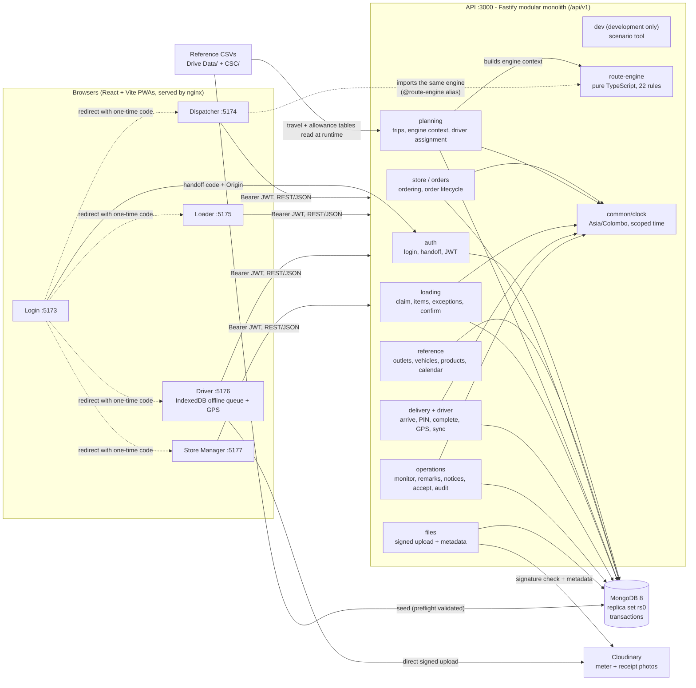
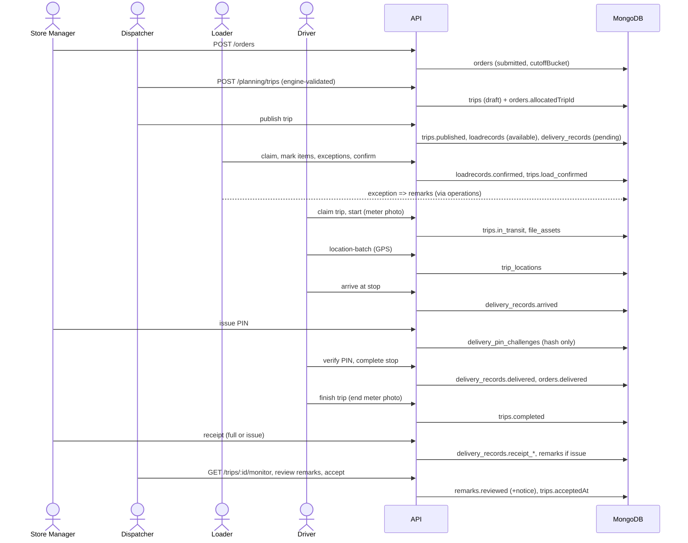
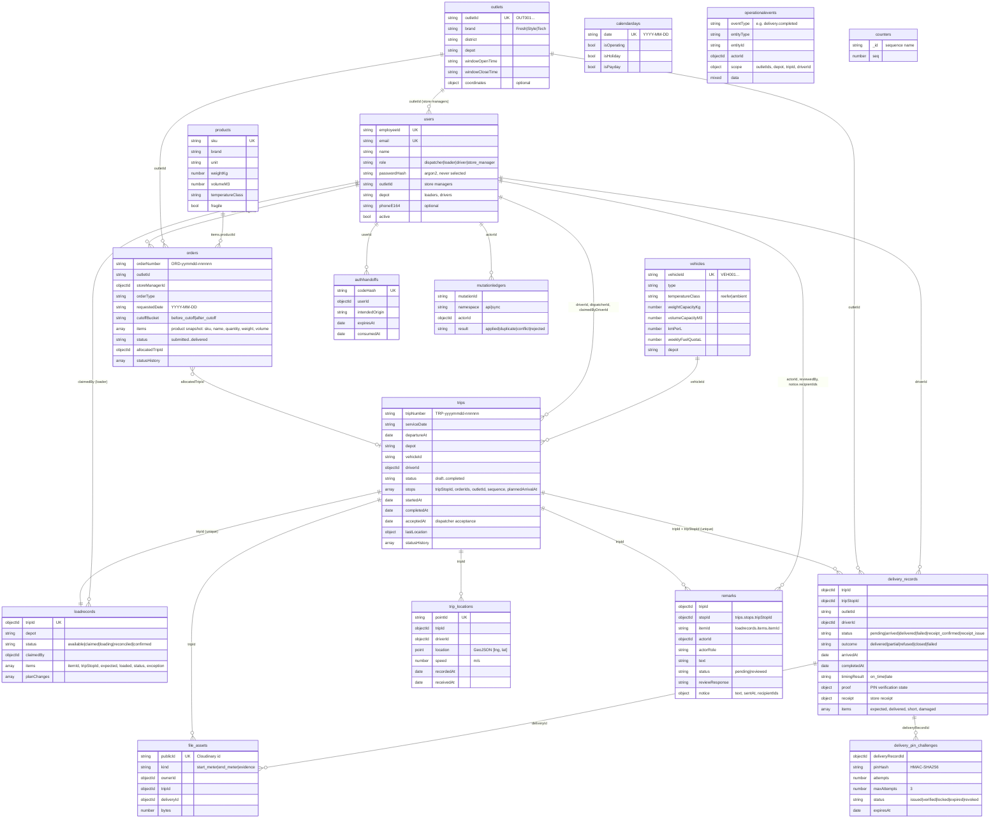

# WayLink architecture and data model

The diagrams are [Mermaid](https://mermaid.js.org/) and render on GitHub and in most Markdown viewers.

## 1. System architecture

Key points:

- **One backend, one database.** Each role app is a thin client over the same API. The backend owns `Order`, `Trip`, `LoadRecord` and `DeliveryRecord`, so a status seen by one role is the same record every other role sees.
- **Module boundaries.** Each module owns its collections. Writes go through command ports and reads through read ports (for example `RemarkCommandPort` / `RemarkReadPort`); other modules do not query a collection they do not own.
- **Authentication across origins.** The Login app calls `POST /auth/login` (employee ID + email + password) and receives a one-time `handoffCode`; the target role app exchanges it at `POST /auth/exchange` with its `Origin` header for a short-lived JWT. Handoff codes are stored hashed and are single use.
- **Route engine.** Pure TypeScript with no database access, living in `backend/src/route-engine`. The Dispatcher imports the same source through the `@route-engine` alias to suggest packs and routes; the API builds the engine's input (`planning/engine-context.ts`: outlets, travel and allowance tables, vehicle usage) and the dev scenario tool runs it. The server still validates every trip it saves with its own rules, so the engine only proposes.
- **Time.** All "now" decisions (16:00 order cutoff, the Driver's "today", PIN expiry) read `common/clock`, which is the real clock except when the dev scenario tool runs one request "as of" another instant.
- **Offline.** The Driver app queues arrivals, completions and GPS points in IndexedDB and syncs them later; the `mutationledgers` collection makes replays idempotent.
- **Photos.** Binary files live in Cloudinary. MongoDB stores only metadata (`file_assets`); the API verifies the Cloudinary signature before it records an asset.

## 2. Delivery lifecycle across the roles

## 3. Data model

MongoDB database `waylink`. Collection names below are the real ones (Mongoose pluralises models that do not name their collection).

### How the data is connected

| From | To | Link | Notes |
| --- | --- | --- | --- |
| `orders` | `outlets`, `users`, `products` | `outletId` (business id), `storeManagerId`, `items.productId` | Items **snapshot** name, unit, weight, volume and temperature class at order time, so later catalogue edits cannot change a placed order. |
| `orders` | `trips` | `allocatedTripId` and `trips.stops[].orderIds` | Both directions are kept; a stop can carry several orders for the same outlet. |
| `trips` | `vehicles`, `users` | `vehicleId` (business id), `driverId`, `dispatcherId`, `claimedByDriverId` | At most two routes per vehicle per day (`vehicleId + serviceDate + routeIndex`); drivers are not limited this way. |
| `loadrecords` | `trips` | `tripId` (unique, one per trip) | The loader is `claimedBy`, so a trip has at most one loader. `items[].tripStopId` ties each load line to a trip stop. |
| `delivery_records` | `trips` | `tripId + tripStopId` (unique) | One per stop; arrival/completion timestamps and the receipt live here, not on the trip's embedded stop. |
| `delivery_pin_challenges` | `delivery_records` | `deliveryRecordId` | A partial unique index allows only one `issued` PIN per delivery. Only the hash is stored. |
| `trip_locations` | `trips` | `tripId` | Append-only GPS history, 2dsphere indexed; the newest row drives live tracking. |
| `file_assets` | `trips`, `delivery_records` | `tripId`, `deliveryId` | Metadata only; the image lives in Cloudinary. |
| `remarks` | `trips`, stop, load item | `tripId`, `stopId`, `itemId` | Loader exceptions join to their load lines through `tripId + itemId`. `notice.recipientIds` is the inbox read by `GET /notices`. |
| `operationalevents` | any entity | `entityType + entityId` (loose) | Append-only audit trail; never updated. Remarks are **not** events, but create and review each emit one. |

Business keys: outlets and vehicles are referenced by their official string ids (`OUT###`, `VEH###`) everywhere; documents that belong to the running system (users, orders, trips, records) use ObjectIds.

### Status models

- **Order** (`orders.status`): `submitted` -> `allocated` -> `loading` -> `load_confirmed` -> `in_transit` -> `delivered`, with `deferred`, `delivery_failed` and `cancelled`. There is no "arrived" order status; arrival lives in `delivery_records.status`.
- **Trip**: `draft` -> `published` -> `loading` -> `load_confirmed` -> `claimed` -> `in_transit` -> `completed` (or `cancelled`). Dispatcher acceptance is recorded as `acceptedAt` / `acceptedBy` without changing the status.
- **Delivery record**: `pending` -> `arrived` -> `delivered` or `failed` -> `receipt_confirmed` or `receipt_issue`.
- **Remark**: `pending` -> `reviewed` (optionally with a notice to named users).

The order timeline shown to the Store Manager is derived on read from these records by `deriveOrderLifecycle`, so there is one source of truth for it.

### Integrity and consistency

- **Transactions.** Multi-document changes (creating and publishing trips, confirming a load, completing a stop, placing an order) run in MongoDB transactions, which is why MongoDB runs as a replica set even locally.
- **Optimistic concurrency.** `trips`, `loadrecords`, `delivery_records` and `delivery_pin_challenges` carry a `version`; writers send `expectedVersion` or `If-Match`, and a stale write gets a 409 instead of overwriting.
- **Idempotency.** `mutationledgers` records each offline/sync mutation by `mutationId`, so a replayed request returns the original result.
- **Uniqueness.** Unique indexes enforce the one-load-record-per-trip, one-delivery-record-per-stop and one-active-PIN rules in the database itself, not only in code.
- **Append-only audit.** `operationalevents` rows are only inserted. State lives in the entity documents; events describe what happened.
- **Secrets.** Passwords are argon2 hashes with `select: false`; PINs and handoff codes are stored only as hashes.
- **Sequences.** `counters` allocates the readable numbers (`ORD-...`, `TRP-...`).

### Reference data and seeding

`outlets`, `vehicles`, `calendardays` and `products` are loaded from `Drive Data/*.csv` and `CSC/products.demo.csv` by the seed after a preflight check that fails loudly on missing columns. The travel, traffic, road-condition and service-allowance tables are not stored in MongoDB: the route engine reads them from `REFERENCE_DATA_DIR` at runtime. The seed also creates the seven demo users (see the README) and, in the demo scenario, a window of synthetic calendar days.
